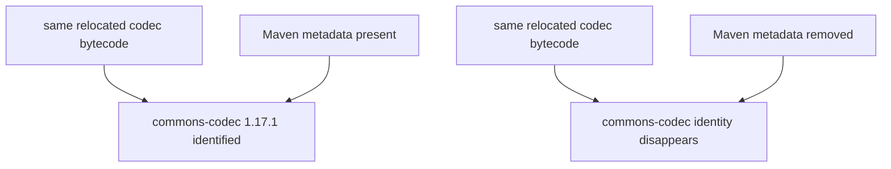
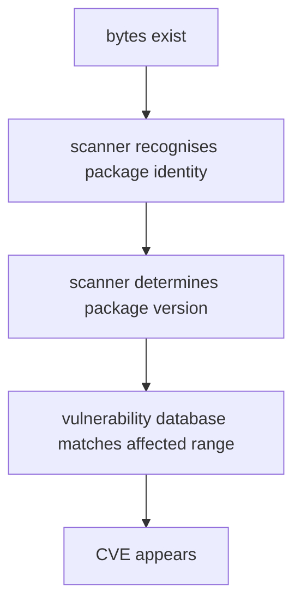

# T03 — Trivy Across S01 Boundaries

## The question

Use one vulnerability tool, Trivy, against several evidence boundaries in S01.

The central question is:

> Does the vulnerability answer change when you observe the same software as a dependency model, a transformed Java archive, a browser bundle, or a final container image?

## The instrument

The observed run used Trivy 0.74.0.

For source dependency models and the frontend bundle, the investigation uses:

```text
trivy fs
```

For built Java archives it uses:

```text
trivy rootfs
```

For the final image it uses:

```text
trivy image --image-src docker
```

The distinction matters: passing a JAR directly to `trivy fs` produced:

```text
Number of language-specific files num=0
```

and did not invoke the Java archive detector. The corrected archive probes stage each JAR in an isolated directory and scan that directory with `trivy rootfs`.

---

# Ground truth

Every expectation below is derived from this section: what S01 actually
contains, established independently of the tool under investigation.

## Fixture

S01 contains these component states:

```text
jackson-databind 2.19.4
    ordinary Maven dependency
    shipped intact

commons-codec 1.18.0
    service-selected Maven dependency
    shipped intact

commons-codec 1.17.1
    dependency of normalizer
    shaded and relocated
    Maven identity metadata survives in the original shaded JAR

normalizer 1.0.0
    custom application library

lodash 4.17.21
    npm dependency
    bundled by Vite
    npm package boundary disappears
```

A controlled copy of the shaded normalizer removes only:

```text
META-INF/maven/commons-codec/commons-codec/*
```

The relocated codec bytecode is unchanged.

## Run

```command
./scripts/baseline-s01.sh
```

## Observed

Maven showed:

```output
normalizer
    -> commons-codec 1.17.1
```

The service dependency tree showed:

```text
service
    -> jackson-databind 2.19.4
    -> normalizer 1.0.0
         -> commons-codec 1.18.0
            (version managed from 1.17.1)
```

npm showed:

```text
checkout-trace-frontend@1.0.0
    -> lodash@4.17.21
```

The original shaded normalizer contained relocated codec classes under:

```text
com/acme/internal/codec/
```

and retained:

```text
META-INF/maven/commons-codec/commons-codec/pom.xml
META-INF/maven/commons-codec/commons-codec/pom.properties
```

The controlled stripped copy still contained the relocated codec bytecode but no codec Maven metadata.

Syft identified the original shaded archive as:

```text
commons-codec 1.17.1
normalizer    1.0.0
```

With only the codec Maven metadata removed, Syft no longer identified codec 1.17.1.

The service JAR physically contained:

```text
BOOT-INF/lib/jackson-databind-2.19.4.jar
BOOT-INF/lib/normalizer-1.0.0.jar
BOOT-INF/lib/commons-codec-1.18.0.jar
```

and the bundled frontend under:

```text
BOOT-INF/classes/static/
```

## What this pins down

The baseline separates:

```text
declared dependency identity
resolved dependency identity
physical shipped bytes
recoverable package identity
```

Those are not the same thing. The probes below test which of them Trivy can
observe at each boundary.

---

# Running the probes

All eight probes are driven by three scripts:

```command
./scripts/run-trivy-nonarchives-s01.sh
./scripts/run-trivy-archives-s01.sh
./scripts/compare-s01.sh
```

You can also run the full clean harness with:

```command
./scripts/run-trivy-s01.sh
```

---

# Probe 1 — normalizer POM

## Question

What does Trivy identify from the normalizer's source dependency model?

## Expectation

Ground truth: the normalizer POM declares `commons-codec 1.17.1` directly. At
this boundary the shading transformation has not happened yet — the declaration
is plain Maven model evidence — so the codec identity should be recoverable.

## Observed

Trivy identified:

```output
commons-codec 1.17.1
normalizer    1.0.0
```

Trivy reported no tracked vulnerability finding.

## Verdict

**codec 1.17.1: identified**, as expected. At the source dependency boundary,
Trivy can identify codec 1.17.1 directly from Maven model evidence.

---

# Probe 2 — service POM

## Question

Does a scan of the service's own POM report the service's *resolved*
dependency set?

## Expectation

Ground truth: the resolved service tree contains `jackson-databind 2.19.4` and
`commons-codec 1.18.0` (managed up from normalizer's 1.17.1). If a single-POM
scan answers the resolved-graph question, both should appear.

## Observed

Trivy identified:

```output
jackson-databind 2.19.4
normalizer         1.0.0
```

It did not surface codec 1.18.0 in the tracked inventory from this single POM scan.

For Jackson 2.19.4 it reported:

```text
HIGH    CVE-2026-54512
HIGH    CVE-2026-54513
MEDIUM  CVE-2026-54514
MEDIUM  CVE-2026-54515
MEDIUM  CVE-2026-59888
```

## Verdict

**Jackson 2.19.4: identified. codec 1.18.0: not identified** from this single
POM. A source-model vulnerability scan answers a dependency-model question, not
necessarily a complete resolved-graph or built-artefact question.

---

# Probe 3 — frontend package-lock

## Question

What does Trivy identify from the npm dependency model?

## Expectation

Ground truth: `package-lock.json` records `lodash@4.17.21` explicitly. At this
boundary the package identity is literal text in the lockfile, so it should be
identified — and any lodash CVEs should attach to it.

## Observed

Trivy identified:

```output
lodash 4.17.21
```

and reported:

```text
HIGH    CVE-2026-4800
MEDIUM  CVE-2025-13465
MEDIUM  CVE-2026-2950
```

## Verdict

**lodash 4.17.21: identified**, with three CVEs attached, as expected. At the
npm package-model boundary, lodash has explicit package identity and Trivy can
attach vulnerability intelligence to it.

---

# Probe 4 — shaded normalizer JAR

## Question

Can Trivy recover the codec identity from the built artefact, after Shade has
relocated the bytecode?

## Expectation

Ground truth: the shaded JAR carries the relocated bytecode under
`com/acme/internal/codec/`, but the original Maven identity metadata
(`META-INF/maven/commons-codec/...`) survives inside it, and Syft identified
the codec from that metadata. If Trivy reads the same evidence, codec 1.17.1
should still be identified here.

## Observed

Using `trivy rootfs` against an isolated directory containing the shaded JAR, Trivy identified:

```output
commons-codec 1.17.1
normalizer    1.0.0
```

Trivy reported no tracked vulnerability finding.

## Verdict

**codec 1.17.1: identified**, as expected. Trivy can recover the shaded codec
identity from the built artefact *while the embedded Maven metadata survives* —
which is precisely the condition the next probe removes.

---

# Probe 5 — metadata-stripped shaded normalizer JAR

## Question

The controlled experiment: with the same relocated bytecode but the Maven
metadata removed, does the codec identity survive?

## Expectation

Ground truth: the stripped copy differs from Probe 4's JAR *only* in the
removal of `META-INF/maven/commons-codec/commons-codec/*`; the executable
bytecode is unchanged. If Probe 4's identification relied on that metadata
rather than on the bytecode, the codec identity should now disappear.

## Observed

The archive still contains the same relocated codec bytecode.

Trivy identified only:

```output
normalizer 1.0.0
```

It no longer identified:

```text
commons-codec 1.17.1
```

## Verdict

**codec 1.17.1: identity lost** — the expectation confirmed, and the key result
of T03:



The package identity disappeared, but the software bytes did not. A CVE scanner
cannot attach package-version vulnerability intelligence to an identity it has
not established.

---

# Probe 6 — Spring Boot service JAR

## Question

What does the built service artefact expose that the service's Maven model did
not?

## Expectation

Ground truth: the service JAR physically contains jackson-databind 2.19.4,
codec 1.18.0 and the normalizer JAR — and nested inside the normalizer, the
shaded codec 1.17.1 with its metadata intact. A scan of the physical artefact
should therefore surface *both* codec versions, where the service POM scan
(Probe 2) surfaced neither.

## Observed

Trivy identified:

```output
jackson-databind 2.19.4
commons-codec    1.17.1
commons-codec    1.18.0
normalizer       1.0.0
```

For Jackson 2.19.4 it reported the same five CVEs:

```text
2 HIGH
3 MEDIUM
```

## Verdict

**Both codec versions: identified**, as expected. The built service JAR
contains a software reality that differs from the service Maven model:

```text
service Maven model
    -> codec 1.18.0

built service JAR
    -> codec 1.18.0
    -> codec 1.17.1 embedded inside shaded normalizer
```

The shaded codec becomes visible because its identifying Maven metadata
survives inside the nested normalizer archive.

---

# Probe 7 — frontend/dist

## Question

After Vite bundles the frontend, can Trivy still see lodash in the shipped
JavaScript?

## Expectation

Ground truth: the lodash code is in the bundle — Vite inlined it — but the npm
package boundary (its `package.json`, its `node_modules` directory) is gone.
If Trivy identifies npm packages by package evidence rather than by code
content, lodash should disappear here even though its code ships.

## Observed

Trivy reported:

```output
Number of language-specific files num=0
```

Trivy recovered no tracked identities and reported no tracked vulnerability findings.

## Verdict

**lodash 4.17.21: identity lost.** The Vite output ships browser JavaScript,
but the npm package boundary has disappeared:

```text
package-lock.json
    -> lodash 4.17.21 identified
    -> 3 CVEs identified

frontend/dist
    -> no lodash package identity
    -> no lodash CVE findings
```

This is evidence that Trivy cannot reconstruct the npm package identity from
the bundled output, not that the lodash code is absent.

---

# Probe 8 — final container image

## Question

Does scanning the final deployed boundary — the container image — restore any
identity that earlier transformations destroyed?

## Expectation

Ground truth: the image contains the service JAR (so the four Java identities
of Probe 6 should reappear) plus an Ubuntu base image (so OS packages enter the
inventory). The bundled frontend is inside the JAR as static content; nothing
at this boundary re-creates the npm evidence Vite destroyed, so lodash should
stay invisible.

## Observed

Trivy detected:

```output
OS: Ubuntu 22.04
OS packages analysed: 143
Java archive files analysed: 1
```

Tracked identity:

```text
jackson-databind 2.19.4
commons-codec    1.17.1
commons-codec    1.18.0
normalizer       1.0.0
```

Trivy did not recover lodash.

For Jackson 2.19.4 Trivy again reported:

```text
HIGH    CVE-2026-54512
HIGH    CVE-2026-54513
MEDIUM  CVE-2026-54514
MEDIUM  CVE-2026-54515
MEDIUM  CVE-2026-59888
```

## Verdict

**Java identities: identified. lodash: still lost**, as expected. The final
container exposes a broader deployed software boundary because Trivy also
analyses operating-system packages — but moving later in the supply chain does
not restore npm identity that Vite already destroyed.

---

# Scorecard

What Trivy identified, tracked component by tracked component, at each boundary — `seen` means the
package identity was established; `—` means it was not. Every `—` in this
table is code that shipped anyway, except where the tracked component genuinely isn't part
of that boundary's evidence.

| Boundary | codec 1.17.1 | codec 1.18.0 | Jackson 2.19.4 | lodash 4.17.21 |
| --- | --- | --- | --- | --- |
| normalizer POM | seen | — | — | — |
| service POM | — | — | seen | — |
| package-lock | — | — | — | seen |
| shaded normalizer JAR | seen | — | — | — |
| stripped normalizer JAR | — | — | — | — |
| service JAR | seen | seen | seen | — |
| frontend/dist | — | — | — | — |
| final container | seen | seen | seen | — |

For the tracked CVEs observed:

```text
Jackson 2.19.4
    service POM      -> 5 CVEs
    service JAR      -> 5 CVEs
    final container  -> 5 CVEs

lodash 4.17.21
    package-lock     -> 3 CVEs
    frontend/dist    -> none
    final container  -> none
```

---

# Findings

## 1. Vulnerability visibility depends on package identity

The controlled codec experiment demonstrates:

```text
code present
    !=
package identified
    !=
CVE can be attached
```

Removing only package metadata changes the scanner's software inventory even though the executable bytecode remains.

## 2. A source dependency model and a built artefact answer different questions

The normalizer POM says:

```text
commons-codec 1.17.1
```

The service Maven model says:

```text
commons-codec 1.18.0
```

The built service JAR exposes:

```text
commons-codec 1.17.1
commons-codec 1.18.0
```

All three are valid observations at different supply-chain boundaries.

## 3. Transformation can remove vulnerability visibility without removing code

Lodash demonstrates this independently of Java shading:

```text
npm lockfile
    -> identity present
    -> CVEs present

Vite bundle
    -> code still shipped
    -> npm identity absent
    -> CVEs absent
```

The absence of a CVE finding at the later boundary does not prove absence of the vulnerable code.

## 4. Moving the scanner later gives a broader deployed view, but not complete history

The container scan adds Ubuntu package analysis and sees the final application archive.

It still does not reconstruct lodash identity after bundling.

The final image therefore answers:

```text
what software can Trivy identify in this deployment?
```

not:

```text
what software participated in every earlier build transformation?
```

## 5. Scanner mode is part of the evidence model

For Trivy 0.74.0:

```text
trivy fs
    -> source/dependency model and filesystem-oriented scanning

trivy rootfs
    -> post-build filesystem/archive analysis

trivy image
    -> final container analysis
```

Using the wrong scan mode can produce a false negative before vulnerability matching even begins.

---

# Final verdict

T03 demonstrates that a CVE scanner is downstream of software identification.

The practical chain is:



Break the chain at package identity and the CVE can disappear from the result even though the underlying code remains.

The practical rule is:

> A clean vulnerability scan proves only that the scanner found no matching vulnerabilities for the software identities it was able to establish at that evidence boundary. It does not prove that the scanner identified all shipped software.
