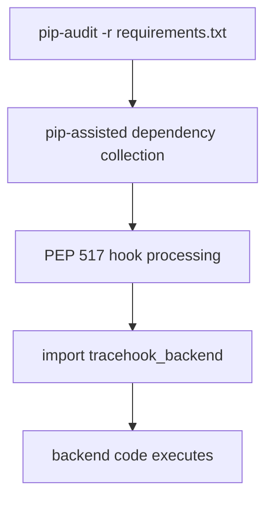

# T05 — pip-audit / S03

## The question

Use `pip-audit` against S03 to separate four different facts:

```text
dependency identity
vulnerability matching
PEP 517 build execution
generated installed content
```

The central question is:

> Can a Python vulnerability audit reconstruct the fact that a transitive source distribution executed a PEP 517 backend and generated runtime files?

T05 also asks a more surprising question:

> Can running the vulnerability audit itself execute packaging code from the dependency being audited?

The observed answer to the second question is **yes**.

## The instrument

The observed run used:

```text
pip-audit 2.10.1
Python 3.14
pip 26.1.2
```

The probes below are variants of one audit operation — requirements audit,
resolution disabled, pip disabled, installed-environment audit, SBOM output —
so the differences between them are evidence about *how* pip-audit collects
what it audits, not about different tools.

---

# Ground truth

Every expectation below is derived from this section: what S03 actually
contains, established independently of the tool.

## Fixture

The direct requirement is:

```text
reportkit==1.0.0
```

The `reportkit` wheel metadata contains:

```text
Requires-Dist: tracehook-demo==1.0.0
```

`tracehook-demo` is supplied as a source distribution.

Its source distribution contains only:

```text
tracehook_demo-1.0.0/pyproject.toml
tracehook_demo-1.0.0/tracehook_backend.py
```

Its PEP 517 configuration contains:

```text
[build-system]
requires = []
build-backend = "tracehook_backend"
backend-path = ["."]
```

The source distribution does **not** contain:

```text
tracehook_demo/__init__.py
tracehook_demo/build-hook.json
```

## Run

```command
./scripts/baseline-s03.sh
```

## Observed

Ordinary pip installation showed:

```output
Processing reportkit-1.0.0-py3-none-any.whl

Processing tracehook_demo-1.0.0.tar.gz
  Getting requirements to build wheel
  Preparing metadata (pyproject.toml)

Building wheels for collected packages: tracehook-demo
  Building wheel for tracehook-demo (pyproject.toml)
  Created wheel for tracehook-demo

Successfully installed:
  reportkit-1.0.0
  tracehook-demo-1.0.0
```

The installed environment contained:

```text
pip             26.1.2
reportkit       1.0.0
tracehook-demo  1.0.0
```

The installed package contained files absent from the source distribution:

```text
tracehook_demo/__init__.py
tracehook_demo/build-hook.json
```

The generated marker contained:

```json
{
  "event": "pep517-build-backend-executed",
  "generatedBy": "tracehook_backend.build_wheel",
  "package": "tracehook-demo",
  "version": "1.0.0"
}
```

## What this pins down

The package installation crosses a transformation boundary:

```text
sdist
    ↓ PEP 517 backend execution
wheel
    ↓ install
runtime files
```

Therefore:

```text
source distribution contents
    !=
installed runtime contents
```

The probes test which of those facts each pip-audit mode can observe — and
whether the audit itself crosses that transformation boundary.

---

# Probe 1 — normal requirements audit

## Question

From the requirements file alone, what package identities does a normal
pip-audit run recover, and can it attach vulnerability intelligence to them?

## Expectation

Ground truth: the requirements file pins only `reportkit==1.0.0`;
`tracehook-demo` is reachable only through reportkit's wheel metadata. A
resolution-based audit should therefore recover both identities. Both are
private scenario packages, so PyPI's vulnerability service has never heard of
them — what happens then is exactly what this probe observes.

## Run

```command
./scripts/run-pip-audit-s03.sh
```

The normal requirements audit uses dependency resolution.

## Observed

`pip-audit` reported:

```output
Dry run: would have audited 2 packages
```

The resulting audit set contained:

```text
reportkit
tracehook-demo
```

`pip-audit` skipped both with:

```text
Dependency not found on PyPI and could not be audited
```

## Verdict

**reportkit: identified. tracehook-demo: identified — but both skipped.**
`pip-audit` recovered the transitive dependency identity:

```text
reportkit
    → tracehook-demo
```

But package identity did not imply vulnerability coverage. For these private
scenario packages:

```text
package identified
    !=
package vulnerability-auditable through PyPI
```

---

# Probe 2 — controlled PEP 517 execution probe

## Question

The controlled experiment: does the audit itself execute the dependency's
PEP 517 backend code during dependency collection?

## Expectation

Ground truth: `tracehook-demo` is an sdist whose own `tracehook_backend.py` is
its build backend. If pip-audit's dependency collection uses pip's PEP 517
machinery, collecting metadata for the sdist should import — and therefore
execute — that backend. To make the execution observable, the harness creates
a temporary, controlled copy of the same source distribution: the dependency
metadata is unchanged, and the backend receives one benign observable side
effect:

```text
when tracehook_backend is imported
    write a marker file
```

If the audit is a purely static inspection, no marker should appear.

## Run

```command
./scripts/run-pep517-exec-probe.sh
```

## Observed

The audit reported:

```output
INFO:pip_audit._audit:Dry run: would have audited 2 packages
No known vulnerabilities found
```

The marker was created:

```text
PEP 517 execution marker:

tracehook_backend imported during pip-audit dependency resolution
```

## Verdict

**Backend execution: confirmed.** This is direct evidence that:



`pip-audit` is not executing code maliciously here. The point is that a vulnerability audit of a requirements file can cross a Python packaging execution boundary: dependency collection uses pip's PEP 517 machinery.

So:

> Running the security audit can itself execute code from the dependency being audited.

This is not visible in the final vulnerability report.

---

# Probe 3 — `--no-deps`

## Question

Does disabling dependency resolution shrink the audit set to only the pinned
requirement?

## Expectation

Ground truth: only `reportkit==1.0.0` is pinned; `tracehook-demo` enters the
picture only through resolution. If `--no-deps` fully disabled pip-assisted
collection, only `reportkit` should remain in the audit set.

## Run

```command
pip-audit --no-deps ...
```

## Observed

The observed audit set still contained:

```output
reportkit
tracehook-demo
```

The tool emitted:

```text
--no-deps is supported, but users are encouraged to fully hash their pinned dependencies
```

## Verdict

**tracehook-demo: still present** — the expectation was not met. For the
observed `pip-audit 2.10.1` run, `--no-deps` alone did not reduce the resulting
audit set to only the directly pinned requirement.

That is recorded as observed rather than inferred behaviour.

---

# Probe 4 — `--no-deps --disable-pip`

## Question

Does additionally disabling pip isolate static handling of the requirements
file from pip-assisted collection?

## Expectation

If pip-assisted collection is what pulls `tracehook-demo` into the audit set
(Probe 3), then removing pip from the operation should leave only the pinned
`reportkit`.

## Run

```command
pip-audit --no-deps --disable-pip ...
```

## Observed

The audit set contained only:

```output
reportkit
```

`tracehook-demo` was absent.

## Verdict

**tracehook-demo: absent**, as expected. The difference is:

```text
--no-deps
    reportkit
    tracehook-demo

--no-deps --disable-pip
    reportkit
```

This isolates pip-assisted dependency collection from static handling of the explicitly pinned requirements file.

---

# Probe 5 — installed-environment audit

## Question

What changes when the audit target is the installed environment rather than
the requirements file?

## Expectation

Ground truth: the installed environment contains `reportkit 1.0.0`,
`tracehook-demo 1.0.0` — and `pip 26.1.2` itself. Auditing `site-packages`
should therefore widen the software universe beyond the application's declared
packages to include the packaging tooling present in the environment.

## Run

The harness audits the already-installed `site-packages` directory.

## Observed

The audit saw:

```output
pip 26.1.2
reportkit 1.0.0
tracehook-demo 1.0.0
```

It found one known vulnerability:

```text
pip 26.1.2

PYSEC-2026-3721
CVE-2026-13346

fixed in:
26.2
```

The audit again skipped the scenario packages because they were not found in PyPI's vulnerability service.

## Verdict

**pip 26.1.2: identified, with a real CVE. Scenario packages: identified,
still skipped.** Auditing the installed environment changes the software
universe. The vulnerability scan now includes packaging/runtime tooling
present in that environment:

```text
pip
```

That produced a real vulnerability finding unrelated to the application dependency graph.

---

# Probe 6 — CycloneDX output

## Question

Does the SBOM output format preserve the same evidence as the JSON
vulnerability result of the same audit?

## Expectation

The JSON result explicitly records the private packages as identified but
skipped. If every output format preserved the same evidence, the CycloneDX
component list should carry `reportkit` and `tracehook-demo` too.

## Observed

The observed pip-audit CycloneDX output surfaced:

```output
pip 26.1.2
```

The comparison helper did not surface the skipped private packages as CycloneDX components:

```text
reportkit
tracehook-demo
```

## Verdict

**reportkit and tracehook-demo: identity lost in the CycloneDX view.** The
JSON vulnerability result and the CycloneDX output preserve different
evidence. The JSON result explicitly records private packages as:

```text
identified but skipped
```

The observed CycloneDX component view did not retain those identities.

Therefore:

```text
same audit operation
    !=
same evidence preserved in every output format
```

---

# Scorecard

What each pip-audit mode observed — `seen` means the identity (or fact)
appeared in that mode's output; `—` means it did not. The last column is the
fact no audit output preserved: the harness's own marker is the only evidence
the backend ran.

| Audit boundary | reportkit 1.0.0 | tracehook-demo 1.0.0 | pip 26.1.2 | PEP 517 execution |
| --- | --- | --- | --- | --- |
| requirements audit | seen | seen | — | — |
| `--no-deps` | seen | seen | — | — |
| `--no-deps --disable-pip` | seen | — | — | — |
| installed environment | seen | seen | seen | — |
| CycloneDX output | — | — | seen | — |

For the vulnerability findings observed:

```text
reportkit / tracehook-demo
    every mode        -> identified where seen, but skipped:
                         not found on PyPI's vulnerability service

pip 26.1.2
    installed environment -> PYSEC-2026-3721 / CVE-2026-13346
```

---

# Findings

## 1. Dependency resolution can recover a transitive package

The direct input declared only:

```text
reportkit==1.0.0
```

Normal pip-audit resolution recovered:

```text
tracehook-demo==1.0.0
```

So transitive dependency identity can be reconstructed from package metadata.

---

## 2. Identified packages can still be unauditable

The audit identified both scenario packages but skipped them:

```text
Dependency not found on PyPI and could not be audited
```

This is materially different from:

```text
package not identified
```

A clean result for a skipped/private package is not proof that the package has no vulnerabilities.

---

## 3. A requirements vulnerability audit can execute packaging code

The controlled marker proves:

```text
pip-audit
    → pip dependency collection
    → PEP 517 backend import
    → backend code execution
```

This is the strongest T05 result.

The vulnerability audit itself participates in the Python software supply chain.

---

## 4. Vulnerability output does not preserve PEP 517 execution history

Although the backend executed during dependency resolution, the vulnerability result does not say:

```text
tracehook_backend was imported
PEP 517 hooks ran
runtime files were generated
```

That evidence exists only because the harness separately instrumented the build/install boundary.

---

## 5. Installed package identity does not explain how installed files were created

The installed environment knows:

```text
tracehook-demo 1.0.0
```

But that identity alone does not tell us that:

```text
__init__.py
build-hook.json
```

were generated by the backend and were absent from the source distribution.

So:

```text
installed package identity
    !=
installation provenance
```

---

## 6. `--disable-pip` materially changes the observed audit boundary

Observed:

```text
--no-deps
    reportkit
    tracehook-demo

--no-deps --disable-pip
    reportkit
```

That distinction matters because using pip for collection can cross packaging execution boundaries.

---

## 7. Auditing the environment can reveal vulnerabilities in the audit/install tooling itself

The installed-environment scan found:

```text
pip 26.1.2
CVE-2026-13346
```

So the vulnerability surface of the environment includes more than the application's declared packages.

---

# Final verdict

T05 demonstrates two different supply-chain blind spots.

First:

```text
package identity
    !=
vulnerability coverage
```

`reportkit` and `tracehook-demo` were identified but not auditable through the selected vulnerability service.

Second:

```text
package identity
    !=
build/install history
```

`pip-audit` could identify the installed/transitive packages, but its final report did not preserve the fact that PEP 517 code executed or that runtime files were generated during wheel construction.

Most importantly, the audit operation itself can participate in that execution chain:

```text
audit requirements
    → resolve dependencies
    → invoke packaging machinery
    → execute PEP 517 backend code
```

The practical rule is:

> Treat Python dependency auditing as an active supply-chain operation when dependency resolution is enabled, not as a purely static inspection step.
