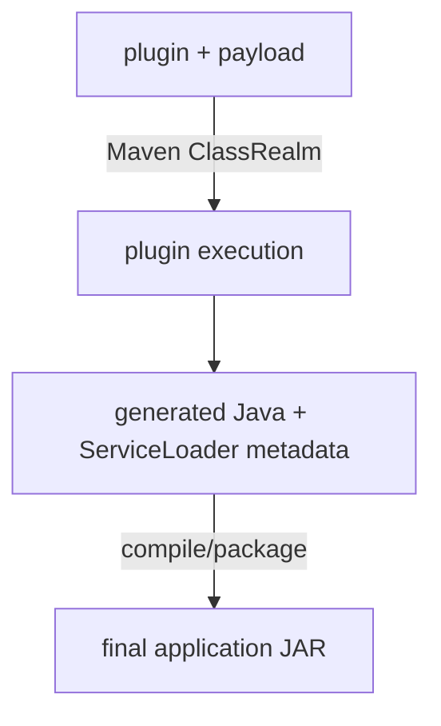

# T06 — OWASP Dependency-Check / S04

## The question

Use OWASP Dependency-Check against S04 to distinguish:

```text
application dependency inventory
Maven plugin dependency inventory
plugin execution
final application bytes
vulnerability matching
```

The central question is:

> If a Maven plugin and its transitive dependency generate runtime capability that survives in the final application JAR, at which boundary can Dependency-Check still identify the build-time packages?

## The instrument

```text
OWASP Dependency-Check Maven Plugin 13.0.0
```

The successful walkthrough used:

```text
NVD API key: supplied via NVD_API_KEY environment variable
```

Dependency-Check data directory:

```text
~/.cache/kcdc-dependency-check/13.0.0
```

---

# NVD API key

The key is instrument configuration, not a detail: it changes which tool
version runs and whether the vulnerability database updates at all, and that
is part of the evidence model.

## Why this matters

OWASP Dependency-Check maintains a local vulnerability database populated from
NVD data.

An NVD API key is not strictly required by Dependency-Check, but version
13.0.0 has a known no-key regression in its NVD update path. The T06
walkthrough therefore used a valid NVD API key with 13.0.0.

The NVD documents higher request limits when a key is supplied.

For a workshop, the best option is normally to reuse a pre-populated
Dependency-Check data directory. That saves every attendee from populating
the complete NVD database.

## Getting an NVD API key

Go to <https://nvd.nist.gov/developers/request-an-api-key>.

The request form asks for:

```text
organisation name
email address
organisation type
```

Then:

```text
1. Read and accept the NVD Terms of Use.
2. Submit the request.
3. Check the supplied email address for the NVD activation email.
4. Open the single-use activation link.
5. Activate and view the API key.
6. Store the key somewhere secure.
```

The activation link expires after seven days.

The page that displays the key is single-use, so copy it to a secure secret
store when it appears.

Requesting and activating another key with the same email address invalidates
the previous key.

Do not commit an NVD API key to this repository.

## Using the key with T06

Export it into the environment:

```command
export NVD_API_KEY='your-key-here'
./scripts/run-dependency-check-s04.sh
```

Check that it is actually exported:

```command
printenv NVD_API_KEY >/dev/null && echo "NVD_API_KEY is exported"
```

The harness should print:

```text
NVD API key: supplied via NVD_API_KEY environment variable
```

---

# Ground truth

Every expectation below is derived from this section: what S04 actually
contains and what its build actually did, established from Maven's own
evidence, independently of the tool under investigation.

## Fixture

S04 plants its controlled tracked components in the build tooling, not in the
application:

```text
maven-plugin-hidden-content 1.0.0
    the application itself
    its ordinary dependency graph is otherwise empty

trace-injector-maven-plugin 1.0.0
    Maven build plugin
    never an application dependency

trace-route-payload 1.0.0
    transitive dependency of that plugin
    never an application dependency
```

Plugin execution generates runtime capability — a `/hidden/build-info` route —
that survives into the final application JAR after the original build-time
package boundaries are gone.

## Run

```command
./scripts/baseline-s04.sh
```

## Observed

The application dependency tree contained only the application itself:

```output
dev.noregressions.trace:maven-plugin-hidden-content:jar:1.0.0
```

Neither controlled build-time tracked component appeared as a normal application
dependency.

Maven plugin resolution showed:

```text
dev.noregressions.trace:trace-injector-maven-plugin:maven-plugin:1.0.0:runtime
    dev.noregressions.trace:trace-injector-maven-plugin:jar:1.0.0
    dev.noregressions.trace:trace-route-payload:jar:1.0.0
```

Maven debug output showed:

```text
Created new class realm plugin>dev.noregressions.trace:trace-injector-maven-plugin:1.0.0

Included:
dev.noregressions.trace:trace-injector-maven-plugin:jar:1.0.0
dev.noregressions.trace:trace-route-payload:jar:1.0.0
```

Maven then loaded:

```text
trace-injector-maven-plugin:1.0.0:inject-route
```

from that ClassRealm.

Plugin execution generated:

```text
target/generated-sources/trace-injector/.../GeneratedTraceRoute.java

target/generated-resources/trace-injector/
    META-INF/services/dev.noregressions.trace.s04.TraceRoute
    META-INF/trace-lab/plugin-injection.properties
```

The final JAR contained:

```text
META-INF/trace-lab/plugin-injection.properties
META-INF/services/dev.noregressions.trace.s04.TraceRoute
dev/noregressions/trace/s04/generated/GeneratedTraceRoute.class
```

Disassembly of the final class contained:

```text
/hidden/build-info
trace-route-payload
trace-injector-maven-plugin
```

## What this pins down

Maven has two separate dependency domains here. The ordinary Maven dependency
universe is:

```text
maven-plugin-hidden-content 1.0.0
```

with no application dependency on:

```text
trace-injector-maven-plugin
trace-route-payload
```

while Maven's build-tooling domain resolves:

```text
trace-injector-maven-plugin 1.0.0
    ↓
trace-route-payload 1.0.0
```

The payload was not merely resolvable: it was present in the actual Maven
ClassRealm used to execute the build plugin, and that execution changed the
final runtime capability. The transformation was:



The behaviour survives into the final JAR — the tracked component *names* even survive as
strings in the generated class — but the original build-time package
boundaries do not travel with it. The probes below test which of these
boundaries Dependency-Check can observe.

---

# Running the probes

All four probes are driven by one harness run (with the NVD API key exported,
as above):

```command
./scripts/run-dependency-check-s04.sh
```

---

# Probe 1 — default application-model scan

## Question

What does the default Dependency-Check Maven scan of S04 see?

## Expectation

Ground truth: the application dependency graph contains only the application
itself, and both controlled tracked components live in Maven's build-tooling domain. If
the default scan follows the ordinary application dependency model, neither
tracked component should appear in the inventory.

## Observed

The default scan produced:

```output
Dependencies: 0
Vulnerability records: 0
S04 tracked components:
(none)
```

## Verdict

**trace-injector-maven-plugin: not identified. trace-route-payload: not
identified** — as expected. The default Maven Dependency-Check view followed
the ordinary application dependency model.

It did not include:

```text
trace-injector-maven-plugin
trace-route-payload
```

So:

```text
default application scan
    !=
complete Maven build-tooling inventory
```

---

# Probe 2 — plugin-aware scan

## Question

Does admitting Maven's build-tooling domain as evidence change the inventory —
and the vulnerability answer?

## Expectation

Ground truth: Maven resolves the plugin and its payload in the plugin realm,
alongside the rest of the build tooling. If plugin scanning admits that domain
to Dependency-Check, both controlled tracked components should be identified — and the
build tooling should bring its own vulnerability surface with it.

## Observed

With Maven plugin scanning enabled, Dependency-Check reported:

```output
Dependencies: 167
Vulnerability records: 78
```

It identified both controlled S04 tracked components:

```text
trace-injector-maven-plugin-1.0.0.jar
pkg:maven/dev.noregressions.trace/trace-injector-maven-plugin@1.0.0

trace-route-payload-1.0.0.jar
pkg:maven/dev.noregressions.trace/trace-route-payload@1.0.0
```

Neither tracked component had a vulnerability match.

The plugin-aware scan also exposed vulnerabilities in build-time tooling,
including dependencies such as:

```text
commons-beanutils 1.7.0
commons-compress 1.20
commons-io 2.6
commons-io 2.11.0
guava 16.0.1
maven-core 3.2.5
jetty 9.4.46.v20220331
plexus-archiver 4.2.7
velocity 1.7
```

## Verdict

**trace-injector-maven-plugin: identified. trace-route-payload: identified**,
as expected — and this is the strongest T06 result. Changing only the evidence
admitted to Dependency-Check changed the software universe from:

```text
0 dependencies
0 vulnerability records
```

to:

```text
167 dependencies
78 vulnerability records
```

The difference is a different dependency boundary, not a different vulnerability database.

---

# Probe 3 — final application JAR

## Question

After the build, can a scan of the shipped artefact reconstruct the build-time
packages that shaped it?

## Expectation

Ground truth: the final JAR carries the generated class, the ServiceLoader
metadata, and even the tracked names as strings inside
`GeneratedTraceRoute.class` — but not the original plugin or payload JARs,
whose package boundaries never entered the artefact. If Dependency-Check
identifies packages by package evidence rather than by generated content, both
build-time identities should be gone here, however much of their behaviour
shipped.

## Observed

The final JAR scan produced:

```output
Dependencies: 1
Vulnerability records: 0
```

The only S04 identity recovered was:

```text
maven-plugin-hidden-content-1.0.0.jar
pkg:maven/dev.noregressions.trace/maven-plugin-hidden-content@1.0.0
```

The final JAR scan did not identify:

```text
trace-injector-maven-plugin
trace-route-payload
```

## Verdict

**maven-plugin-hidden-content: identified. trace-injector-maven-plugin:
identity lost. trace-route-payload: identity lost.** The final application JAR
retains the generated behaviour:

```text
GeneratedTraceRoute.class
ServiceLoader metadata
/hidden/build-info
trace-route-payload
trace-injector-maven-plugin
```

but it no longer retains those original build-time components as package
identities.

So:

```text
runtime behaviour present
    !=
build-time package identity recoverable
```

---

# Probe 4 — direct plugin/payload controls

## Question

The control: is the identity loss in Probe 3 a transformation effect, or can
Dependency-Check simply not recognise these packages at all?

## Expectation

Ground truth: the original plugin and payload JARs still have intact package
boundaries. If the scanner is capable of recognising the controlled tracked components,
scanning those JARs directly should identify both — and a failure here would
invalidate the interpretation of Probes 1–3.

## Observed

Scanning the original build-time JARs directly produced:

```output
Dependencies: 2
Vulnerability records: 0
```

Dependency-Check identified both:

```text
trace-injector-maven-plugin-1.0.0.jar
pkg:maven/dev.noregressions.trace/trace-injector-maven-plugin@1.0.0

trace-route-payload-1.0.0.jar
pkg:maven/dev.noregressions.trace/trace-route-payload@1.0.0
```

## Verdict

**Both build-time packages: identified**, as expected. This rules out:

```text
Dependency-Check cannot recognise the controlled tracked jars
```

The scanner can identify both original packages when the package boundaries
are still available.

The loss occurs after the plugin transformation:

```text
original plugin/payload JARs
    → identities recoverable

final application JAR
    → identities not recoverable
```

---

# Operational notes

Instrument behaviour observed alongside the probes, recorded because it shapes
how T06 runs in a workshop setting.

The first full 13.0.0 run populated:

```text
381,857 NVD records
```

and took substantially longer than subsequent runs.

Once populated, later scans reused the local database and completed quickly.

The first run also encountered unrelated RetireJS and .NET Assembly analyzer
noise. The final harness disables those analyzers because they are outside the
Java-only experiment.

A separate 13.0.0 no-key run failed before analysis with:

```text
NvdApiException:
Invalid API Key, length of 0 too short to provided a masked partial key
```

That failure was not an S04 dependency-analysis result.

---

# Scorecard

What Dependency-Check identified, tracked component by tracked component, at each boundary — `seen`
means the package identity was established; `—` means it was not, although the
software (or its effect) is part of that boundary; `n/a` means the tracked component was
outside what that probe scanned or recorded.

| Boundary | trace-injector-maven-plugin 1.0.0 | trace-route-payload 1.0.0 | maven-plugin-hidden-content 1.0.0 |
| --- | --- | --- | --- |
| default Maven scan | — | — | — |
| plugin-aware Maven scan | seen | seen | n/a |
| final application JAR | — | — | seen |
| direct plugin/payload JARs | seen | seen | n/a |

Observed:

```text
default Maven
    no tracked components

plugin-aware Maven
    trace-injector-maven-plugin
    trace-route-payload

final JAR
    maven-plugin-hidden-content only

direct plugin/payload
    trace-injector-maven-plugin
    trace-route-payload
```

The transformation boundary is therefore visible directly in the
Dependency-Check results.

---

# Findings

## 1. Maven has more than one dependency universe

The ordinary application dependency graph can be empty while Maven still
loads a substantial amount of executable third-party software to build the
application.

For S04:

```text
application dependencies
    0

plugin-aware Dependency-Check inventory
    167
```

---

## 2. Build tooling has its own vulnerability surface

Enabling plugin scanning exposed:

```text
78 vulnerability records
```

that were completely absent from the default application scan.

Therefore:

```text
application vulnerability scan
    !=
build-pipeline vulnerability scan
```

---

## 3. Maven plugin dependencies can directly change shipped runtime behaviour

`trace-route-payload` was:

```text
not an application dependency
present in the Maven plugin ClassRealm
used during plugin execution
responsible for generated runtime content
```

The final application exposes:

```text
/hidden/build-info
```

because of that build-time dependency.

---

## 4. A final artefact scan cannot reconstruct every build-time dependency

The final JAR still contains the generated behaviour, but Dependency-Check
identified only:

```text
maven-plugin-hidden-content 1.0.0
```

It did not reconstruct:

```text
trace-injector-maven-plugin
trace-route-payload
```

So:

```text
shipped behaviour
    !=
recoverable build provenance
```

---

## 5. Direct controls prove this is identity loss, not scanner incapability

When shown the original plugin and payload JARs directly, Dependency-Check
identified both.

Therefore the transformation boundary, not an inability to recognise the
packages, explains the missing identities in the final application JAR.

---

## 6. Vulnerability visibility depends on what enters the inventory

The same Dependency-Check engine and vulnerability database produced:

```text
default Maven
    0 vulnerabilities

plugin-aware Maven
    78 vulnerability records
```

The decisive variable was what software identities the scan admitted, not the CVE data.

---

# Final verdict

T06 demonstrates:

```text
application dependency graph
    !=
build-tool dependency graph
    !=
plugin execution realm
    !=
final artefact package identity
```

and:

```text
software executed during build
    can alter shipped runtime behaviour
    without remaining identifiable
    in the final application artefact
```

The practical rule is:

> Scan build tooling at the point where its package identity still exists. A later scan of the shipped application cannot reliably reconstruct the software that transformed it.
