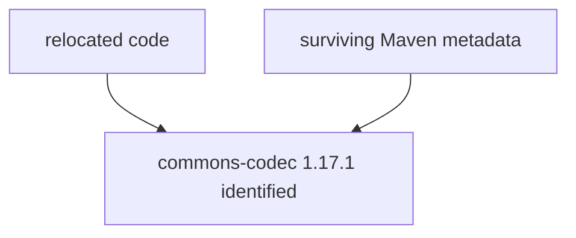
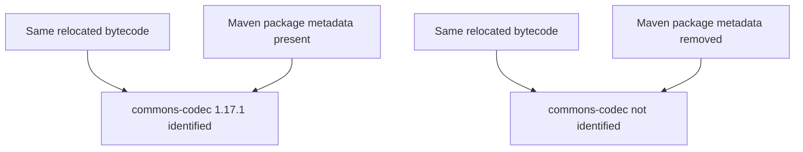
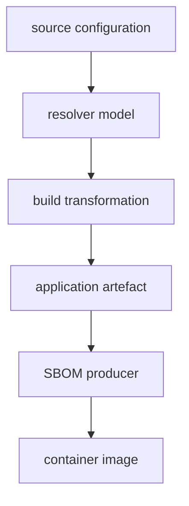

# S01 — Software Supply Chain Trace Lab

This lab follows three specific components through a small but realistic software supply chain:

- `jackson-databind`: an ordinary Java dependency whose version is selected by dependency management.
- `commons-codec`: a Java dependency whose bytecode is shaded and relocated into another JAR.
- `lodash`: an npm dependency that is bundled into frontend JavaScript and loses its package boundary.

The objective is to see **what evidence exists at each stage, what survives the next transformation, and what different tools can legitimately know**.


## Overview

```text
control          jackson-databind agrees in resolver and artefact scan
shading          commons-codec identified — until only its metadata is removed
bundling         lodash's fingerprints are in the bundle; no package identified
```

## Requirements

For the basic build:

- JDK 21
- Maven 3.9+
- Node.js 20+ / npm

For the full trace:

- `jq`
- `syft`
- `zip`
- Docker

---

## The scenario

The application is a small "checkout" web service in three modules:

|module|type|description|
|--------------|-----------|-----------------------------------------|
|frontend|     React single-page app, bundled by Vite| Fetches /api/trace and renders the result, sorted with lodash (imported whole: `import _ from 'lodash'`).|
|normalizer|   Java Library| Trims and lower-cases a string, then SHA-256 hashes it — hex-encoded with commons-codec. The Shade Plugin relocates that codec bytecode to com.acme.internal.codec inside the normalizer JAR.|
|service|      Spring Boot REST service| GET /api/trace?value=... returns the normalised value, its hash, and the tracked list as JSON (serialised by jackson-databind, version managed by Spring Boot). Serves the built frontend as its static content.|


At runtime it is one executable Spring Boot JAR on port 8080; the
`Dockerfile` copies that JAR onto `eclipse-temurin:21-jre-jammy` as the
`checkout-service` image.

---

# 1. Initial setup


The project contains a `clean.sh` wrapper so every run starts from the same state. It removes Maven targets, npm-installed modules, frontend build output, SBOM output, and controlled-experiment output.

It also removes `normalizer/dependency-reduced-pom.xml`. The Maven Shade plugin writes that file, and Shade's rewriting is one of the things this lab examines, so we do not want a copy left over from an earlier build.

It deliberately preserves `package-lock.json` because that is part of the dependency-resolution evidence.

## Run

```command
./scripts/clean.sh
```

---

# 2. Inspect the source declarations


Before asking a resolver or scanner what exists, we need to know what the developers actually asked the build to do.

A declaration is only intent. It may contain no version, may inherit a version from elsewhere, may later be overridden, or may describe a transformation that never actually happens. We will keep that distinction visible throughout the lab.


Look at the source configuration directly rather than asking Maven or npm to reinterpret it for us. This gives us the literal declarations against which we can compare later resolver and artefact evidence.

Look at:

- `service/pom.xml`
- `normalizer/pom.xml`
- `pom.xml`
- `frontend/package.json`

### `service/pom.xml`

Declares `jackson-databind` without a local version. The root `pom.xml` imports the Spring Boot dependency-management BOM.

At this point we know Jackson is requested, but not which version Maven will select.

### `normalizer/pom.xml`

Declares `commons-codec` using the property `${commons-codec.version}`. The root `pom.xml` defines that property as `1.17.1`.

The Maven Shade Plugin is also configured to relocate:

```text
org.apache.commons.codec
        ↓
com.acme.internal.codec
```

At source-inspection time this is only the intended transformation.

###  `frontend/package.json`

declares lodash

```text
lodash: 4.17.21
```

## Evidence

These are source declarations/configuration only. They are not proof of what gets resolved or shipped.

---

# 3. Build

The interesting evidence only appears once the build has actually run. Resolution chooses concrete versions; Vite changes JavaScript package structure; Shade rewrites bytecode; Spring Boot assembles the executable JAR.

`build.sh` runs the project's normal build path in the correct order, so we inspect outputs produced by the same path the application actually uses.

The order matters: the frontend is installed and bundled first, because Maven packages the resulting `frontend/dist/` output into the service JAR.

For the frontend install, the script prefers `npm ci`, which installs exactly what `package-lock.json` specifies; if no lockfile is present it falls back to `npm install` once, to create one. On a fresh checkout without a lockfile, the versions observed later in this lab are therefore whatever npm resolved at that moment rather than a pinned set — which is why step 1 preserved the lockfile.

## Run

```command
./scripts/build.sh
```

---

# Step 4. Identify Jackson version

The source POM did not state a Jackson version. The version that matters to the build is the one Maven resolves after applying dependency management.

This is our first example of the difference between **declared dependency** and **resolved dependency**.

We ask Maven's dependency plugin for the resolved dependency tree of the `service` module.

`-pl service` selects the `service` module from the reactor.

`-am` means "also make" the projects that `service` depends on, so reactor dependencies are available rather than being treated as missing external artefacts.

`-Dincludes=...` filters the tree to the component we are tracing; it does not affect resolution.

## Run

```command
mvn -pl service -am dependency:tree \
  -Dincludes=com.fasterxml.jackson.core:jackson-databind
```

```output
[INFO] dev.noregressions.trace:service:jar:1.0.0
[INFO] \- com.fasterxml.jackson.core:jackson-databind:jar:2.19.4:compile
```


## Evidence


```text
The original non-specified version of  jackson-databind is now  jackson-databind:2.19.4
This proves Maven selected jackson-databind:2.19.4. It does not yet prove it was packaged.
```


---

# Step 5. Resolve commons-codec for normalizer

The Shade plugin will transform `commons-codec`. Before looking at that transformation, we need a baseline: which version did the `normalizer` module actually resolve before shading?

Without that baseline we could not later tell whether the shaded code and metadata still correspond to the resolved component.

Again we use Maven's resolved dependency tree, but this time for `normalizer`. The `-Dincludes` filter keeps the result focused on `commons-codec`.

## Run

```command
mvn -pl normalizer dependency:tree \
  -Dincludes=commons-codec:commons-codec
```

```output
[INFO] dev.noregressions.trace:normalizer:jar:1.0.0
[INFO] \- commons-codec:commons-codec:jar:1.17.1:compile
```

## Evidence

```text
Resolved commons-codec:1.17.1
```

---

# Step 6. Resolve lodash

Frontend Node dependencies behave differently from Java JARs. Vite will later fold lodash into a generated JavaScript bundle, so now is the point where its package identity is strongest and easiest to prove.

We want both the installed package view and the lockfile evidence before bundling destroys that structure.

`npm ls lodash` asks npm to show the installed dependency graph for just lodash.

The lockfile gives us stronger input evidence: exact version, registry tarball, and integrity hash. We inspect the lockfile directly rather than asking another tool to infer it.

From `frontend/`:

## Run

```command
npm ls lodash
```

```output
checkout-trace-frontend@1.0.0
└── lodash@4.17.21
```

Look at the `node_modules/lodash` entry in `frontend/package-lock.json`.

## Observed lockfile entry

```json
"node_modules/lodash": {
  "version": "4.17.21",
  "resolved": "https://registry.npmjs.org/lodash/-/lodash-4.17.21.tgz",
  "integrity": "sha512-v2kDEe57lecTulaDIuNTPy3Ry4gLGJ6Z1O3vE1krgXZNrsQ+LFTGHVxVjcXPs17LhbZVGedAJv8XZ1tvj5FvSg==",
  "license": "MIT"
}
```

## What we Established

- `jackson-databind` version is 2.19.4
- `commons-codec` version is 1.17.1
- `lodash` version is 4.17.21

These are our resolved component versions before packaging transformations obscure or duplicate them.

---

# Step 7. Confirm Jackson in the application


A dependency tree tells us what Maven resolved. It does not prove that those bytes ended up in the product.

Jackson is our uncomplicated control case: if Spring Boot packages it normally, we should find an ordinary nested JAR with the same version Maven resolved.


Spring Boot executable JARs store dependency JARs under `BOOT-INF/lib`. We list the archive and filter for `jackson-databind`.

`unzip -l` lists archive entries without extracting them; the `grep` only narrows the listing.

## Run

```command
unzip -l service/target/service-1.0.0.jar \
  | grep jackson-databind
```

```output
1679441  10-30-2025 00:03   BOOT-INF/lib/jackson-databind-2.19.4.jar
```

## Establish

```text
Maven resolution
    jackson-databind:2.19.4

        ↓ Spring Boot packaging

service-1.0.0.jar
    BOOT-INF/lib/jackson-databind-2.19.4.jar
```

Jackson `2.19.4` is both resolved and physically packaged.

---

# Step 8. Inspect commons-codec after shading

The Shade plugin configuration said commons-codec would be relocated. We need to prove the transformation actually happened and see what it did to the component's visible structure.

This is where a simple dependency graph starts to diverge from the physical artefact.


We inspect the built normalizer JAR, not the POM. First we look for classes under the new namespace, then verify that the old namespace is absent.

`head` keeps the listing small; the important evidence is the path prefix, not every class name.

## Run

```command
unzip -l normalizer/target/normalizer-1.0.0.jar \
  | grep 'com/acme/internal/codec' \
  | head
```

```output
        0  07-12-2024 16:14   com/acme/internal/codec/
      265  07-12-2024 16:14   com/acme/internal/codec/BinaryDecoder.class
      265  07-12-2024 16:14   com/acme/internal/codec/BinaryEncoder.class
      911  07-12-2024 16:14   com/acme/internal/codec/CharEncoding.class
     1306  07-12-2024 16:14   com/acme/internal/codec/Charsets.class
     1091  07-12-2024 16:14   com/acme/internal/codec/CodecPolicy.class
```

Now check for the original namespace.

## Run

```command
unzip -l normalizer/target/normalizer-1.0.0.jar \
  | grep 'org/apache/commons/codec' \
  | head
```

```output
(no output)
```

## Establish

```text
org.apache.commons.codec.*
        ↓ Shade
com.acme.internal.codec.*
```

The configured relocation actually occurred.

---

# Step 9. Check whether Maven component identity survived shading


Relocating class names does not necessarily erase all evidence of the original component. Many Java archives carry Maven metadata under `META-INF/maven`.

Whether that metadata survives matters because downstream inventory tools may use it to recognise software even when the bytecode namespace has changed completely.


First we list the commons-codec Maven metadata entries inside the shaded JAR. Then `unzip -p` streams the contents of `pom.properties` to stdout without extracting a file to disk.

## Run

```command
unzip -l normalizer/target/normalizer-1.0.0.jar \
  | grep 'META-INF/maven/commons-codec'
```

```output
META-INF/maven/commons-codec/
META-INF/maven/commons-codec/commons-codec/
META-INF/maven/commons-codec/commons-codec/pom.xml
META-INF/maven/commons-codec/commons-codec/pom.properties
```

Inspect the identity metadata.

## Run

```command
unzip -p normalizer/target/normalizer-1.0.0.jar \
  META-INF/maven/commons-codec/commons-codec/pom.properties
```

```output
artifactId=commons-codec
groupId=commons-codec
version=1.17.1
```

## What we established

The Java namespace changed, but the original Maven component identity survived.

---

# Step 10. Ask Syft to identify the shaded dependency


So far we have manually correlated relocated classes with surviving Maven metadata. A real SBOM or inventory workflow needs a tool to make that identification from the artefact itself.

This step asks whether an independent artefact scanner can recover `commons-codec:1.17.1` from the finished shaded JAR.


Syft is a software package cataloguer from Anchore. Given a filesystem, archive, or container image, it looks for package-identifying evidence (package-manager metadata, archive metadata) and emits a software inventory.

We give Syft only `normalizer-1.0.0.jar` here; it does not see the Maven dependency tree or the project source.

## Run

```command
syft normalizer/target/normalizer-1.0.0.jar
```

```output
NAME           VERSION  TYPE
commons-codec  1.17.1   java-archive
normalizer     1.0.0    java-archive
```

## What we've established



The transformed class names did not prevent component identification because identifying package evidence survived in the artefact.

---

# Step 11. Controlled evidence-loss experiment


The previous result is correlation: the metadata exists and Syft finds the package. To understand whether that evidence is actually important, we need a controlled change.

We will remove only the identifying Maven metadata while leaving the relocated commons-codec bytecode unchanged, then repeat the same scan. If the result changes, the difference is attributable to the evidence we removed.


`strip-codec-metadata.sh` creates a copy of the shaded normalizer JAR, removes only `META-INF/maven/commons-codec/...`, and runs the same Syft check before and after. In essence:

```command
cp normalizer/target/normalizer-1.0.0.jar \
   trace-output/normalizer-no-codec-metadata.jar
zip -qd trace-output/normalizer-no-codec-metadata.jar \
   'META-INF/maven/commons-codec/commons-codec/*'
syft trace-output/normalizer-no-codec-metadata.jar   # rescan the stripped copy
```

The `zip -qd` line is the whole intervention: one metadata directory deleted from the archive, no bytecode touched. The script is part of the project so the experiment is repeatable rather than a one-off sequence of archive edits.

## Run

```command
./scripts/strip-codec-metadata.sh
```

## Observed output

Original Syft result:

```output
commons-codec  1.17.1   java-archive
normalizer     1.0.0    java-archive
```

Metadata-stripped result:

```text
normalizer                    1.0.0    java-archive
normalizer-no-codec-metadata  UNKNOWN  java-archive
```

## Establish

`commons-codec:1.17.1` disappeared from Syft's inventory although the relocated bytecode remained.



The important distinction is:

**Software presence ≠ software identifiability.**

---

# Step 12. Inspect the Vite output


Lodash gives us a different transformation. Rather than relocating classes inside an archive, Vite incorporates npm package code into generated frontend assets.

We need to see what remains of the npm package structure after bundling before asking a scanner to identify anything.


We list only the generated files in `frontend/dist`. `find -maxdepth 2` keeps the listing to the deployable output and its immediate asset directories.

## Run

```command
find frontend/dist -maxdepth 2 -type f -print
```

```output
frontend/dist/index.html
frontend/dist/assets/index-QMB-eT_H.js
frontend/dist/assets/index-DVImxnjI.css
frontend/dist/.vite/manifest.json
```

## Establish

Where the build input had a `node_modules/lodash/` directory, the deployable output has only generated JavaScript and CSS assets. The npm package structure is gone.

---

# Step 13. Scan the frontend bundle


We know lodash was a build input. The question is whether its package identity survives bundling strongly enough for an artefact scanner to recover `lodash@4.17.21` from the deployable frontend alone.

This is the frontend counterpart to the shaded-Java experiment.


We give Syft only `frontend/dist`. It does not receive `package.json`, `package-lock.json`, or `node_modules` from the build workspace.

That distinction matters: this is an **artefact inspection** question, not a build-input inventory question.

## Run

```command
syft frontend/dist
```

```output
✔ Packages [0 packages]
✔ Executables [0 executables]

No packages discovered
```

## Establish

```text
npm build input
    lodash@4.17.21

        ↓ Vite bundling

frontend/dist
    generated JavaScript bundle

        ↓ Syft

0 packages identified
```

This proves that the built frontend does not retain enough npm package identity for this Syft scan to identify `lodash@4.17.21`. It does **not** prove lodash-derived code is absent.

Compare this with the shaded Java example:

- `commons-codec` — transformed, metadata survives → component remains identifiable
- `lodash` — bundled, package identity evidence disappears → component is not identified

---

# Step 14. Follow the frontend into the service

The fact that Vite produced a bundle does not prove that bundle reached the application we ship. We need to cross the next packaging boundary.

This keeps the evidence chain continuous: build input → transformed frontend → packaged application.

Spring Boot serves static application resources from its packaged classes area. We inspect the finished executable JAR for the exact files we saw in `frontend/dist`.

## Run

```command
unzip -l service/target/service-1.0.0.jar \
  | grep 'BOOT-INF/classes/static/'
```

```output
        0  08-21-2026 13:02   BOOT-INF/classes/static/
        0  08-21-2026 13:02   BOOT-INF/classes/static/assets/
        0  08-21-2026 13:02   BOOT-INF/classes/static/.vite/
      416  08-21-2026 13:02   BOOT-INF/classes/static/index.html
   216542  08-21-2026 13:02   BOOT-INF/classes/static/assets/index-QMB-eT_H.js
      254  08-21-2026 13:02   BOOT-INF/classes/static/assets/index-DVImxnjI.css
      185  08-21-2026 13:02   BOOT-INF/classes/static/.vite/manifest.json
```

## Establish

The transformed frontend reached the final application.

We can prove the bundle was shipped even though the lodash package identity is no longer recoverable from it.

---

# Step 15. Follow normalizer into the service


We have proved what is inside the standalone normalizer JAR. Now we need to prove that this transformed component reached the final Spring Boot application as well.


Spring Boot packages ordinary dependency JARs under `BOOT-INF/lib`. We inspect the service archive for `normalizer-1.0.0.jar`.

## Run

```command
unzip -l service/target/service-1.0.0.jar \
  | grep 'normalizer-1.0.0.jar'
```

```output
373350  08-21-2026 13:02   BOOT-INF/lib/normalizer-1.0.0.jar
```

## Establish

The shaded normalizer is present as a nested JAR in the executable application.

---

# 16. Scan the complete Spring Boot JAR


We have inspected individual tracked components manually. Now we want an independent inventory of the **finished application as a whole**.

This is the first point where unexpected software can appear: the scanner sees nested artefacts and surviving metadata that may not be obvious from the top-level dependency model.

We give Syft the complete Spring Boot JAR. Syft recursively catalogues package evidence inside the archive, including nested Java archives.

Its answer is therefore an artefact-derived inventory, not a Maven dependency tree.

## Run

```command
syft service/target/service-1.0.0.jar
```

## Observed output

Syft discovered 34 Java packages. Relevant entries:

```output
commons-codec     1.17.1   java-archive
commons-codec     1.18.0   java-archive
jackson-databind  2.19.4   java-archive
normalizer        1.0.0    java-archive
service           1.0.0    java-archive
```

No lodash package was identified.

## Establish

The final-JAR scan gives:

```text
Known build input             Final artefact scan

jackson-databind 2.19.4       2.19.4 identified
commons-codec 1.17.1          1.17.1 identified
lodash 4.17.21                 not identified
```

But the scan also reveals `commons-codec:1.18.0`, which we have not yet accounted for.

---

# 17. Confirm commons-codec 1.18.0 is physically present


A scanner finding is evidence, but we should independently verify surprising results where possible.

Syft reported a second commons-codec version. Before explaining why, we need to establish that `1.18.0` really exists as a physical nested JAR rather than being a duplicate identification or metadata artefact.


We inspect the executable JAR directly for any archive whose name contains `commons-codec`.

## Run

```command
unzip -l service/target/service-1.0.0.jar \
  | grep 'commons-codec'
```

```output
373045  01-24-2025 14:02   BOOT-INF/lib/commons-codec-1.18.0.jar
```

## Establish

The application genuinely contains two versions of commons-codec code:

- `BOOT-INF/lib/normalizer-1.0.0.jar` — relocated commons-codec 1.17.1
- `BOOT-INF/lib/commons-codec-1.18.0.jar` — ordinary commons-codec 1.18.0

---

# 18. Explain why both versions exist

We now have an apparent contradiction:

- `normalizer` resolved and embedded `commons-codec:1.17.1`.
- the final service also contains `commons-codec:1.18.0`.

This is where dependency resolution and physical packaging diverge. We need Maven's view of the service graph to explain the extra version.

We run `dependency:tree` for `service` with `-am` so the reactor's `normalizer` module participates.

`-Dverbose` asks the dependency plugin to include mediation information such as the version that was managed from another value. The important phrase in the output is `version managed from 1.17.1`.

## Run

```command
mvn -pl service -am dependency:tree \
  -Dincludes=commons-codec:commons-codec \
  -Dverbose
```

## Observed output

Normalizer:

```output
[INFO] dev.noregressions.trace:normalizer:jar:1.0.0
[INFO] \- commons-codec:commons-codec:jar:1.17.1:compile
```

Service:

```output
[INFO] dev.noregressions.trace:service:jar:1.0.0
[INFO] \- dev.noregressions.trace:normalizer:jar:1.0.0:compile
[INFO]    \- commons-codec:commons-codec:jar:1.18.0:compile (version managed from 1.17.1)
```

## Establish

Normalizer build:

```text
commons-codec 1.17.1
        ↓
Shade
        ↓
1.17.1 embedded inside normalizer
```

Service resolution:

```text
normalizer
    └── commons-codec 1.17.1
                ↓
        dependency management
                ↓
        commons-codec 1.18.0
```

Maven dependency management can change the transitive dependency selected for `service`; it cannot retroactively replace code already embedded inside the shaded `normalizer` JAR.

Therefore:

**Dependency graph ≠ complete physical software inventory.**

---

# 19. Generate Maven/CycloneDX SBOMs


So far we have compared resolver output with artefact inspection. Now we want to see how those different viewpoints affect a formal SBOM.

The first SBOM will be generated from Maven's dependency model. That means it should describe what Maven believes the project depends on, not necessarily everything physically embedded inside transformed artefacts.


We invoke the CycloneDX Maven Plugin directly by its full Maven coordinate and goal:

`org.cyclonedx:cyclonedx-maven-plugin:2.9.3:makeBom`

This avoids relying on the plugin already being configured in the project POM.

`-pl service -am` runs the goal for the service and required reactor modules.

`-DoutputFormat=json` asks the plugin to emit CycloneDX JSON rather than XML.

CycloneDX is the SBOM data standard here; the plugin is the producer.

## Run

```command
mvn -pl service -am \
  org.cyclonedx:cyclonedx-maven-plugin:2.9.3:makeBom \
  -DoutputFormat=json
```

```output
root BOM
    0 components
    target/bom.json

normalizer BOM
    1 component
    normalizer/target/bom.json

service BOM
    36 components
    service/target/bom.json
```

## Establish

CycloneDX generated a separate SBOM from the Maven dependency model of each reactor project.

---

# 20. Compare the Maven-generated BOMs

The same component can be resolved differently in different modules. We want to see whether the module-level SBOMs preserve that distinction.

In particular, we expect the normalizer BOM to say `commons-codec:1.17.1` while the service BOM follows the service's managed dependency graph and says `1.18.0`.


`compare-sboms.sh` reads the two generated CycloneDX JSON files and prints only our tracked components.

Internally it uses `jq`, a JSON query tool, to select components by name and emit three fields: package name, version, and PURL. The essential query — worth knowing, because it works on any CycloneDX SBOM — is:

```command
jq -r '.components[]
       | select(.name == "commons-codec")
       | [.name, .version, .purl] | @tsv' normalizer/target/bom.json
```

A PURL (Package URL) is a standard package identifier such as:

```text
pkg:maven/commons-codec/commons-codec@1.17.1
```

The script exists so the comparison is repeatable and does not depend on remembering the `jq` expression.

## Run

```command
./scripts/compare-sboms.sh
```

```output
=== normalizer BOM ===

commons-codec	1.17.1	pkg:maven/commons-codec/commons-codec@1.17.1?type=jar

=== service BOM ===

jackson-databind	2.19.4	pkg:maven/com.fasterxml.jackson.core/jackson-databind@2.19.4?type=jar
normalizer	1.0.0	pkg:maven/dev.noregressions.trace/normalizer@1.0.0?type=jar
commons-codec	1.18.0	pkg:maven/commons-codec/commons-codec@1.18.0?type=jar
```

## Establish

The normalizer SBOM contains:

- `commons-codec` 1.17.1

The service SBOM contains:

- `normalizer` 1.0.0
- `commons-codec` 1.18.0
- `jackson-databind` 2.19.4

The service's Maven-generated SBOM does not include the `commons-codec:1.17.1` code already embedded inside `normalizer-1.0.0.jar`. It also has no knowledge of lodash.

---

# 21. Generate a Syft CycloneDX SBOM from the finished JAR


Comparing Maven console output with Syft console output is useful, but the tools are not producing the same kind of document.

To isolate the effect of **evidence source**, we want both tools to emit the same SBOM format for the same application.

Syft supports CycloneDX JSON output.

`-o cyclonedx-json=...` selects the output format and file in one argument. The input remains the finished Spring Boot JAR, so Syft is still deriving its inventory from the artefact rather than from Maven's model.

## Run

```command
mkdir -p trace-output

syft service/target/service-1.0.0.jar \
  -o cyclonedx-json=trace-output/service-syft.cdx.json
```

```output
✔ Indexed file system
✔ Cataloged contents
   ├── ✔ Packages [34 packages]
   ├── ✔ Executables [0 executables]
   ├── ✔ File digests [1 files]
```

Generated:

- `trace-output/service-syft.cdx.json`

## Establish

We now have two CycloneDX SBOMs for the same application:

- `service/target/bom.json` — generated from Maven's dependency model
- `trace-output/service-syft.cdx.json` — generated from finished-artefact inspection

---

# 22. Compare the two service CycloneDX SBOMs


This is the key SBOM comparison in the lab.

If the inventories differ now, the difference cannot be blamed on SBOM format: both documents are CycloneDX. The difference comes from **where in the supply chain the inventory was observed and what evidence each producer used**.


`compare-service-sboms.sh` reads the Maven-generated and Syft-generated CycloneDX JSON documents and prints the same tracked fields from both — step 20's `jq` query run twice, once against `service/target/bom.json` and once against `trace-output/service-syft.cdx.json`.

## Run

```command
./scripts/compare-service-sboms.sh
```

```output
=== Maven-generated service SBOM ===

commons-codec	1.18.0	pkg:maven/commons-codec/commons-codec@1.18.0?type=jar
jackson-databind	2.19.4	pkg:maven/com.fasterxml.jackson.core/jackson-databind@2.19.4?type=jar
normalizer	1.0.0	pkg:maven/dev.noregressions.trace/normalizer@1.0.0?type=jar

=== Syft-generated service SBOM ===

commons-codec	1.17.1	pkg:maven/commons-codec/commons-codec@1.17.1
commons-codec	1.18.0	pkg:maven/commons-codec/commons-codec@1.18.0
jackson-databind	2.19.4	pkg:maven/com.fasterxml.jackson.core/jackson-databind@2.19.4
normalizer	1.0.0	pkg:maven/dev.noregressions.trace/normalizer@1.0.0
```

## Establish

This is an apples-to-apples comparison:

- Maven-generated CycloneDX SBOM:
  - `commons-codec` 1.18.0
  - `jackson-databind` 2.19.4
  - `normalizer` 1.0.0
- Syft-generated CycloneDX SBOM:
  - `commons-codec` 1.17.1
  - `commons-codec` 1.18.0
  - `jackson-databind` 2.19.4
  - `normalizer` 1.0.0

Both describe the same application and use the same SBOM standard, but they contain different software inventories because they use different evidence sources.

```text
Maven/CycloneDX
    resolved dependency model
        ↓
    commons-codec 1.18.0

Syft/CycloneDX
    finished JAR
        ↓
    commons-codec 1.17.1
    commons-codec 1.18.0
```

Therefore:

**SBOM format does not determine inventory completeness. Where and how the SBOM is generated matters.**

---

# 23. Move from application JAR to container image


The application JAR is not the whole product we deploy. A container image adds a JRE, operating-system packages, native libraries, shell utilities, certificates, and other runtime material.

An application-level SBOM can therefore be correct while still describing only part of the software ultimately shipped.

The container image is the outermost boundary in this exercise.


`image-trace.sh` performs three related actions:

1. It builds the Docker image from the project's `Dockerfile` using the tag `registry.example.com/checkout-service:release-123`.
2. It asks Docker for the resulting local image identity, including the repository digest. A tag is a mutable name; the digest identifies the built OCI image content.
3. It asks Syft to catalogue the **container image**, not just the application JAR, and writes a CycloneDX image SBOM before printing the tracked components.

In essence:

```command
docker build -t registry.example.com/checkout-service:release-123 .
docker image inspect registry.example.com/checkout-service:release-123 \
  --format '{{.Id}} {{json .RepoTags}} {{json .RepoDigests}}'
syft registry.example.com/checkout-service:release-123 \
  -o cyclonedx-json=trace-output/image.cdx.json
```

The Docker build output also shows the digest to which the mutable base-image tag `eclipse-temurin:21-jre-jammy` resolved for this build. This is useful evidence because the base image itself is part of the product's software supply chain.

## Run

```command
./scripts/image-trace.sh
```

## Observed build identity

The Dockerfile requests:

```output
eclipse-temurin:21-jre-jammy
```

During this build Docker resolved the base image to:

```text
eclipse-temurin:21-jre-jammy@sha256:8208b3a3733529f42c4b565bfcbf16d914eb628f3ead8488b6b4d6363fcbe7cf
```

The application image was named:

```text
registry.example.com/checkout-service:release-123
```

The local repository digest was:

```text
registry.example.com/checkout-service@sha256:486526852f765f196f97765b17a3f18286257a3fdf28fdeae8866cdad11bf1b9
```

## Observed image scan

```output
Packages      179
Executables   837
```

Tracked components:

```text
commons-codec     1.17.1
commons-codec     1.18.0
jackson-databind  2.19.4
normalizer        1.0.0
```

No lodash component was identified.

## Establish

The application-level inventory survived the JAR → image transition:

```text
Service JAR
    commons-codec 1.17.1
    commons-codec 1.18.0
    jackson-databind 2.19.4
    normalizer 1.0.0

        ↓ Docker build

Container image
    commons-codec 1.17.1
    commons-codec 1.18.0
    jackson-databind 2.19.4
    normalizer 1.0.0
```

But the product inventory expanded:

- service JAR — 34 packages
- container image — 179 packages, 837 executables

The container includes substantially more software than the application artefact alone because it also contains the runtime environment and base operating-system contents.

This demonstrates:

**Application SBOM ≠ container/product SBOM.**

The container image is the outermost deployable artefact in this lab.

---

# What this lab establishes

Starting from three ordinary dependency declarations, we followed them through resolution, transformation, packaging, SBOM generation, and containerisation.

The important findings are:

1. A source declaration is not the same thing as a resolved dependency.
2. A resolved dependency is not proof of what was physically shipped.
3. Transformation can preserve code while destroying or preserving component identity evidence.
4. Software presence ≠ software identifiability.
5. A consuming Maven dependency graph can omit software already embedded inside one of its dependencies.
6. Two CycloneDX SBOMs for the same application can legitimately contain different inventories because they were generated from different evidence.
7. Bundled frontend dependencies can be present in shipped code while becoming invisible to an artefact-level package scanner.
8. The container image contains a larger software universe than the application JAR alone.

The most important conceptual point is that every inventory is an observation made from a particular evidence source at a particular point in the supply chain.



Compare those views rather than assuming they are interchangeable.

A separate reverse-provenance exercise should examine the different problem of starting from a binary/container and determining whether it is possible to identify the corresponding source repository and exact source commit.

---

# Running the application

The trace does not require the application to be running, but it is a real
service. After the build:

```command
java -jar service/target/service-1.0.0.jar
curl 'http://localhost:8080/api/trace?value=Hello%20Supply%20Chain'
```

Then open <http://localhost:8080/>. Ctrl-C stops the service when you are done.

---

# Replay in one pass

```command
./scripts/trace.sh
```

It replays the walkthrough's evidence commands — the source-declaration greps,
both dependency trees, the plugin resolutions, and the archive listings — in
one pass, and writes retained evidence into `trace-output/`. It introduces
nothing the step-by-step trace does not show.

---

# Verify the lab still holds

```command
./scripts/proof-check.sh
```

`proof-check.sh` re-runs the lab and asserts that it still produces the outcomes this walkthrough describes: the embedded `commons-codec` at `1.17.1`, the service's `1.18.0`, `jackson-databind` at `2.19.4`, `lodash` at `4.17.21`, and the normalizer at `1.0.0`. Use it after changing dependencies or tooling versions to find out whether the walkthrough text needs updating.

It takes `--skip-build`, `--skip-runtime`, `--skip-image` and `--quick` (the last being equivalent to `--skip-runtime --skip-image`) when you only need part of the check. Run `./scripts/proof-check.sh --help` for the full list.

---

# Optional: runtime image identity

The `k8s/` directory holds optional example deployment files; they are not
part of the walkthrough above.

```command
./scripts/runtime-trace.sh
```

`runtime-trace.sh` requires `kubectl` and a cluster with the `checkout-service` deployment from `k8s/` applied. It prints the image reference requested by the deployment spec alongside the image and resolved `imageID` actually running in each pod: the difference between what was asked for and what is running. In essence:

```command
kubectl get deployment checkout-service \
  -o jsonpath='{.spec.template.spec.containers[0].image}'
kubectl get pods -l app=checkout-service \
  -o jsonpath='{range .items[*]}{.status.containerStatuses[0].imageID}{"\n"}{end}'
```
