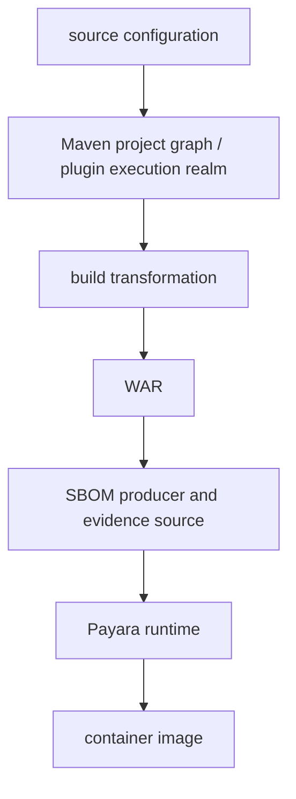

# S02 — Payara + mvnpm Supply Chain Trace Lab


This lab follows four different kinds of software through one build and into one running container:

- `commons-lang3`: an ordinary Maven application dependency that survives as a discrete JAR in the WAR.
- `lodash-es`: npm-origin software consumed as a Maven **plugin dependency**, transformed by esbuild into browser JavaScript.
- `jakarta.jakartaee-web-api`: a Maven `provided` dependency used to compile the application but deliberately omitted from the WAR.
- Payara, Jakarta runtime libraries, the JDK, and operating-system packages: software supplied by the final container image.

Rather than teaching Maven, mvnpm, Payara, Docker, or SBOM basics, the point is to see **what evidence exists at each stage, which dependency domain a component belongs to, what survives transformation, and what different inventory tools can legitimately know**.

The pattern throughout is:

**Why → Approach → Run → Observed output → Establish**

The exercise ends at the container-image boundary.

## Requirements

- JDK 21+
- Maven
- Docker for the container stage
- Syft and jq for the optional SBOM/image trace

---

## The scenario

The application is a single-page "info" app packaged as a WAR and deployed
to a Payara application server:

```text
InfoServlet          GET /api/info — uses commons-lang3
                     (StringUtils.defaultIfBlank, capitalize) to shape a
                     greeting and returns it as JSON via jakarta.json.

src/main/web/app.js  Browser code. Imports { escape, startCase } from
                     "lodash-es" and renders the servlet's JSON into the
                     page.

index.html           Loads the bundle esbuild produced from app.js.
```

`lodash-es` is **not** an application dependency. It is resolved from mvnpm (npm packages republished as Maven
artefacts) inside the esbuild-maven-plugin's execution realm, bundled into
`target/generated-web/assets/app.js`, and packaged into the WAR as static
content. The Jakarta APIs are `provided` — supplied at runtime by Payara.

At runtime the WAR deploys as `/trace` inside the `payara/server-web`
container on port 8080.

---

# 1. Start clean

A clean start ensures every artefact we inspect came from this build:

## Run

```command
rm -rf trace-output
mvn clean
```

## Establish

This removes generated Maven, frontend, WAR, and SBOM output from earlier runs. Source configuration remains unchanged.

---

# 2. Inspect the source declarations

Before asking Maven, Syft, or an SBOM producer what exists, we need the literal declarations the developer gave the build.

This scenario deliberately uses three different dependency paths:

```text
ordinary application dependency
    commons-lang3

provided application dependency
    jakarta.jakartaee-web-api

build-plugin dependency
    lodash-es
```

Those declarations do not have the same resolution or packaging semantics.

Inspect the relevant sections of `pom.xml` directly.

### commons-lang3

## Run

```command
grep -n -A5 -B2 'commons-lang3' pom.xml
```
```output
16-        <maven.compiler.release>21</maven.compiler.release>
17-        <jakartaee.version>11.0.0</jakartaee.version>
18:        <commons-lang3.version>3.18.0</commons-lang3.version>
19-        <lodash-es.version>4.17.21</lodash-es.version>
20-        <esbuild-maven-plugin.version>2.0.0</esbuild-maven-plugin.version>
21-    </properties>
22-
23-    <dependencies>
--
31-        <dependency>
32-            <groupId>org.apache.commons</groupId>
33:            <artifactId>commons-lang3</artifactId>
34:            <version>${commons-lang3.version}</version>
35-        </dependency>
36-    </dependencies>
37-
38-    <build>
39-        <finalName>${project.artifactId}-${project.version}</finalName>
```

### Jakarta EE Web API

## Run

```command
grep -n -A5 -B2 'jakarta.jakartaee-web-api' pom.xml
```
```output
24-        <dependency>
25-            <groupId>jakarta.platform</groupId>
26:            <artifactId>jakarta.jakartaee-web-api</artifactId>
27-            <version>${jakartaee.version}</version>
28-            <scope>provided</scope>
29-        </dependency>
30-
31-        <dependency>
```

### lodash-es

## Run

```command
grep -n -A8 -B4 'lodash-es' pom.xml
```
```output
15-        <project.build.sourceEncoding>UTF-8</project.build.sourceEncoding>
16-        <maven.compiler.release>21</maven.compiler.release>
17-        <jakartaee.version>11.0.0</jakartaee.version>
18-        <commons-lang3.version>3.18.0</commons-lang3.version>
19:        <lodash-es.version>4.17.21</lodash-es.version>
20-        <esbuild-maven-plugin.version>2.0.0</esbuild-maven-plugin.version>
21-    </properties>
22-
23-    <dependencies>
24-        <dependency>
25-            <groupId>jakarta.platform</groupId>
26-            <artifactId>jakarta.jakartaee-web-api</artifactId>
27-            <version>${jakartaee.version}</version>
--
67-            </configuration>
68-            <dependencies>
69-                <dependency>
70-                    <groupId>org.mvnpm</groupId>
71:                    <artifactId>lodash-es</artifactId>
72:                    <version>${lodash-es.version}</version>
73-                </dependency>
74-            </dependencies>
75-        </plugin>
76-
77-        <plugin>
78-            <groupId>org.apache.maven.plugins</groupId>
79-            <artifactId>maven-war-plugin</artifactId>
80-            <version>3.4.0</version>
```

## Establish

The source configuration asks Maven to treat the three tracked components differently:

```text
commons-lang3:3.18.0
    normal project dependency

jakarta.jakartaee-web-api:11.0.0
    project dependency
    Maven scope: provided

lodash-es:4.17.21
    dependency of esbuild-maven-plugin
    not a normal WAR project dependency
```

These are declarations. We have not yet proved how Maven resolves them or what reaches the finished artefact.

---

# 3. Build the WAR

The source configuration only describes intent. The interesting evidence appears after Maven resolves dependencies, constructs the plugin execution realm, runs esbuild, and packages the generated output into the WAR.

Use the project's normal build wrapper and then verify the generated browser assets and WAR directly.

## Run

```command
./scripts/build.sh
```

Then verify the outputs:

```command
find target/generated-web -maxdepth 2 -type f -print
ls -lh target/payara-mvnpm-trace-lab-1.0.0.war
```
```output
target/generated-web/assets/app.js.map
target/generated-web/assets/app.js
```

```text
-rw-r--r--@ 1 spoole  staff   638K 22 Aug 09:44 target/payara-mvnpm-trace-lab-1.0.0.war
```

## Establish

The normal build produced:

```text
esbuild output
    target/generated-web/assets/app.js
    target/generated-web/assets/app.js.map

deployable application
    target/payara-mvnpm-trace-lab-1.0.0.war
```

We still need to determine which dependency evidence belongs to the application graph and which belongs to the build itself.

---

# 4. Resolve the ordinary application dependency

`commons-lang3` is our control case. It is declared as an ordinary project dependency, so it should appear in Maven's normal project dependency graph.

Ask Maven's Dependency Plugin for the resolved project graph and filter it to `commons-lang3`.

## Run

```command
mvn dependency:tree \
  -Dincludes=org.apache.commons:commons-lang3
```
```output
[INFO] --- dependency:3.7.0:tree (default-cli) @ payara-mvnpm-trace-lab ---
[INFO] dev.noregressions.trace:payara-mvnpm-trace-lab:war:1.0.0
[INFO] \- org.apache.commons:commons-lang3:jar:3.18.0:compile
[INFO] ------------------------------------------------------------------------
[INFO] BUILD SUCCESS
```

## Establish

```text
pom.xml
    commons-lang3:3.18.0

        ↓ Maven project dependency resolution

project dependency graph
    commons-lang3:3.18.0
    scope: compile
```

Maven sees `commons-lang3:3.18.0` as normal application software.

---

# 5. Show that lodash-es is absent from the project dependency graph

`lodash-es` is declared under `esbuild-maven-plugin`, not under the project's ordinary `<dependencies>` section.

We want to prove that Maven's normal project dependency graph does not treat it like `commons-lang3`.

Run the same project dependency-tree query, filtered to the mvnpm coordinate.

## Run

```command
mvn dependency:tree \
  -Dincludes=org.mvnpm:lodash-es
```
```output
[INFO] --- dependency:3.7.0:tree (default-cli) @ payara-mvnpm-trace-lab ---
[INFO] ------------------------------------------------------------------------
[INFO] BUILD SUCCESS
```

No `lodash-es` dependency appears beneath the project.

## Establish

```text
pom.xml
    esbuild-maven-plugin
        └── org.mvnpm:lodash-es:4.17.21

        X not part of

Maven project dependency graph
```

A normal `dependency:tree` for the WAR does not contain `lodash-es`.

This does not mean the build did not use it. Maven maintains different dependency domains for the project being built and the plugins that perform the build.

---

# 6. Inspect what resolve-plugins reports

The project dependency graph does not contain `lodash-es`. The next question is whether Maven's plugin dependency reporting exposes it.

Ask the Maven Dependency Plugin to resolve the esbuild Maven plugin and its published dependency set.

## Run

```command
mvn dependency:resolve-plugins \
  -DincludeArtifactIds=esbuild-maven-plugin
```

## Observed output

Representative excerpt:

```output
[INFO] The following plugins have been resolved:
[INFO]    io.mvnpm:esbuild-maven-plugin:maven-plugin:2.0.0:runtime
[INFO]       io.mvnpm:esbuild-maven-plugin:jar:2.0.0
[INFO]       io.mvnpm:esbuild-java-plugin-sass:jar:2.1.1
[INFO]       io.mvnpm:esbuild-java:jar:2.1.1
[INFO]       org.jboss.logging:jboss-logging:jar:3.6.1.Final
[INFO]       org.mvnpm:esbuild:jar:0.25.10
[INFO]       io.mvnpm:importmap:jar:1.0.11
...
[INFO] BUILD SUCCESS
```

`org.mvnpm:lodash-es:4.17.21` was **not** listed.

## Establish

```text
project dependency tree
    lodash-es absent

resolve-plugins report
    esbuild-maven-plugin present
    published plugin dependencies present
    lodash-es absent

POM
    lodash-es explicitly added under this project's
    esbuild-maven-plugin <dependencies>
```

`resolve-plugins` is not sufficient evidence for this project-specific plugin dependency. We need to inspect the actual execution realm Maven constructs for the plugin.

---

# 7. Inspect the actual plugin execution realm

A project can add dependencies to a Maven plugin. Maven resolves those dependencies for the plugin's isolated execution realm rather than for the application's normal dependency graph.

That means build-time software can affect the bytes we ship while remaining absent from `dependency:tree`.

Run the `generate-resources` phase with Maven debug logging enabled and filter the plugin-realm construction to `lodash-es`.

## Run

```command
mvn -X generate-resources 2>&1 \
  | grep 'org.mvnpm:lodash-es'
```
```output
[DEBUG]    org.mvnpm:lodash-es:jar:4.17.21:runtime
[DEBUG]   Included: org.mvnpm:lodash-es:jar:4.17.21
```

## Establish

```text
project dependency graph
    lodash-es absent

resolve-plugins report
    lodash-es absent

actual esbuild plugin execution realm
    lodash-es:4.17.21 present
```

The build can therefore use `lodash-es` even though a normal application dependency tree never reports it.

This is the first important supply-chain distinction in the lab:

```text
application dependency graph
    !=
complete set of software that can influence the build
```

---

# 8. Inspect the generated browser bundle

Finding `lodash-es` in the plugin execution realm only proves that the package was available to esbuild. It does not prove that lodash code contributed to the application output.

We need evidence from the generated artefact.

The build produced `app.js` and `app.js.map`. The source map records source modules represented in the generated JavaScript.

## Run

```command
find target/generated-web -maxdepth 2 -type f -print
```
```output
target/generated-web/assets/app.js.map
target/generated-web/assets/app.js
```

## Establish

The esbuild execution produced browser-facing application code and a source map.

```text
plugin execution
        ↓ esbuild
target/generated-web/assets/app.js
target/generated-web/assets/app.js.map
```

We still need to prove that lodash contributed to those bytes.

---

# 9. Prove that lodash-es contributed to the generated bundle

The plugin execution realm tells us `lodash-es:4.17.21` was available. The source map lets us independently establish whether lodash modules contributed to the output.

Read the source map's `sources` array and filter it to lodash modules.

## Run

```command
jq -r '.sources[]' target/generated-web/assets/app.js.map \
  | grep 'lodash'
```
```output
../../../../node_modules/lodash-es/_freeGlobal.js
../../../../node_modules/lodash-es/_root.js
../../../../node_modules/lodash-es/_Symbol.js
../../../../node_modules/lodash-es/_getRawTag.js
../../../../node_modules/lodash-es/_objectToString.js
../../../../node_modules/lodash-es/_baseGetTag.js
../../../../node_modules/lodash-es/isObjectLike.js
../../../../node_modules/lodash-es/isSymbol.js
../../../../node_modules/lodash-es/_arrayMap.js
../../../../node_modules/lodash-es/isArray.js
../../../../node_modules/lodash-es/_baseToString.js
../../../../node_modules/lodash-es/toString.js
../../../../node_modules/lodash-es/_baseSlice.js
../../../../node_modules/lodash-es/_castSlice.js
../../../../node_modules/lodash-es/_hasUnicode.js
../../../../node_modules/lodash-es/_asciiToArray.js
../../../../node_modules/lodash-es/_unicodeToArray.js
../../../../node_modules/lodash-es/_stringToArray.js
../../../../node_modules/lodash-es/_createCaseFirst.js
../../../../node_modules/lodash-es/upperFirst.js
../../../../node_modules/lodash-es/_arrayReduce.js
../../../../node_modules/lodash-es/_basePropertyOf.js
../../../../node_modules/lodash-es/_deburrLetter.js
../../../../node_modules/lodash-es/deburr.js
../../../../node_modules/lodash-es/_asciiWords.js
../../../../node_modules/lodash-es/_hasUnicodeWord.js
../../../../node_modules/lodash-es/_unicodeWords.js
../../../../node_modules/lodash-es/words.js
../../../../node_modules/lodash-es/_createCompounder.js
../../../../node_modules/lodash-es/_escapeHtmlChar.js
../../../../node_modules/lodash-es/escape.js
../../../../node_modules/lodash-es/startCase.js
```

## Establish

```text
plugin execution evidence
    org.mvnpm:lodash-es:4.17.21

        ↓ esbuild

source-map evidence
    lodash-es modules contributed to app.js
```

The source-map paths establish the package identity `lodash-es`; the version comes from the plugin-execution evidence.

We have now proved that lodash did more than merely exist in Maven's build environment: its code contributed to the generated application JavaScript.

---

# 10. Scan the generated frontend as an artefact

Now deliberately throw away the Maven build context.

We know `lodash-es` contributed code. The question is whether an artefact scanner can recover the npm package identity from only the generated frontend output.

Give Syft only `target/generated-web`. It receives no POM, plugin realm, mvnpm coordinate, or original package tree.

## Run

```command
syft target/generated-web
```
```output
✔ Indexed file system
✔ Cataloged contents
   ├── ✔ Packages [0 packages]
   └── ✔ Executables [0 executables]

WARN no explicit name and version provided for directory source, deriving artifact ID from the given path (which is not ideal)

No packages discovered
```

## Establish

```text
build/plugin evidence
    lodash-es:4.17.21

source-map evidence
    lodash-es modules contributed code

artefact-only Syft scan
    0 packages
    lodash-es not identified
```

Rather than proving that lodash code is absent, this demonstrates:

```text
software contribution != package identifiability
```

---

# 11. Follow both dependency paths into the WAR

The generated browser bundle exists, but that does not yet prove it reached the deployable application.

At the same boundary we can compare the ordinary Java dependency with the transformed npm-origin dependency.

Inspect the finished WAR directly for the versioned `commons-lang3` JAR and generated browser assets.

## Run

```command
unzip -l target/payara-mvnpm-trace-lab-1.0.0.war \
  | grep -E 'WEB-INF/lib/commons-lang3|assets/app\.js'
```
```output
702952  07-06-2025 18:43   WEB-INF/lib/commons-lang3-3.18.0.jar
44987   08-22-2026 09:44   assets/app.js.map
8110    08-22-2026 09:44   assets/app.js
```

## Establish

Both paths reached the same deployable WAR:

```text
commons-lang3:3.18.0
        ↓
WEB-INF/lib/commons-lang3-3.18.0.jar
    package boundary and version survive

lodash-es:4.17.21
        ↓ esbuild
assets/app.js + assets/app.js.map
    contributed code survives
    npm package boundary does not
```

The WAR therefore contains third-party software from both ecosystems, but only one still looks like an ordinary package.

---

# 12. Scan the finished WAR

We have manually proved that the WAR contains both the conventional Java library and lodash-derived JavaScript.

Now ask an independent artefact scanner what package identities it can recover from the finished WAR alone.

Give Syft only the completed WAR.

## Run

```command
syft target/payara-mvnpm-trace-lab-1.0.0.war
```
```output
✔ Packages [2 packages]

NAME                     VERSION  TYPE
commons-lang3             3.18.0   java-archive
payara-mvnpm-trace-lab    1.0.0    java-archive
```

## Establish

```text
WAR physically contains
    commons-lang3 JAR
    lodash-derived JavaScript

Syft identifies
    commons-lang3:3.18.0
    payara-mvnpm-trace-lab:1.0.0

Syft does not identify
    lodash-es
```

The central artefact-level result is:

```text
code can be present in a deployable artefact
without the originating package remaining identifiable
```

---

# 13. Confirm what the WAR deliberately does not contain

The Jakarta EE Web API follows a third path.

It is a project dependency, but Maven scope `provided` tells the build that the runtime environment is expected to supply it. We should therefore find it in Maven's dependency model but not packaged into `WEB-INF/lib`.

First inspect the WAR library directory.

## Run

```command
unzip -l target/payara-mvnpm-trace-lab-1.0.0.war \
  | grep 'WEB-INF/lib/'
```
```output
0       08-22-2026 09:44   WEB-INF/lib/
702952  07-06-2025 18:43   WEB-INF/lib/commons-lang3-3.18.0.jar
```

No Jakarta EE API JAR is packaged.

Now ask Maven for the resolved Jakarta dependency.

## Run

```command
mvn dependency:tree \
  -Dincludes=jakarta.platform:jakarta.jakartaee-web-api
```
```output
[INFO] --- dependency:3.7.0:tree (default-cli) @ payara-mvnpm-trace-lab ---
[INFO] dev.noregressions.trace:payara-mvnpm-trace-lab:war:1.0.0
[INFO] \- jakarta.platform:jakarta.jakartaee-web-api:jar:11.0.0:provided
[INFO] ------------------------------------------------------------------------
[INFO] BUILD SUCCESS
```

## Establish

```text
Maven dependency model
    jakarta.jakartaee-web-api:11.0.0
    scope: provided

WAR
    jakarta.jakartaee-web-api absent
```

Combined, this establishes:

```text
jakarta.jakartaee-web-api:11.0.0
    resolved by Maven
    used for compilation
    deliberately omitted from the WAR
    expected to be supplied by the runtime
```

We now have three fully distinct dependency paths:

```text
commons-lang3
    project dependency
    -> packaged as a JAR

lodash-es
    plugin dependency
    -> transformed into browser code
    -> package identity not recovered from WAR

Jakarta EE API
    provided project dependency
    -> in Maven model
    -> absent from WAR
```

---

# 14. Generate the Maven-model CycloneDX SBOM

So far we have compared Maven resolution with physical artefact inspection.

Now we want to see what a formal SBOM generated from Maven's project model says about those same three tracked components.

Invoke the CycloneDX Maven Plugin directly and emit JSON.

## Run

```command
mvn org.cyclonedx:cyclonedx-maven-plugin:2.9.3:makeBom \
  -DoutputFormat=json
```
```output
[INFO] CycloneDX: Resolving Dependencies
[INFO] CycloneDX: Creating BOM version 1.6 with 27 component(s)
[INFO] CycloneDX: Writing and validating BOM (JSON): .../target/bom.json
[INFO]            attaching as payara-mvnpm-trace-lab-1.0.0-cyclonedx.json
[INFO] ------------------------------------------------------------------------
[INFO] BUILD SUCCESS
```

The plugin also emitted schema-keyword warnings during validation. They did not prevent BOM generation.

Now inspect the three tracked component identities.

## Run

```command
jq -r '.components[] | [.name, .version, (.scope // "-")] | @tsv' \
  target/bom.json \
  | grep -E 'commons-lang3|jakarta.jakartaee-web-api|lodash-es'
```
```output
jakarta.jakartaee-web-api    11.0.0    required
commons-lang3                3.18.0    required
```

`lodash-es` is absent.

## Establish

The Maven-generated CycloneDX SBOM contains:

```text
commons-lang3:3.18.0              present
jakarta.jakartaee-web-api:11.0.0  present
lodash-es:4.17.21                 absent
```

This is a model-derived inventory. It follows Maven's application dependency model, not a literal inventory of the files physically contained in the WAR.

---

# 15. Understand Maven `provided` versus CycloneDX `required`

The previous result looks surprising:

```text
Maven
    jakarta.jakartaee-web-api
    scope: provided

WAR
    component physically absent

CycloneDX Maven SBOM
    component scope: required
```

It would be easy to read `required` as meaning "physically included in this WAR." That is not what this result means.

Keep the scope models separate.

Maven's `provided` describes Maven classpath and packaging behaviour: the dependency is available for compilation but is expected to be supplied by the runtime.

CycloneDX's component scope is a different model. `required` means the component is required for the described system to operate; it is not a statement that the component's bytes are physically embedded in the WAR.

The CycloneDX Maven Plugin includes Maven `provided` dependencies by default and does not preserve Maven's `provided` label as a CycloneDX scope value.

## Establish

```text
Maven "provided"
    !=
CycloneDX "required"
    !=
physical presence in the WAR
```

The Maven-generated SBOM is therefore not evidence that `jakarta.jakartaee-web-api-11.0.0.jar` is inside the WAR.

This becomes important when we compare it with an SBOM generated from the physical artefact.

---

# 16. Generate an artefact-derived CycloneDX SBOM from the WAR

We now have one CycloneDX SBOM generated from Maven's dependency model.

To isolate the effect of **evidence source**, generate a second CycloneDX SBOM from the completed WAR itself.

The format stays the same:

```text
same application
same CycloneDX format

Maven model -> SBOM
WAR bytes   -> SBOM
```

Ask Syft to inspect the WAR and emit CycloneDX JSON.

## Run

```command
mkdir -p trace-output

syft target/payara-mvnpm-trace-lab-1.0.0.war \
  -o cyclonedx-json=trace-output/war-syft.cdx.json
```
```output
✔ Indexed file system
✔ Cataloged contents
   ├── ✔ Packages [2 packages]
   ├── ✔ File digests [1 files]
   └── ✔ Executables [0 executables]
```

Now inspect the exact tracked component names rather than grepping the complete JSON.

## Run

```command
jq -r '
  .components[]
  | select(
      .name == "commons-lang3" or
      .name == "jakarta.jakartaee-web-api" or
      .name == "lodash-es" or
      .name == "payara-mvnpm-trace-lab"
    )
  | [.name, .version, (.scope // "-")]
  | @tsv
' trace-output/war-syft.cdx.json
```
```output
commons-lang3            3.18.0    -
payara-mvnpm-trace-lab   1.0.0     -
```

## Establish

The WAR-derived CycloneDX inventory contains only the identities Syft can recover from the physical WAR:

```text
commons-lang3:3.18.0              present
payara-mvnpm-trace-lab:1.0.0      present
jakarta.jakartaee-web-api         absent
lodash-es                         absent
```

---

# 17. Compare the two CycloneDX SBOMs

This is the key SBOM comparison in the lab.

Both documents use CycloneDX. Both describe the same application. The difference is where their inventory evidence came from.

## Establish

```text
Maven-generated CycloneDX

    commons-lang3              3.18.0   required
    jakarta.jakartaee-web-api  11.0.0   required
    lodash-es                  absent


WAR-derived CycloneDX

    commons-lang3              3.18.0
    payara-mvnpm-trace-lab     1.0.0
    jakarta.jakartaee-web-api  absent
    lodash-es                  absent
```

The differences are meaningful:

```text
Maven model
    knows the application declares a provided Jakarta EE dependency
    does not include the project-specific esbuild plugin dependency

WAR inspection
    sees the packaged application and commons-lang3
    does not see the provided Jakarta API
    cannot recover lodash-es after bundling
```

Therefore:

```text
SBOM format does not determine inventory completeness.

Where and how the SBOM is generated matters.
```

A model-derived SBOM can include software that is required but not packaged in the artefact. An artefact-derived SBOM can identify what survives as package evidence but cannot necessarily reconstruct transformed build inputs.

---

# 18. Move the WAR into the Payara runtime

The WAR is not the complete runtime product.

The application deliberately omitted Jakarta runtime APIs, and Payara itself brings a much larger body of server, JDK, and operating-system software.

`run.sh` moves the WAR into a running Payara server in three steps:

1. If `target/payara-mvnpm-trace-lab-1.0.0.war` is missing it runs `mvn clean package` first, so the image is never built around a stale or absent WAR.
2. `docker build -t payara-mvnpm-trace-lab:local .` builds the project image from the `Dockerfile`, which copies the WAR into Payara's auto-deploy directory. This is also where the base-image digest below comes from.
3. It force-removes any container already named `payara-mvnpm-trace-lab`, then starts a new one detached with port `8080` published.

The container is deliberately named rather than anonymous, so a re-run replaces the previous one instead of failing on a port clash or leaving orphans behind.

Payara deploys the WAR asynchronously after the container starts, so the application context `/trace` becomes available a few seconds later. Follow the deployment with:

```command
docker logs -f payara-mvnpm-trace-lab
```

## Run

```command
./scripts/run.sh
```

## Observed output

The Docker build used:

```output
payara/server-web:7.2026.7
```

For this walkthrough, Docker resolved that base image to:

```text
payara/server-web:7.2026.7@sha256:989bde76edb44118bad9dba6d2d7ce93b7f0c0aab3577773f8d89a74257d90e7
```

The build copied the application WAR to:

```text
/opt/payara/deployments/trace.war
```

and named the local image:

```text
payara-mvnpm-trace-lab:local
```

## Establish

The WAR has crossed into a concrete Payara runtime image.

The base-image digest is build-time evidence for this walkthrough, not a value to assume stable for future runs of the mutable tag.

Starting the container does not by itself prove that Payara successfully deployed the application. We verify that next.

---

# 19. Verify the running application

We need runtime evidence, not merely image-construction evidence.

A successful request proves that Payara deployed the WAR and that code relying on both the packaged Java dependency and server-provided Jakarta functionality can execute.

Call the servlet endpoint.

## Run

```command
curl -sS 'http://localhost:8080/trace/api/info?name=runtime%20trace' | jq
```

## Observed output

```json
{
  "message": "Hello Runtime trace",
  "application": "payara-mvnpm-trace-lab",
  "javaLibrary": "commons-lang3",
  "server": "Payara"
}
```

## Establish

```text
WAR
    commons-lang3 packaged
    Jakarta EE API not packaged

        ↓ deployed to Payara

runtime
    servlet executes successfully
    commons-lang3 works
    Jakarta JSON-P works
```

The application is more than merely present in the image: Payara successfully deployed and executed it.

The runtime supplies Jakarta capability that was deliberately absent from the WAR.

---

# 20. Inspect the complete container image

The running product contains much more software than the WAR.

The final image adds Payara itself, concrete Jakarta runtime libraries, a JDK, Ubuntu packages, utilities, and other transitive runtime software.

This is the outermost software boundary in the exercise.

Give Syft the completed local container image.

## Run

```command
syft payara-mvnpm-trace-lab:local
```

## Observed output

Syft catalogued:

```output
589 packages
825 executables
5,424 file-metadata locations
```

Representative entries relevant to this trace included:

```text
commons-lang3                  3.18.0       java-archive
payara-mvnpm-trace-lab        1.0.0        java-archive
jakarta.json-api              2.1.0        java-archive
jakarta.servlet-api           6.1.0        java-archive
payara-api                    7.2026.7     java-archive
zulu21-jre                    21.0.11-3    deb
```

The image also contains a large set of Payara `7.2026.7` modules, Jakarta APIs and implementations, JDK packages, and Ubuntu packages.

Syft still did not identify `lodash-es` as a package.

## Establish

Crossing from WAR to container dramatically changes the visible software universe:

```text
WAR scan
    2 identifiable packages

container scan
    589 packages
    825 executables
```

At the container boundary:

```text
commons-lang3
    still identifiable

application WAR
    still identifiable

runtime-provided Jakarta software
    now identifiable as concrete runtime components

Payara
    visible

JDK and OS
    visible

lodash-es
    still not identifiable as a package
```

This also clarifies the earlier Maven `provided` result.

The Maven project declares the umbrella compile-time API:

```text
jakarta.jakartaee-web-api:11.0.0
```

The running container contains the concrete runtime libraries supplied by Payara, for example:

```text
jakarta.json-api:2.1.0
jakarta.servlet-api:6.1.0
```

Those are different evidence views of the runtime requirement.

The application artefact is therefore not the whole deployed software inventory:

```text
application SBOM != container/product SBOM
```

---

# 21. Stop the container

The container started in step 18 runs detached and keeps holding port `8080` after the walkthrough ends.

`stop.sh` force-removes the `payara-mvnpm-trace-lab` container. It is safe to run when nothing is running.

The `payara-mvnpm-trace-lab:local` image is left in place, because rebuilding it is the slowest part of the lab. Remove it explicitly if you want the disk space back:

```command
docker image rm payara-mvnpm-trace-lab:local
```

## Run

```command
./scripts/stop.sh
```

## Establish

Port `8080` is released and no scenario container remains from this walkthrough.

---

# What this lab establishes

Starting from three deliberately different dependency declarations, we followed them through Maven resolution, plugin execution, transformation, WAR packaging, two SBOM producers, runtime deployment, and the final container image.

The important findings are:

```text
1. Maven's normal project dependency graph does not describe every
   dependency that can influence a build.

2. A project-specific Maven plugin dependency can be absent from both
   dependency:tree and resolve-plugins while still being present in the
   actual plugin execution realm.

3. Finding software in a build environment is not proof that its code
   reached the product. Build-output evidence is needed.

4. lodash-es:4.17.21 contributed code to app.js, but after esbuild
   transformed it, Syft could no longer recover lodash-es as a package
   from either the generated frontend or the WAR.

5. software contribution != package identifiability

6. Maven `provided`, CycloneDX `required`, and physical presence in a WAR
   describe different things and must not be treated as interchangeable
   scope semantics.

7. Two CycloneDX SBOMs for the same application can legitimately contain
   different inventories because one is generated from the Maven model
   and the other from the physical WAR.

8. The container image introduces an additional software universe:
   Payara, concrete Jakarta runtime libraries, the JDK, operating-system
   packages, and other runtime software that does not exist in the WAR.
```

The complete evidence chain is:



The central lesson is the same as the first trace lab:

**Every inventory is an observation made from a particular evidence source at a particular point in the supply chain.**

Those observations should be compared, not assumed to be interchangeable.

---

# Replay in one pass

```command
./scripts/trace-mvnpm.sh
./scripts/image-trace.sh
```

`trace-mvnpm.sh` replays the core evidence sequence in one pass: `commons-lang3` in the project dependency tree, `lodash-es` absent from it, `lodash-es` present in the plugin execution realm, the generated browser assets, the lodash sources named in the source map, and the relevant WAR entries.

`image-trace.sh` builds the project image, prints its identity, and writes a Syft CycloneDX image SBOM to `trace-output/image.cdx.json`.

---

# Verify the lab still holds

```command
./scripts/proof-check.sh
```

`proof-check.sh` re-runs the lab and asserts that it still produces the outcomes this walkthrough describes. Use it after changing dependencies or tooling versions to find out whether the walkthrough text needs updating.

It takes `--skip-build`, `--skip-runtime`, `--skip-image` and `--quick` (equivalent to `--skip-runtime --skip-image`) when you only need part of the check. Run `./scripts/proof-check.sh --help` for the full list.
