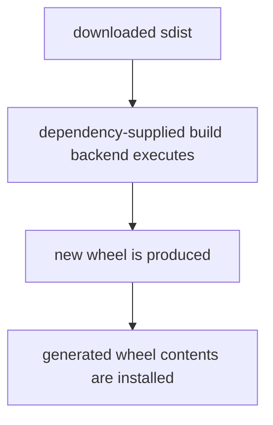

# S03 — Python PEP 517 Supply Chain Trace Lab

This lab follows a direct Python dependency into a transitive source distribution, through PEP 517 build execution, into the installed environment, and finally into runtime behaviour.

## What PEP 517 means in this lab

PEP 517 defines the standard interface between a Python **build frontend**, such as `pip`, and a package's **build backend**.

For a ready-made wheel, installation is mostly a matter of unpacking already-built files. An `sdist` is different: before it can be installed, `pip` may need to build a wheel from the source distribution. It reads the package's `[build-system]` configuration from `pyproject.toml`, loads the nominated backend, and calls build hooks such as `build_wheel()`.

Those hooks are executable Python code. They run as part of dependency installation and can generate code, resources, metadata, compiled extensions, or other files that are then placed into the wheel.

That makes PEP 517 an important supply-chain execution boundary:



In this lab, `tracehook-demo` is a **transitive** dependency and is available only as an sdist. Its own `pyproject.toml` nominates `tracehook_backend` as the build backend. When `pip` resolves the dependency, it executes that backend, which creates files that were not present in the original sdist. Those generated files then become part of the installed application and affect runtime behaviour.

The tracked components are:

- `reportkit==1.0.0` — the dependency explicitly named by the application.
- `tracehook-demo==1.0.0` — a transitive dependency discovered from wheel metadata.
- `tracehook_backend` — executable PEP 517 build code shipped in the transitive sdist.
- `build-hook.json` — content generated by that backend during wheel construction.

The pattern is:

**Why → Approach → Run → Observed output → Establish**

The central question is simple:

> Can code that was not present in a transitive dependency's source archive be created during `pip install` and then affect application runtime behaviour?

## Requirements

- Python 3.11+
- `curl`
- `tar`
- `unzip`
- `jq` optional
- Syft optional

The package fixtures are local, so the build does not need PyPI access.

---

## The scenario

The application is a small stdlib-only Python web service:

```text
src/app.py       ThreadingHTTPServer on port 8081. GET / prints a
                 banner; GET /trace returns reportkit.runtime_trace()
                 as JSON.

reportkit        The application's ONLY declared dependency (a wheel,
                 from the local python-repo/). Its entire body is one
                 function that delegates to tracehook_demo.trace_data().

tracehook-demo   reportkit's transitive dependency — the package this
                 lab traces. It arrives as an sdist containing exactly two
                 files: pyproject.toml and tracehook_backend.py. The
                 pyproject declares tracehook_backend as its own PEP 517
                 build backend, and that backend GENERATES the
                 tracehook_demo package (plus a provenance marker) while
                 pip builds the wheel during install.
```

So the package the application ultimately imports does not exist in any
checked-in source or distributed archive — it is manufactured on your
machine, by dependency-owned code, at `pip install` time. Both packages
install from the local `python-repo/`; no PyPI access is involved.

---

# 1. Start clean

A clean start ensures the virtual environment and pip evidence we inspect belong to this run:

## Run

```command
./scripts/clean.sh
```

```output
Cleaning S03 Python trace lab...
S03 clean.

Removed:
  .venv/
  trace-output/
  .runtime.pid
  .runtime.log
  Python cache files

Kept:
  requirements.txt
  src/
  python-sources/
  python-repo/
```

The exact stop message depends on whether the runtime was already running.

## Establish

The package fixtures remain, but the installed environment and previous execution evidence are gone.

---

# 2. Inspect the direct dependency declaration

Start with the dependency information visible in the application itself.

Read `requirements.txt`.

## Run

```command
cat requirements.txt
```

```output
reportkit==1.0.0
```

## Establish

The application explicitly declares one Python package:

- `reportkit==1.0.0`

There is no local declaration of `tracehook-demo`.

---

# 3. Inspect the direct package metadata

Python transitive dependencies are carried by package metadata, not necessarily by the application's requirements file.

Read the metadata inside the `reportkit` wheel.

## Run

```command
unzip -p python-repo/reportkit-1.0.0-py3-none-any.whl \
  reportkit-1.0.0.dist-info/METADATA
```

```output
Metadata-Version: 2.1
Name: reportkit
Version: 1.0.0
Summary: Direct dependency for the Python trace lab
Requires-Python: >=3.11
Requires-Dist: tracehook-demo==1.0.0
```

## Establish

The direct package introduces another package through:

- `Requires-Dist: tracehook-demo==1.0.0`

The dependency chain is therefore already larger than `requirements.txt` suggests.

---

# 4. Inspect the transitive distribution

How a Python package is distributed affects what pip must do before it can install it.

Inspect the transitive package archive.

## Run

```command
tar -tzf python-repo/tracehook_demo-1.0.0.tar.gz
```

```output
tracehook_demo-1.0.0/pyproject.toml
tracehook_demo-1.0.0/tracehook_backend.py
```

## Establish

`tracehook-demo==1.0.0` is supplied as a source distribution containing build configuration and build code.

It is not supplied as an install-ready wheel.

---

# 5. Prove the eventual runtime files are absent from the sdist

The lab's main transformation claim depends on showing that the files used later were not simply copied from the source archive.

Search the sdist for the importable package and generated marker.

## Run

```command
tar -tzf python-repo/tracehook_demo-1.0.0.tar.gz \
  | grep -E 'tracehook_demo/__init__.py|build-hook.json' || true
```

```output
```

There is no matching output.

## Establish

Neither of these files exists in the source distribution:

- `tracehook_demo/__init__.py`
- `tracehook_demo/build-hook.json`

If they later appear in the installed environment, some build-time transformation created them.

---

# 6. Inspect the PEP 517 backend declaration

An sdist can nominate dependency-supplied Python code to act as its build backend.

Read `pyproject.toml` from inside the sdist.

## Run

```command
tar -xOzf python-repo/tracehook_demo-1.0.0.tar.gz \
  tracehook_demo-1.0.0/pyproject.toml
```

## Observed output

```toml
[build-system]
requires = []
build-backend = "tracehook_backend"
backend-path = ["."]

[project]
name = "tracehook-demo"
version = "1.0.0"
description = "Benign PEP 517 build-hook trace package"
requires-python = ">=3.11"
```

## Establish

The package nominates code shipped inside its own sdist as the PEP 517 build backend:

- `build-backend = "tracehook_backend"`
- `backend-path = ["."]`

---

# 7. Inspect what the build backend can generate

We need to connect later generated files to the code pip is allowed to execute during wheel construction.

Inspect the relevant part of `tracehook_backend.py`.

## Run

```command
tar -xOzf python-repo/tracehook_demo-1.0.0.tar.gz \
  tracehook_demo-1.0.0/tracehook_backend.py \
  | grep -nE 'def build_wheel|__init__\.py|build-hook\.json'
```

## Observed output

Representative lines show `build_wheel()` constructing both:

- `tracehook_demo/__init__.py`
- `tracehook_demo/build-hook.json`

## Establish

The backend contains executable code that manufactures the package files before creating the wheel.

---

# 8. Install the application dependencies

Now we move from source inspection to actual package-manager behaviour.

Create a fresh virtual environment and let pip resolve and install from the local package repository.

The build disables pip's wheel cache so the transitive sdist is rebuilt for the trace.

## Run

```command
./scripts/build.sh
```

## Observed output

The build completed successfully. The relevant pip evidence was:

```output
Processing ./python-repo/tracehook_demo-1.0.0.tar.gz (from reportkit==1.0.0->-r requirements.txt (line 1))
  Getting requirements to build wheel: started
  Getting requirements to build wheel: finished with status 'done'
Building wheels for collected packages: tracehook-demo
  Building wheel for tracehook-demo (pyproject.toml): started
  Building wheel for tracehook-demo (pyproject.toml): finished with status 'done'
  Created wheel for tracehook-demo: filename=tracehook_demo-1.0.0-py3-none-any.whl ...
Successfully built tracehook-demo
Installing collected packages: tracehook-demo, reportkit
Successfully installed reportkit-1.0.0 tracehook-demo-1.0.0
```

We omit the generated wheel size and digest: they are run-specific, not the invariant being traced.

## Establish

The actual resolver/build path is:

```text
requirements.txt
    ↓
reportkit==1.0.0
    ↓
tracehook_demo-1.0.0.tar.gz
    ↓
PEP 517 wheel build
    ↓
tracehook_demo-1.0.0-py3-none-any.whl
    ↓
installation
```

The transitive sdist caused Python build code to execute during dependency installation.

---

# 9. Compare declaration with installed package set

We want to make the difference between local declaration and resolved environment explicit.

Ask pip for the installed package set.

## Run

```command
.venv/bin/python -m pip freeze
```

```output
reportkit==1.0.0
tracehook-demo==1.0.0
```

## Establish

Compare the two views:

- `requirements.txt`:
  - `reportkit==1.0.0`
- installed environment:
  - `reportkit==1.0.0`
  - `tracehook-demo==1.0.0`

A requirements file is not necessarily a complete inventory of the resulting environment.

---

# 10. Find the generated package content

The importable package and marker were absent from the sdist. We now need to prove they exist after the PEP 517 build/install path.

Search `site-packages` inside the virtual environment.

## Run

```command
find .venv \
  \( -path '*site-packages/tracehook_demo/__init__.py' \
     -o -path '*site-packages/tracehook_demo/build-hook.json' \) \
  -print
```

```output
.venv/lib/python3.14/site-packages/tracehook_demo/__init__.py
.venv/lib/python3.14/site-packages/tracehook_demo/build-hook.json
```

The Python minor version in this path is environment-specific.

## Establish

The files that were absent from the source distribution now exist in the installed environment:

```text
sdist
    tracehook_demo/__init__.py      absent
    build-hook.json                 absent

        ↓ PEP 517 build_wheel()

installed environment
    tracehook_demo/__init__.py      present
    build-hook.json                 present
```

---

# 11. Inspect the generated marker

We want direct evidence tying the installed content back to the PEP 517 backend that generated it.

Read `build-hook.json` from the installed environment.

## Run

```command
find .venv \
  -path '*site-packages/tracehook_demo/build-hook.json' \
  -exec cat {} \;
```

## Observed output

```json
{
  "event": "pep517-build-backend-executed",
  "generatedBy": "tracehook_backend.build_wheel",
  "message": "This content did not exist in the source distribution. The PEP 517 backend generated it while building the wheel.",
  "package": "tracehook-demo",
  "version": "1.0.0"
}
```

## Establish

The generated file identifies both the package and the build function responsible for creating it.

---

# 12. Prove the generated package affects Python runtime behaviour

Presence on disk is not the same as runtime use.

Import the direct package and call its trace function.

## Run

```command
.venv/bin/python -c 'import reportkit; print(reportkit.runtime_trace())'
```

```output
{'event': 'pep517-build-backend-executed', 'package': 'tracehook-demo', 'version': '1.0.0', 'generatedBy': 'tracehook_backend.build_wheel', 'message': 'This content did not exist in the source distribution. The PEP 517 backend generated it while building the wheel.'}
```

## Establish

The runtime import path is:

```text
reportkit
    ↓
tracehook_demo
    ↓
generated runtime data
```

Runtime behaviour now depends on package content that did not exist in the original transitive source archive.

---

# 13. Run the application

The final boundary is the actual application, not a one-off Python import.

Start the local HTTP application from the traced virtual environment.

S03 uses port `8081` by default so it can coexist with S02's Payara service on `8080`.

## Run

```command
./scripts/run.sh
```

```output
Runtime started as PID 68583
Open:  http://localhost:8081/
Trace: http://localhost:8081/trace
```

The PID is run-specific.

## Establish

The application is running from the same environment produced by the traced pip install.

The run script also verifies that it is seeing the S03 trace response, rather than accepting an unrelated HTTP service already bound to the port.

---

# 14. Request the generated trace at runtime

This closes the chain from dependency declaration to observable application behaviour.

Call the local endpoint.

## Run

```command
curl -sS http://localhost:8081/trace | jq
```

## Observed output

```json
{
  "event": "pep517-build-backend-executed",
  "generatedBy": "tracehook_backend.build_wheel",
  "message": "This content did not exist in the source distribution. The PEP 517 backend generated it while building the wheel.",
  "package": "tracehook-demo",
  "version": "1.0.0"
}
```

## Establish

The complete observed path is:

```text
requirements.txt
        ↓
reportkit==1.0.0
        ↓
Requires-Dist: tracehook-demo==1.0.0
        ↓
tracehook-demo sdist
        ↓
tracehook_backend.build_wheel()
        ↓
generated Python package + build-hook.json
        ↓
generated wheel
        ↓
site-packages
        ↓
reportkit imports tracehook_demo
        ↓
application runtime
        ↓
GET /trace
```

---

# 15. Stop the runtime

The application started in step 13 is detached and keeps holding port `8081` after the walkthrough ends.

Leaving it running also blocks a later re-run: `run.sh` verifies the port before starting and refuses when something is already serving there.

`stop.sh` reads `.runtime.pid`, terminates that process, and removes the file. It is safe to run when nothing is running.

`clean.sh` calls it too, so a later `./scripts/clean.sh` also releases the port. This only works while `.runtime.pid` exists. If you delete the file before stopping the process, neither script can find the runtime and you have to stop it by hand:

```command
lsof -nP -iTCP:8081 -sTCP:LISTEN
```

## Run

```command
./scripts/stop.sh
```

```output
Stopped runtime PID 68583
```

## Establish

Port `8081` is released and no scenario process remains from this walkthrough.

---

# What this lab establishes

## 1. Declaration is not the resolved dependency set

The application declares only:

- `reportkit==1.0.0`

but the resulting environment also contains:

- `tracehook-demo==1.0.0`

The transitive relationship lives in package metadata.

## 2. Distribution type changes the install path

`reportkit` arrives as a wheel. `tracehook-demo` arrives as an sdist.

That means installing the latter requires a build step before installation.

## 3. Installing an sdist can execute dependency-supplied code

The sdist's `pyproject.toml` nominates `tracehook_backend` as its PEP 517 build backend, and pip executes that backend while creating the wheel.

## 4. Build execution can manufacture software that was absent from source

Neither of these files existed in the sdist:

- `tracehook_demo/__init__.py`
- `tracehook_demo/build-hook.json`

Both existed after wheel construction and installation.

So:

**Source distribution contents ≠ installed package contents.**

## 5. Generated build output can affect application runtime behaviour

The application reaches the generated package through:

```text
application
    ↓
reportkit
    ↓
tracehook_demo
```

and exposes backend-generated data through `/trace`.

## 6. Python supply-chain evidence exists at several different boundaries

This one application can be observed through:

```text
requirements.txt
        ↓
wheel metadata
        ↓
resolver output
        ↓
PEP 517 build execution
        ↓
generated wheel
        ↓
site-packages
        ↓
runtime import
        ↓
HTTP behaviour
```

No single one of those views explains the complete provenance chain by itself.

The central lesson is:

**A Python dependency installation is not necessarily just file extraction. Resolving an sdist can cause dependency-supplied build code to execute, create new package content, install that content, and ultimately change application runtime behaviour.**

---

# Package fixtures

`python-repo/` contains the exact package artefacts consumed by pip:

```text
reportkit-1.0.0-py3-none-any.whl
tracehook_demo-1.0.0.tar.gz
```

`python-sources/` contains their auditable fixture source.

If you deliberately change those fixtures, rebuild the local package repository:

```command
python3 scripts/rebuild-python-repo.py
```

---

# Replay in one pass

```command
./scripts/trace-python.sh
```

`trace-python.sh` replays the core evidence sequence in one pass: the direct declaration in `requirements.txt`, the `reportkit` wheel metadata that names the transitive dependency, the contents of the `tracehook_demo` sdist, its PEP 517 backend declaration, the generated `build-hook.json` marker in `site-packages`, and the installed package metadata.

It reads the virtual environment created by `./scripts/build.sh`, so run the build first.

---

# Verify the lab still holds

```command
./scripts/proof-check.sh
```

`proof-check.sh` re-runs the lab and asserts that it still produces the outcomes this walkthrough describes. Use it after changing dependencies or tooling versions to find out whether the walkthrough text needs updating.
