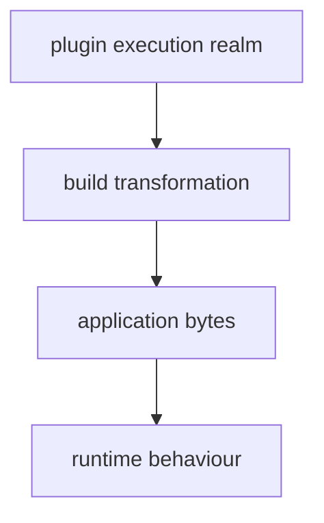
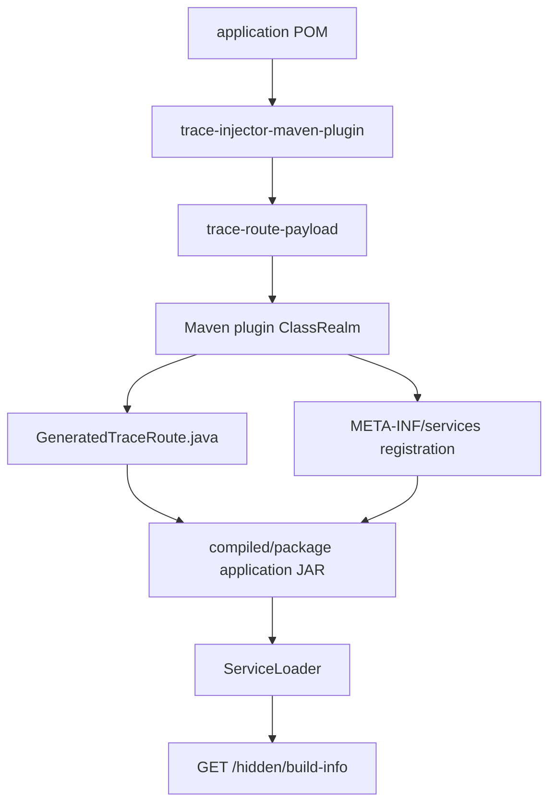

# S04 — Maven Plugin Hidden-Content Supply Chain Trace Lab

This lab follows runtime capability that enters a Java application through **Maven plugin execution**, rather than through the application's normal dependency graph.

The tracked components are:

- `trace-injector-maven-plugin` — executable build-time software attached to the Maven lifecycle.
- `trace-route-payload` — a transitive dependency of that plugin.
- `/hidden/build-info` — a route definition carried by the plugin dependency.
- `GeneratedTraceRoute` — Java source generated during the build.
- `META-INF/services/...TraceRoute` — generated ServiceLoader metadata that activates the class at runtime.

The pattern is:

**Why → Approach → Run → Observed output → Establish**

## What Maven plugins mean in this lab

Maven has more than one dependency domain.

`mvn dependency:tree` describes the application's **project dependencies**. Maven plugins are different: they are executable build-time software. Maven resolves a plugin and its own dependencies, creates a **plugin classloader realm**, and invokes the plugin goal during the build lifecycle.

So these are different evidence views:

**application dependency graph ≠ plugin dependency graph ≠ plugin execution realm**

A plugin can then transform the application by generating source, resources, metadata or other content. Once that content has been compiled and packaged, the final JAR may contain the resulting behaviour without retaining an obvious package boundary for the build-time software that introduced it.

The important trace boundary is therefore:



In this lab, the application POM declares `trace-injector-maven-plugin`, but does **not** declare `trace-route-payload` as an application dependency: the payload is a transitive dependency of the plugin. During `generate-sources` the plugin reads it and generates Java code plus ServiceLoader metadata, which Maven compiles and packages as ordinary application content.

## Requirements

- JDK 21+
- Maven 3.9+
- `curl`
- `unzip`
- `jq` optional
- Syft optional

The first build needs normal Maven Central access for Maven's own plugin/API dependencies.

---

## The scenario

The application is two source files and — deliberately — zero declared
dependencies:

- `TraceServer.java` — A JDK-built-in (`jdk.httpserver`) web server on port
  8082. Serves `/` and `/health` itself, then asks ServiceLoader for
  `TraceRoute` implementations and mounts every one it finds.
- `TraceRoute.java` — The extension interface: `path()` + `responseJson()`.
  The checked-in source contains NO implementations.

The application POM attaches
`trace-injector-maven-plugin` (built from `tooling/` into the
scenario-local `.maven-repo/`). That plugin has its own transitive
dependency, `trace-route-payload`, whose resource file defines a route.
During `generate-sources` the plugin reads the payload and writes
`GeneratedTraceRoute.java` plus the ServiceLoader registration — which
Maven then compiles and packages as ordinary application code.

The result: a runtime endpoint (`/hidden/build-info`) that no application
source file defines and no application dependency supplies.

---

# 1. Start clean

Separate source-controlled content from previous generated build output.

Most of the evidence in this lab is generated during the build. If output from an earlier run survives, we cannot tell which build produced the bytes we are inspecting.

`clean.sh` removes the generated state of all three modules in this scenario:

- `target/` — the application build output
- `tooling/plugin/target/` — the Maven plugin build output
- `tooling/payload/target/` — the plugin's transitive payload build output
- `trace-output/` — captured trace evidence

It also stops any runtime left over from a previous walkthrough and removes the `.runtime.pid` and `.runtime.log` files that track it.

It deliberately **keeps** `.maven-repo/`, the scenario-local Maven repository. That directory is where the plugin and payload fixtures are installed, and every Maven command in this lab passes `-Dmaven.repo.local="$PWD/.maven-repo"` to read from it. Keeping it means we never resolve these fixtures from a public repository, and it keeps the lab runnable offline.

If you want a cold dependency-resolution run, remove it as well:

```command
rm -rf .maven-repo
```

## Run

```command
./scripts/clean.sh
```

```output
S04 clean.

Kept the scenario-local Maven repository:
  .maven-repo/

Remove it too if you want a cold Maven dependency-resolution run:
  rm -rf .maven-repo
```

## Establish

The application can be rebuilt from the checked-in scenario sources and local Maven fixture repository.

---

# 2. Build the plugin, the payload, and the application

Everything after this step inspects build output, so we have to produce it first.

This scenario has two build domains, and they must be built in order:

```text
tooling/payload   the data the plugin reads
tooling/plugin    the plugin that reads it and generates application code
        ↓  installed into .maven-repo/
application       declares the plugin, declares no dependencies
```

The application build cannot resolve the plugin until it exists in a repository, which is why the tooling is built and installed first.

`build.sh` runs both phases against the scenario-local repository rather than the developer's `~/.m2`:

1. `mvn -Dmaven.repo.local="$PWD/.maven-repo" -f tooling/pom.xml install` builds `trace-route-payload` and `trace-injector-maven-plugin` and installs both into `.maven-repo/`. The plugin declares the payload as an ordinary `compile` dependency: that is what makes it *transitive plugin* software later.
2. `mvn -Dmaven.repo.local="$PWD/.maven-repo" clean package` builds the application, which resolves the plugin from `.maven-repo/`, executes its `inject-route` goal during `generate-sources`, and packages the generated output.

Using a scenario-local repository matters for the trace: it guarantees the plugin being executed is the fixture in `tooling/`, not a same-named artefact cached from somewhere else.

## Run

```command
./scripts/build.sh
```

## Observed output

The tooling phase installs both fixtures:

```output
== Build the Maven plugin and its transitive payload ==

[INFO] Reactor Summary for s04-build-tooling 1.0.0:
[INFO]
[INFO] s04-build-tooling .................................. SUCCESS [  0.100 s]
[INFO] S04 Trace Route Payload ............................ SUCCESS [  0.647 s]
[INFO] S04 Trace Injector Maven Plugin .................... SUCCESS [  0.649 s]
[INFO] BUILD SUCCESS
```

The application phase shows the plugin executing inside the normal lifecycle:

```text
== Build the application ==

[INFO] --------< dev.noregressions.trace:maven-plugin-hidden-content >---------
[INFO] Building S04 Maven Plugin Hidden Content Trace Lab 1.0.0

[INFO] --- trace-injector:1.0.0:inject-route (inject-build-route) @ maven-plugin-hidden-content ---
[INFO] Injected TraceRoute source from plugin payload: trace-route-payload
[INFO] Injected route: /hidden/build-info

[INFO] --- resources:3.4.0:resources (default-resources) @ maven-plugin-hidden-content ---
[INFO] Copying 2 resources from target/generated-resources/trace-injector to target/classes

[INFO] --- compiler:3.14.1:compile (default-compile) @ maven-plugin-hidden-content ---
[INFO] Compiling 3 source files with javac [debug release 21] to target/classes

[INFO] --- jar:3.4.2:jar (default-jar) @ maven-plugin-hidden-content ---
[INFO] Building jar: target/maven-plugin-hidden-content-1.0.0.jar
[INFO] BUILD SUCCESS
```

Note the compiler line: javac compiled three source files, but only two exist in `src/`. The plugin generated the third moments earlier.

## Establish

Both fixtures are installed in `.maven-repo/`, and `target/maven-plugin-hidden-content-1.0.0.jar` exists.

The build log already shows the transformation this lab investigates:

```text
trace-route-payload (plugin dependency)
        ↓
inject-route goal, generate-sources phase
        ↓
generated Java + ServiceLoader metadata
        ↓
compiled and packaged as ordinary application content
```

---

# 3. Look at the application dependency graph

Start with the Maven view most developers use when asking "what does this application depend on?"

## Run

```command
mvn \
  -Dmaven.repo.local="$PWD/.maven-repo" \
  dependency:tree
```

```output
[INFO] --------< dev.noregressions.trace:maven-plugin-hidden-content >---------
[INFO] Building S04 Maven Plugin Hidden Content Trace Lab 1.0.0
[INFO]   from pom.xml
[INFO] --------------------------------[ jar ]---------------------------------

[INFO] --- dependency:3.7.0:tree (default-cli) @ maven-plugin-hidden-content ---
[INFO] dev.noregressions.trace:maven-plugin-hidden-content:jar:1.0.0

[INFO] BUILD SUCCESS
```

## Establish

The application's normal Maven dependency graph is empty:

```text
maven-plugin-hidden-content:1.0.0
```

Neither `trace-injector-maven-plugin` nor `trace-route-payload` appears as an application dependency.

---

# 4. Ask Maven about plugin dependencies instead

The project dependency graph is not Maven's only dependency domain.

## Run

```command
mvn \
  -Dmaven.repo.local="$PWD/.maven-repo" \
  dependency:resolve-plugins \
  -DincludeArtifactIds=trace-injector-maven-plugin
```

```output
[INFO] The following plugins have been resolved:

[INFO]    dev.noregressions.trace:trace-injector-maven-plugin:maven-plugin:1.0.0:runtime
[INFO]       dev.noregressions.trace:trace-injector-maven-plugin:jar:1.0.0
[INFO]       dev.noregressions.trace:trace-route-payload:jar:1.0.0

[INFO] BUILD SUCCESS
```

## Establish

When we ask Maven about the **plugin** dependency domain, a second graph appears:

```text
trace-injector-maven-plugin:1.0.0
        ↓
trace-route-payload:1.0.0
```

Maven knows about the payload, but not as an application dependency.

---

# 5. Inspect the actual plugin execution realm

Resolver output tells us what Maven can resolve. Debug output tells us what Maven actually loads to execute the plugin.

## Run

```command
mvn \
  -Dmaven.repo.local="$PWD/.maven-repo" \
  -X generate-sources 2>&1 \
  | grep -E 'trace-injector|trace-route-payload'
```

```output
[DEBUG] Goal:          dev.noregressions.trace:trace-injector-maven-plugin:1.0.0:inject-route (inject-build-route)
[INFO] --- trace-injector:1.0.0:inject-route (inject-build-route) @ maven-plugin-hidden-content ---
[DEBUG] dev.noregressions.trace:trace-injector-maven-plugin:jar:1.0.0
[DEBUG]    dev.noregressions.trace:trace-route-payload:jar:1.0.0:compile
[DEBUG] Created new class realm plugin>dev.noregressions.trace:trace-injector-maven-plugin:1.0.0
[DEBUG] Populating class realm plugin>dev.noregressions.trace:trace-injector-maven-plugin:1.0.0
[DEBUG]   Included: dev.noregressions.trace:trace-injector-maven-plugin:jar:1.0.0
[DEBUG]   Included: dev.noregressions.trace:trace-route-payload:jar:1.0.0
[DEBUG] Loading mojo dev.noregressions.trace:trace-injector-maven-plugin:1.0.0:inject-route from plugin realm ClassRealm[plugin>dev.noregressions.trace:trace-injector-maven-plugin:1.0.0, ...]
```

## Establish

`trace-route-payload` is actually present in the Maven **plugin ClassRealm** used to execute `inject-route`, not merely resolvable.

- application dependency graph — no payload
- plugin execution realm — plugin + payload

---

# 6. Inspect the generated Java source

Now follow the build-time input across the transformation boundary into application source.

## Run

```command
find target/generated-sources -type f -print
```

```output
target/generated-sources/trace-injector/dev/noregressions/trace/s04/generated/GeneratedTraceRoute.java
```

Then:

```command
sed -n '1,220p' \
  target/generated-sources/trace-injector/dev/noregressions/trace/s04/generated/GeneratedTraceRoute.java
```

## Observed output

```java
package dev.noregressions.trace.s04.generated;

import dev.noregressions.trace.s04.TraceRoute;

public final class GeneratedTraceRoute implements TraceRoute {

    @Override
    public String path() {
        return "/hidden/build-info";
    }

    @Override
    public String responseJson() {
        return "{\n  \"message\": \"This runtime endpoint came from a transitive Maven plugin dependency.\",\n  \"origin\": \"trace-route-payload\",\n  \"introducedBy\": \"trace-injector-maven-plugin\",\n  \"route\": \"/hidden/build-info\"\n}\n";
    }
}
```

## Establish

The runtime route now exists as Java application source even though it did not originate in the application's checked-in Java source.

Its provenance is explicit:

- `origin` = `trace-route-payload`
- `introducedBy` = `trace-injector-maven-plugin`
- `route` = `/hidden/build-info`

---

# 7. Inspect the generated activation metadata

Generating a class does not make it execute. We need to see how the build connects it to the application.

## Run

```command
find target/generated-resources -type f -print
```

```output
target/generated-resources/trace-injector/META-INF/trace-lab/plugin-injection.properties
target/generated-resources/trace-injector/META-INF/services/dev.noregressions.trace.s04.TraceRoute
```

Inspect the ServiceLoader registration:

```command
cat \
  target/generated-resources/trace-injector/META-INF/services/dev.noregressions.trace.s04.TraceRoute
```

```output
dev.noregressions.trace.s04.generated.GeneratedTraceRoute
```

Inspect the provenance marker:

```command
cat \
  target/generated-resources/trace-injector/META-INF/trace-lab/plugin-injection.properties
```

```output
plugin=trace-injector-maven-plugin
payload=trace-route-payload
route=/hidden/build-info
```

## Establish

The build generated both:

- `GeneratedTraceRoute.class`
- `META-INF/services/...TraceRoute`

The ServiceLoader descriptor makes the generated implementation discoverable by the source-defined application at runtime.

---

# 8. Prove the generated content entered the final JAR

Generated build directories are intermediate evidence. The deployable JAR is the shipped artefact.

## Run

```command
unzip -l target/maven-plugin-hidden-content-1.0.0.jar \
  | grep -E 'GeneratedTraceRoute|META-INF/services|plugin-injection'
```

```output
        0  08-22-2026 11:58   META-INF/services/
       88  08-22-2026 11:58   META-INF/trace-lab/plugin-injection.properties
       58  08-22-2026 11:58   META-INF/services/dev.noregressions.trace.s04.TraceRoute
      803  08-22-2026 11:58   dev/noregressions/trace/s04/generated/GeneratedTraceRoute.class
```

## Establish

The generated implementation, activation metadata and provenance marker are all bytes in the final application JAR.

---

# 9. Inspect the shipped bytecode

Generated Java source may be deleted after the build. The final JAR still has to carry the behaviour.

## Run

```command
javap \
  -classpath target/maven-plugin-hidden-content-1.0.0.jar \
  -c -p \
  dev.noregressions.trace.s04.generated.GeneratedTraceRoute
```

```output
Compiled from "GeneratedTraceRoute.java"

public final class dev.noregressions.trace.s04.generated.GeneratedTraceRoute implements dev.noregressions.trace.s04.TraceRoute {

  public java.lang.String path();
    Code:
       0: ldc           #7                  // String /hidden/build-info
       2: areturn

  public java.lang.String responseJson();
    Code:
       0: ldc           #9                  // String {\n  \"message\": \"This runtime endpoint came from a transitive Maven plugin dependency.\",\n  \"origin\": \"trace-route-payload\",\n  \"introducedBy\": \"trace-injector-maven-plugin\",\n  \"route\": \"/hidden/build-info\"\n}\n
       2: areturn
}
```

## Establish

The final application bytecode contains:

- `/hidden/build-info`
- `trace-route-payload`
- `trace-injector-maven-plugin`

The runtime behaviour survived the transformation even though the build-time package boundary did not.

---

# 10. Scan the final JAR with Syft

Now compare physical runtime capability with a package scanner's inventory.

## Run

```command
syft target/maven-plugin-hidden-content-1.0.0.jar
```

```output
✔ Indexed file system   target/maven-plugin-hidden-content-1.0.0.jar
✔ Cataloged contents

   ├── ✔ Packages      [1 packages]
   ├── ✔ File digests  [1 files]
   ├── ✔ Executables   [0 executables]

NAME                         VERSION  TYPE
maven-plugin-hidden-content  1.0.0    java-archive
```

## Establish

Syft sees the application archive, but does not identify either of the build-time components responsible for the generated behaviour:

- `trace-injector-maven-plugin` — not identified
- `trace-route-payload` — not identified

The bytes are present. Syft does not recover their build provenance as package identity.

---

# 11. Generate a Maven-model CycloneDX SBOM

Compare the scanner view with an SBOM generated from Maven's project dependency model.

## Run

```command
mvn \
  -Dmaven.repo.local="$PWD/.maven-repo" \
  org.cyclonedx:cyclonedx-maven-plugin:2.9.3:makeBom \
  -DoutputFormat=json
```

```output
[INFO] CycloneDX: Resolving Dependencies
[INFO] CycloneDX: Creating BOM version 1.6 with 0 component(s)
[INFO] CycloneDX: Writing and validating BOM (JSON): .../target/bom.json
[INFO] BUILD SUCCESS
```

Focused check:

```command
jq -r '.components[]? | [.name, .version] | @tsv' target/bom.json \
  | grep -E 'trace-injector|trace-route-payload|maven-plugin-hidden-content' || true
```

```output
```

No matching output.

## Establish

The Maven-model CycloneDX SBOM contains **zero dependency components**. It does not identify the build plugin or its transitive payload.

At this point the evidence views are:

- Maven dependency tree — no plugin or payload
- CycloneDX Maven SBOM — no plugin or payload
- Maven plugin resolution — plugin + payload
- Maven execution realm — plugin + payload
- final JAR — generated runtime behaviour present
- Syft JAR scan — application archive only

---

# 12. Run the application

The final test is whether the generated, packaged bytes actually change runtime capability.

`run.sh` starts the packaged JAR (not a recompiled classpath), so the runtime evidence comes from the same artefact Syft scanned in step 10.

Three details of the script matter when reading the output:

- It serves on port `8082` by default, chosen so it can coexist with S02 on `8080` and S03 on `8081`. Override with `PORT=8084 ./scripts/run.sh`.
- It starts the JVM detached and records the process id in `.runtime.pid`, with output captured to `.runtime.log`. The JVM needs `--add-modules jdk.httpserver`, which the script supplies.
- It then polls `/health` for up to 30 seconds and only reports success once that endpoint identifies itself as this application. This is why the reported PID is trustworthy evidence: the script refuses to start if the port is already serving HTTP, so we cannot accidentally interrogate an unrelated service.

## Run

```command
./scripts/run.sh
```

```output
Runtime started as PID 69945
Open:   http://localhost:8082/
Health: http://localhost:8082/health
```

## Establish

The application starts successfully from the final JAR on port `8082`.

The PID is an observation from this run, not an invariant.

---

# 13. Verify the source-defined application endpoint

This is the control endpoint: behaviour deliberately present in the checked-in application source.

## Run

```command
curl -sS http://localhost:8082/health | jq
```

## Observed output

```json
{
  "application": "maven-plugin-hidden-content",
  "status": "UP"
}
```

## Establish

The source-defined application is running normally.

---

# 14. Request the build-supplied endpoint

This closes the chain from plugin dependency to runtime behaviour.

## Run

```command
curl -sS http://localhost:8082/hidden/build-info | jq
```

## Observed output

```json
{
  "message": "This runtime endpoint came from a transitive Maven plugin dependency.",
  "origin": "trace-route-payload",
  "introducedBy": "trace-injector-maven-plugin",
  "route": "/hidden/build-info"
}
```

## Establish

The endpoint exists at runtime and explicitly ties itself back to:

```text
trace-route-payload
        ↓
trace-injector-maven-plugin
        ↓
generated Java + ServiceLoader metadata
        ↓
application JAR
        ↓
/hidden/build-info
```

---

# 15. Stop the runtime

The runtime started in step 12 is detached and will keep holding port `8082` after the walkthrough ends.

Leaving it running also blocks a later re-run: `run.sh` deliberately refuses to start when the port is already serving HTTP.

`stop.sh` reads `.runtime.pid`, terminates that process, and removes the file. It is safe to run when nothing is running.

`clean.sh` calls it too, so a later `./scripts/clean.sh` also releases the port.

## Run

```command
./scripts/stop.sh
```

```output
Stopped runtime PID 69945
```

## Establish

Port `8082` is released and no scenario process remains from this walkthrough.

---

# What this lab establishes

1. **Maven has multiple dependency domains.** An empty application dependency tree does not mean no third-party software participates in producing the application.

2. **Maven plugins are executable supply-chain inputs.** The plugin and its transitive dependencies are loaded into a separate plugin ClassRealm and execute during the build.

3. **A transitive plugin dependency can influence shipped behaviour without becoming an application dependency.** `trace-route-payload` supplied data used to create runtime code, but never appeared in `mvn dependency:tree`.

4. **Build transformations can destroy obvious package identity.** The plugin and payload become generated Java bytecode and ServiceLoader metadata in the application JAR.

5. **Presence and provenance are different questions.** `javap` proves the behaviour is physically present. Syft identifies the application archive but does not recover the plugin or payload that caused those bytes to exist.

6. **A normal dependency-derived SBOM can omit causally important build software.** The CycloneDX Maven plugin produced zero dependency components even though two external build components participated in producing the JAR.

7. **The correct evidence depends on the question.** Project graph, plugin graph, plugin realm, generated source, packaged bytes, scanner output, SBOM and runtime each reveal different parts of the same supply-chain event.

The complete evidence chain is:



---

# Replay in one pass

```command
./scripts/trace-plugin.sh
```

`trace-plugin.sh` replays the core evidence sequence in one pass: the (empty) application dependency tree, the plugin declaration in `pom.xml`, the payload declaration in the plugin's own POM, the route definition carried by the payload, the generated application source and resources, and the relevant entries in the final JAR.

It needs the build output, so run `./scripts/build.sh` first.

---

# Verify the lab still holds

```command
./scripts/proof-check.sh
```

`proof-check.sh` re-runs the lab and asserts that the demonstrated invariants still hold, failing non-zero if a required claim no longer does. It uses an isolated runtime port (`18084` by default) and runs the Syft and `jq` checks when those tools are installed.
