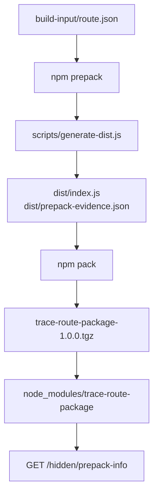

# S05 — Node npm `prepack` Supply Chain Trace Lab

This lab follows a Node package from source, through an npm lifecycle hook, into a packed tarball, into `node_modules`, and finally into runtime behaviour.

The pattern is:

**Why → Approach → Run → Observed output → Establish**

## What `prepack` means in this lab

npm packages can execute lifecycle scripts while a distributable package is being created.

`trace-route-package` declares:

```json
"scripts": {
  "prepack": "node scripts/generate-dist.js"
}
```

Its runtime entry point is:

```json
"main": "dist/index.js"
```

but `dist/` is generated by the lifecycle script. The package also declares:

```json
"files": [
  "dist"
]
```

so the tarball contains the generated runtime files while excluding the generator and its build input.

That creates an important supply-chain execution boundary:

```text
package source
        ↓
package-owned lifecycle code executes
        ↓
generated distribution files
        ↓
packed npm artefact
```

The packed package is therefore not simply a copy of the source tree.

In this lab the complete chain is:



## Requirements

- Node.js 20+
- npm
- `curl`
- `tar`
- Syft for the scanner comparison
- `jq` for the walkthrough formatting

No external npm packages are required.

---

## The scenario

The application is a stdlib-only Node web service with one dependency:

```text
src/server.js          node:http server on port 8083. Serves /health
                       itself, then mounts whatever route its dependency
                       exports: require('trace-route-package') gives it a
                       { path, response } pair.

trace-route-package    The dependency this lab traces. Its
                       checked-in source (packages/trace-route-package/)
                       contains NO runtime code at all: just package.json,
                       a build-input/route.json data file, and
                       scripts/generate-dist.js. The package.json declares
                       a prepack lifecycle script, and "files" publishes
                       only dist/ — a directory that does not exist in
                       source.
```

When `npm pack` runs, the prepack script generates `dist/index.js` (and a
provenance marker) from the build input; only that generated output goes
into the tarball. The application installs the package from a locally
packed tarball in `npm-repo/` with install scripts disabled — so the code
the server mounts was manufactured entirely at packaging time, by
package-owned code.

---

# 1. Start clean

We need to distinguish checked-in package inputs from files created by the npm lifecycle.

The central claim of this lab is that `dist/` does not exist in the package source and is created during packing. That claim is only checkable from a known-clean starting state.

`clean.sh` removes every piece of generated and installed state:

- `node_modules/` — installed dependency tree
- `package-lock.json` — resolution result, regenerated by the build
- `npm-repo/` — locally packed tarballs
- `trace-output/` — captured npm logs and SBOMs
- `packages/trace-route-package/dist/` — the prepack output we are investigating
- `.runtime.pid`, `.runtime.log` — runtime tracking state

It also stops any runtime left over from a previous walkthrough before deleting those files.

Unlike the other scenarios in this workshop, this one deliberately does **not** preserve `package-lock.json`. The lockfile is a build product in this lab rather than evidence: the application depends on a tarball this scenario packs itself, so a lockfile from an earlier run would pin a tarball we are about to replace.

Everything under `packages/trace-route-package/` other than `dist/` is checked-in source and remains.

## Run

```command
./scripts/clean.sh
```

```output
S05 clean.

Removed generated/installed state; kept application and package source.
```

## Establish

The scenario has an explicit clean state in which the package's generated `dist/` directory is absent.

The automated proof-check verifies this directly before packing.

---

# 2. Pack and install the package

The first execution boundary is `npm pack`: we want to see whether package-owned code executes before the tarball is assembled.

`build.sh` performs the two steps separately so you can observe each execution boundary on its own. It also makes two deliberate choices that shape the evidence.

**Pack the package into a local repository:**

```command
npm pack --foreground-scripts --pack-destination ../../npm-repo
```

`--foreground-scripts` is the reason we can see anything at all. Without it npm buffers lifecycle-script output, and the `prepack` execution we are trying to observe would run silently. npm writes the tarball to `npm-repo/` so the application installs from a local file rather than a registry, keeping the trace offline and reproducible.

**Install the application's dependencies from that tarball:**

```command
npm install --ignore-scripts
```

`--ignore-scripts` is the important control in this lab. npm can execute package code at *install* time as well as at *pack* time. If we allowed install-time scripts to run, we could not tell which lifecycle produced the generated files. Disabling them makes `prepack`, which already ran in the package author's own working copy, the only script execution in the whole trace. Everything we find in `node_modules` afterwards therefore arrived inside the tarball.

The build keeps both logs under `trace-output/` (`npm-pack.log` and `npm-install.log`) so the evidence survives the walkthrough.

`build.sh` starts by removing `node_modules/`, `package-lock.json`, `npm-repo/`, `trace-output/` and the package's `dist/` directory — re-establishing step 1's clean state, so it is safe to re-run at any point.

## Run

```command
./scripts/build.sh
```

```output
== Pack trace-route-package ==

npm notice run trace-route-package@1.0.0 prepack
npm notice run node scripts/generate-dist.js

generated dist/index.js for /hidden/prepack-info
generated dist/prepack-evidence.json

npm notice
npm notice 📦  trace-route-package@1.0.0
npm notice Tarball Contents
npm notice 435B dist/index.js
npm notice 334B dist/prepack-evidence.json
npm notice 300B package.json
npm notice Tarball Details
npm notice name: trace-route-package
npm notice version: 1.0.0
npm notice filename: trace-route-package-1.0.0.tgz
npm notice package size: 525 B
npm notice unpacked size: 1.1 kB
npm notice shasum: 480d3319ffb7d64dd91cf5065d588c971075f6b0
npm notice integrity: sha512-SbqxnntqZlzVp[...]51seeyFTJ3cig==
npm notice total files: 3
npm notice

trace-route-package-1.0.0.tgz

== Install application dependencies from the packed tarball ==

added 1 package in 167ms

== Installed dependency tree ==

node-prepack-trace-lab@1.0.0 .../scenarios/S05-node-prepack
└── trace-route-package@1.0.0
```

## Establish

`npm pack` did more than archive existing files. It first executed:

```text
trace-route-package@1.0.0 prepack
        ↓
node scripts/generate-dist.js
```

That execution created:

- `dist/index.js`
- `dist/prepack-evidence.json`

and those generated files immediately became tarball content.

The exact tarball size, shasum and integrity digest are observations from this walkthrough, not invariants of the scenario.

---

# 3. Inspect the package source after packing

After the lifecycle has run, the source workspace contains both original inputs and generated output.

## Run

```command
find packages/trace-route-package -maxdepth 3 -type f -print | sort
```

```output
packages/trace-route-package/.DS_Store
packages/trace-route-package/build-input/route.json
packages/trace-route-package/dist/index.js
packages/trace-route-package/dist/prepack-evidence.json
packages/trace-route-package/package.json
packages/trace-route-package/scripts/generate-dist.js
```

## Establish

After `prepack`, three classes of evidence coexist in the package workspace:

- original build input — `build-input/route.json`
- executable build logic — `scripts/generate-dist.js`
- generated distribution output — `dist/index.js`, `dist/prepack-evidence.json`

`.DS_Store` is incidental local filesystem metadata and is not part of the scenario.

---

# 4. Inspect the packed npm artefact

The distributable tarball is a different evidence view from the package source workspace.

## Run

```command
tar -tzf npm-repo/trace-route-package-1.0.0.tgz
```

```output
package/dist/index.js
package/package.json
package/dist/prepack-evidence.json
```

## Establish

The tarball contains the generated runtime output, but not:

- `scripts/generate-dist.js`
- `build-input/route.json`

The publication boundary has therefore preserved the **result** of the lifecycle execution while removing the generator and its original input.

---

# 5. Inspect provenance retained in the tarball

Although the actual generator and input are absent, this lab deliberately writes a provenance marker into the generated output so we can trace the transformation.

## Run

```command
tar -xOzf npm-repo/trace-route-package-1.0.0.tgz \
  package/dist/prepack-evidence.json | jq
```

## Observed output

```json
{
  "event": "npm-prepack-generated",
  "package": "trace-route-package",
  "version": "1.0.0",
  "generatedBy": "npm lifecycle prepack -> scripts/generate-dist.js",
  "message": "This runtime route was generated by an npm prepack lifecycle script.",
  "origin": "trace-route-package build input",
  "route": "/hidden/prepack-info"
}
```

## Establish

The distributed artefact retains an explicit statement that its runtime content was generated by:

```text
npm lifecycle prepack
        ↓
scripts/generate-dist.js
```

Without that marker, the tarball would preserve the generated result but say little about how it was produced.

---

# 6. Inspect the installed package

Installation creates another evidence boundary. We want to see what survives into `node_modules`.

## Run

```command
find node_modules/trace-route-package -maxdepth 3 -type f -print | sort
```

```output
node_modules/trace-route-package/dist/index.js
node_modules/trace-route-package/dist/prepack-evidence.json
node_modules/trace-route-package/package.json
```

## Establish

The installed package mirrors the packed artefact. It contains generated runtime code, generated provenance metadata and package metadata, but not the generator or original build input.

---

# 7. Inspect the installed provenance marker

## Run

```command
cat node_modules/trace-route-package/dist/prepack-evidence.json | jq
```

## Observed output

```json
{
  "event": "npm-prepack-generated",
  "package": "trace-route-package",
  "version": "1.0.0",
  "generatedBy": "npm lifecycle prepack -> scripts/generate-dist.js",
  "message": "This runtime route was generated by an npm prepack lifecycle script.",
  "origin": "trace-route-package build input",
  "route": "/hidden/prepack-info"
}
```

## Establish

The generated provenance marker survives unchanged from tarball to installed package.

---

# 8. Ask npm for the installed dependency view

## Run

```command
npm ls --all
```

```output
node-prepack-trace-lab@1.0.0 .../scenarios/S05-node-prepack
└── trace-route-package@1.0.0
```

## Establish

npm identifies the dependency relationship, but package identity alone does not explain how the package's runtime files were produced.

---

# 9. Generate npm's CycloneDX SBOM

## Run

```command
npm sbom --sbom-format cyclonedx > trace-output/npm-sbom.json
```

Then:

```command
jq -r '.components[]? | [.name, .version] | @tsv' trace-output/npm-sbom.json \
  | grep -E 'node-prepack-trace-lab|trace-route-package' || true
```

```output
trace-route-package	1.0.0
```

## Establish

npm's CycloneDX SBOM identifies `trace-route-package@1.0.0`, but that component identity does not describe:

```text
prepack
    ↓
generate-dist.js
    ↓
dist/index.js
```

The SBOM answers **what package is present**. It does not, in this view, answer **how the package's shipped runtime bytes were produced**.

---

# 10. Scan only the installed package directory with Syft

## Run

```command
syft node_modules/trace-route-package
```

```output
✔ Indexed file system  node_modules/trace-route-package
✔ Cataloged contents

   ├── ✔ Packages      [0 packages]
   └── ✔ Executables   [0 executables]

WARN no explicit name and version

No packages discovered
```

## Establish

When given only the isolated installed package directory, Syft did not identify an npm package in this walkthrough.

---

# 11. Give Syft the whole application context

## Run

```command
syft dir:.
```

```output
✔ Indexed file system  .
✔ Cataloged contents

   ├── ✔ Packages       [2 packages]
   ├── ✔ Executables    [0 executables]
   ├── ✔ File digests   [1 files]
   └── ✔ File metadata  [1 locations]

NAME                     VERSION  TYPE
node-prepack-trace-lab   1.0.0    npm
trace-route-package      1.0.0    npm
```

## Establish

With the surrounding project context, Syft recovers both npm package identities.

- isolated `node_modules` package → 0 packages
- whole project → 2 npm packages

Neither package inventory view, by itself, exposes the `prepack` transformation that generated the runtime code.

---

# 12. Run the application

Static inspection has shown the generated files exist in the installed package. The remaining question is whether they change what the application can do.

`run.sh` starts `src/server.js` against the `node_modules` tree produced in step 2, so the runtime loads exactly the package we packed and installed.

Three details of the script matter when reading the output:

- It serves on port `8083` by default, chosen so it can coexist with S02 on `8080`, S03 on `8081` and S04 on `8082`. Override with `PORT=8085 ./scripts/run.sh`.
- It starts Node detached and records the process id in `.runtime.pid`, with output captured to `.runtime.log`.
- It then polls `/health` for up to 30 seconds and only reports success once that endpoint identifies itself as this application. It also refuses to start if the port is already serving HTTP, so we cannot accidentally interrogate an unrelated service.

## Run

```command
./scripts/run.sh
```

```output
Runtime started as PID 71203
Open:   http://localhost:8083/
Health: http://localhost:8083/health
Trace:  http://localhost:8083/hidden/prepack-info
```

## Establish

The application starts successfully with the packed-and-installed dependency on port `8083`.

The PID is an observation from this run, not an invariant.

---

# 13. Request the lifecycle-generated endpoint

## Run

```command
curl -sS http://localhost:8083/hidden/prepack-info | jq
```

## Observed output

```json
{
  "event": "npm-prepack-generated",
  "package": "trace-route-package",
  "version": "1.0.0",
  "generatedBy": "npm lifecycle prepack -> scripts/generate-dist.js",
  "message": "This runtime route was generated by an npm prepack lifecycle script.",
  "origin": "trace-route-package build input",
  "route": "/hidden/prepack-info"
}
```

## Establish

The generated package content does more than sit on disk: it changes runtime behaviour.

---

# 14. Verify the source-defined control endpoint

## Run

```command
curl -sS http://localhost:8083/health | jq
```

## Observed output

```json
{
  "application": "node-prepack-trace-lab",
  "status": "UP"
}
```

## Establish

Both forms of behaviour coexist in the running process:

- `/health` — source-defined application behaviour
- `/hidden/prepack-info` — dependency behaviour generated during npm prepack

---

# 15. Stop the runtime

The runtime started in step 12 is detached and keeps holding port `8083` after the walkthrough ends.

Leaving it running also blocks a later re-run: `run.sh` refuses to start when the port is already serving HTTP.

`stop.sh` reads `.runtime.pid`, terminates that process, and removes the file. It is safe to run when nothing is running.

`clean.sh` removes the same PID and log files, so a later clean leaves no stale tracking state behind.

## Run

```command
./scripts/stop.sh
```

```output
Stopped runtime PID 71203
```

## Establish

Port `8083` is released and no scenario process remains from this walkthrough.

---

# What this lab establishes

1. **npm package creation can execute package-owned code before the distributable artefact is assembled.**

2. **The packed npm artefact can contain runtime files produced by that execution.**

3. **Publication rules can retain generated output while dropping the mechanism that produced it.**

4. **Package identity and build provenance are different evidence.** npm and Syft can identify `trace-route-package@1.0.0` in suitable context, but that identity does not explain how its runtime bytes came into existence.

5. **Scanner results depend on evidence context.** Syft found no package when scanning the isolated installed directory, but identified both npm packages when scanning the whole project.

6. **A dependency-derived SBOM can correctly identify the package and still omit its build transformation history.**

7. **Generated package content can directly affect runtime behaviour.** `/hidden/prepack-info` is served from content generated by the package lifecycle.

The complete evidence chain is:

```text
package build input
        ↓
package-owned prepack script
        ↓
generated runtime files
        ↓
npm tarball
        ↓
installed node_modules package
        ↓
runtime endpoint
```

The evidence views are:

- package source → input + generator + generated output after prepack
- tarball → generated output, no generator/input
- installed package → generated output, no generator/input
- npm dependency tree → package identity + relationship
- npm CycloneDX SBOM → package identity
- Syft isolated package → no package identified in this walkthrough
- Syft whole project → both npm package identities
- runtime → generated behaviour executes

---

# Verify the lab still holds

```command
./scripts/proof-check.sh
```

`proof-check.sh` starts from the clean state, verifies `dist/` is absent before packing, exercises `prepack`, checks the tarball and installed package, validates the npm and Syft evidence views, and runs the application on isolated port `18085`. If Syft is not installed, it skips the Syft checks with a warning.
