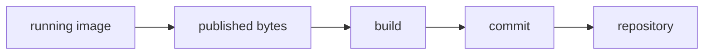

# S07 — Reverse Provenance / S01

## Objective

Take S01's finished artefact and walk the chain *backwards*: from a running
image to the source that produced it. The baseline cannot make the walk. Then
record provenance one layer at a time until it can, and be honest at each step
about whether you have produced a *claim* or a *proof*.



## What you need

This lab reuses [S01](../S01-spring-node/LESSON.md)'s Spring Boot service and
Docker image rather than building a new application, so S01 needs to be
buildable — but there is no new app to learn. On top of S01's own toolchain
(Maven, JDK 21, Node, Docker) the provenance layers add **`syft`** for the
SBOM and **`cosign`** for signing and attestation, plus a throwaway local
registry so the image has a real content digest to key everything on.

**The scripts never modify S01.** They build a throwaway copy under `work/`,
so you can run this as many times as you like and your S01 lab is untouched.
Commit ids and digests differ on every run, which means the values printed
below and in `evidence/` are illustrative rather than fixed.

---

# Tooling observed

```text
docker 29.4.3   maven 3.9.11   java 21
syft 1.29.1     cosign v3.1.3  git-commit-id-maven-plugin 9.0.1
local registry: registry:2 at localhost:5000
```

The registry is a throwaway container. It matters because a content **digest**
only exists once an image is pushed, and cosign stores signatures and
attestations in the registry beside the image they cover. Commit ids and
digests below will differ on your run.

---

# 1. The baseline: a finished image that cannot name its origin

## Run

```command
./scripts/build-baseline.sh
```

This builds S01 exactly as it ships (`Dockerfile` copies the service JAR into
`eclipse-temurin:21-jre-jammy`) and then reverse-audits the result.

## Observe

```text
-- Which commit produced this? (git.properties in the JAR) --
   MISSING — the JAR names no commit
-- Which repo/commit built this image? (OCI labels) --
   {"org.opencontainers.image.version":"22.04"}
   (only the base image's inherited label; nothing of ours)
-- What is inside? (an SBOM travelling with the image) --
   NONE
-- Can we prove the image is what we think? (a signature) --
   NONE — only a mutable tag names it
```

## Establish

The single label present, `22.04`, came from the Ubuntu base image, not from
us. The artefact is honest work and completely anonymous: nothing in it points
at a commit, a repository, an inventory, or a way to prove the bytes. This is
where ordinary "just build and ship" stops. Everything that follows is a
choice to record something the build would otherwise throw away.

---

# 2. Add provenance, one layer at a time

## Run

```command
./scripts/add-provenance.sh
```

The rest of this trace walks its four layers.

## Layer 1 — the commit, inside the JAR

The `git-commit-id-maven-plugin` (snippet in `provenance/git-plugin-snippet.xml`)
writes `git.properties` into the fat JAR at build time. Now the artefact
carries its own origin:

```text
git.branch=master
git.build.time=2026-08-25T09:16:04Z
git.commit.id.abbrev=9d82b4d
git.remote.origin.url=https://github.com/herodevs/kcdc2026workshop.git
```

The commit travels *inside* the bytes, so it survives being copied into the
image, pushed to a registry, and pulled somewhere else. It is a **claim**,
though: anyone can build a JAR asserting any commit. It is worth having and it
is not proof.

## Layer 2 — OCI labels, on the image

`provenance/Dockerfile.provenance` takes the commit, source URL and build time
as build args and stamps them into standard
[OCI image labels](https://github.com/opencontainers/image-spec/blob/main/annotations.md):

```json
{
    "org.opencontainers.image.created": "2026-08-25T09:16:09Z",
    "org.opencontainers.image.revision": "9d82b4d94d90df9201c920b4ac11acc2891a41d8",
    "org.opencontainers.image.source": "https://github.com/herodevs/kcdc2026workshop.git",
    "org.opencontainers.image.version": "1.0.0"
}
```

`docker image inspect` recovers them without unpacking the JAR. Here the label
carries the full commit SHA while this run's `git.properties` recorded the
abbreviated id (the plugin's property selection decides which; both resolve to
the same commit). Same kind of claim as layer 1, and no more trustworthy: an
unsigned label is as forgeable as an unsigned properties file. What it buys is
placement, in a spot tools already look, not proof.

## Layer 3 — an SBOM, keyed to the digest

Push the image and it gets a content digest. `syft` builds a CycloneDX
inventory of that exact digest:

```text
Image digest: sha256:905a374614f3d7a42b67b4ebe21b200ea021efab0990d932fc0107ac43660311
SBOM components: 5040
```

Five thousand components, because the scan sees the JVM application
dependencies *and* every OS package in the base image. Our tracked components are all in
there (`evidence/sbom-excerpt.json`): `jackson-databind 2.19.4`, both
`commons-codec` versions from S01's shading leg, `normalizer 1.0.0`, and
`spring-boot 3.5.12`, the same EOL framework Part 4 flagged, now itemised in
the inventory. The SBOM answers "what is inside", but on its own it is a file
sitting next to the image, with nothing tying one to the other.

## Layer 4 — a signed attestation

This is the rung that changes the kind of evidence. `cosign` signs the image
**by digest** and attests the SBOM as a predicate bound to that digest:

```command
cosign sign   --key cosign.key <digest>
cosign attest --key cosign.key --type cyclonedx --predicate sbom.json <digest>
```

Now hand someone only the **public** key. They can check the image is exactly
what was signed, and pull back the SBOM that was attested to it:

```text
Verification for localhost:5000/checkout-service@sha256:905a374614f3d7a42b67b4ebe21b200ea021efab0990d932fc0107ac43660311 --
  - The cosign claims were validated
  - Existence of the claims in the transparency log was verified offline
  - The signatures were verified against the specified public key

signature:   VERIFIED
attestation: VERIFIED (the SBOM travels bound to the digest)
```

Layers 1–3 were claims you take on trust. Layer 4 is the first one an outsider
can **verify** against a key they hold, without trusting your build at all.

---

# 3. The reverse audit, second time

Run the walk again against the provenance image, and every link that broke at
the baseline now holds:

```text
running image → digest            content-addressed, verified by signature
digest        → inventory         attested SBOM, pulled back by digest
image         → commit            OCI revision label (full SHA)
JAR           → commit            embedded git.properties (survives repackaging)
commit        → repository        OCI source label
```

The discipline this teaches is the workshop's Part 5 conclusion in miniature:
**control what comes in, verify the bytes you receive, and preserve evidence of
how they were produced.** S01 shipped with none of that recorded. Four small,
standard additions (a Maven plugin, four `LABEL`s, a syft call, two cosign
calls) turned an anonymous image into one that can prove where it came from.

---

# What this proves

```text
"just build and ship" records nothing you can trace back
provenance is a ladder: unsigned claims (embedded + labelled) < inventory < signed attestation
only the top rung is verifiable by someone who does not trust your build
```

Worth saying plainly: most pipelines never climb past the unsigned rungs. An
embedded commit id and an OCI label are the same trust tier — both are claims
anyone able to build an image could fake, differing only in how easily a tool
finds them. They are genuinely useful for debugging and worth nothing against
an adversary.

# What this does NOT prove

That any single layer is enough. An embedded commit id with no signature is a
sticky note that says "trust me". The value arrives at layer 4, and only for a
verifier who has the right public key through some channel you still have to
secure. In production that channel is a keyless flow (Fulcio/Rekor, tied to a
CI identity) rather than the local key pair used here; the mechanics are the
same, the key management is the hard part this lab does not solve.

---

# Run

```command
./scripts/build-baseline.sh    # build S01, then fail to trace it home
./scripts/add-provenance.sh    # git → OCI labels → SBOM → attestation
./scripts/proof-check.sh
```
