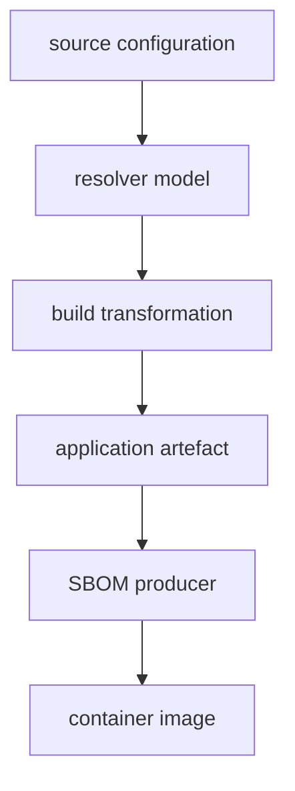

# About This Workshop

This manual documents the Software Supply Chain Trace Lab: an empirical study of software component identifiability across build and deployment boundaries.

## Core Problem

Declaring a dependency initiates a sequence of transformations: resolution, compilation, shading, bundling, packaging, and containerization. At the final deployment stage, security scanners inspect the artifact to determine its composition.

Every scenario in this workshop tracks specific declared components across build and packaging boundaries to evaluate a specific technical question:

```text
is it still identifiable here?
```

During build transformations, executable code often persists in the target artifact while the associated provenance and package metadata are removed or obscured.

## Technical Context

Software inventories (SBOMs), dependency trees, static scanner reports, and container analyses provide distinct observations of application composition. Each representation is an **observation generated at a specific supply-chain boundary using a specific evidence source**.



These representations frequently diverge due to transformations applied during the build lifecycle:

```text
software presence  !=  software identifiability
```

Build transformations can preserve executable logic while eliminating the metadata required for component identification. Analyzing an application at only one boundary produces an incomplete inventory.

## Methodology

- **Production Build Tooling:** All builds execute directly against production tools without mocks or stubs: Maven, npm, Vite, esbuild, Maven Shade Plugin, Spring Boot, PEP 517 backends, npm lifecycle hooks, and Docker.
- **Traced Components:** Each scenario isolates specific tracked components across five to six lifecycle boundaries to evaluate evidence retention.
- **Empirical Evidence:** Every step provides explicit CLI commands and verifiable terminal output documenting what the step establishes.
- **Controlled Differential Testing:** Scenarios apply isolated changes (such as stripping Maven metadata while preserving bytecode) to measure the exact effect on scanner detection.

## Structure

- **Scenarios (S01–S05):** Build pipelines demonstrating component obscurity across distinct mechanisms: bytecode relocation, Maven plugin execution realms, PEP 517 build backends, npm lifecycle hooks, frontend bundlers, and mvnpm registry translation in a Jakarta EE WAR (S02).
- **Scenarios (S07, S08):** Reverse provenance from a finished image, and a second SBOM generator that records what *built* an artefact rather than only what ships in it. Every scenario is on the core route.
- **Investigations (T01–T10):** Tool evaluations (Snyk, Docker Scout, Trivy, Grype, pip-audit, OWASP Dependency-Check, npm audit, GuardDog, and a three-scanner head-to-head) measuring detection capability against the scenario artifacts.
- **Investigation (T10):** One real vulnerability record read end to end across four public APIs, as the worked example behind Part 3.

Each scenario and investigation is documented in a standalone `LESSON.md` containing requirements, reproduction commands, and annotated walkthroughs.

## Trace Format

### Scenario Walkthroughs

Scenario walkthroughs evaluate component survival across build stages using a five-beat structure:

```text
Why                Technical question addressed by the step
Approach           Operational mechanism and command rationale
Run                Execution command
Observed output    Verifiable stdout/stderr output
Establish          Technical conclusions and limitations of the evidence
```

### Investigations

Investigations evaluate scanner behavior against known ground truth using four sections:

```text
Question       Capability evaluated by the probe
Expectation    Predicted outcome based on ground truth
Observed       Tool output
Verdict        Detection outcome and underlying boundary limitation
```

Each investigation concludes with a scorecard summarizing tracked-component detection across boundaries. Note that vulnerability database updates may alter exact vulnerability counts over time, but component identification behavior remains consistent.

## Technical Objectives

1. Identify the boundary at which an inventory was generated.
2. Determine what evidence was available to the generator at that boundary.
3. Identify components and transformations invisible to that evidence source.
4. Select the specific evidence sources (build logs, plugin ClassRealms, lockfiles, archives) required to recover missing inventory items.

## Scope

The exercises focus on boundaries from source declaration to the container image. Reverse provenance tracking (mapping an arbitrary binary artifact back to its source commit) is covered in scenario S07.

## Initial Setup

Setup is two steps: clone the repository, then either install the tools on your
host or use the workshop container image, built locally or pulled. See
[`setup/01 getting-started.md`](./01%20getting-started.md) for all three routes.

The host route, from the repository root:

```command
./scripts/tools-check.sh    # Verify required tool installations
./scripts/build-all.sh      # Download dependencies, pull images, and compile targets
```
