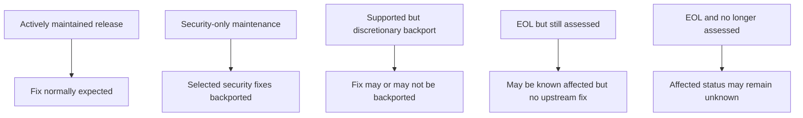
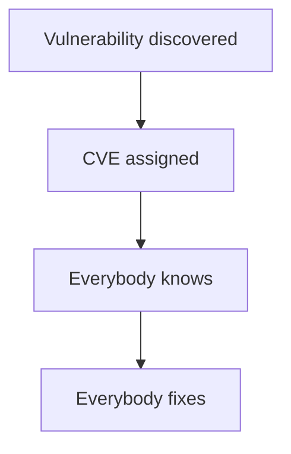
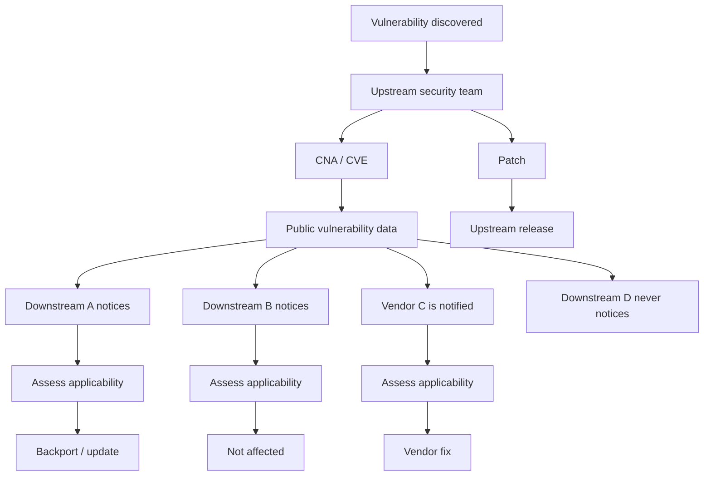
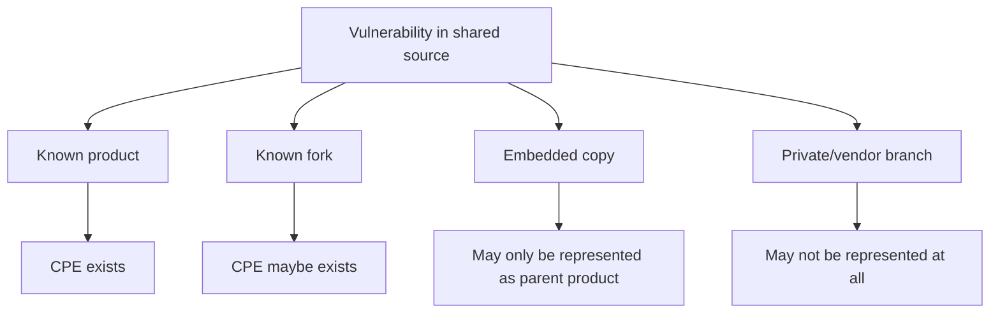

# A CVE Is Not a Software Genealogy System

This card and the five that follow are a research note, consolidated from an
investigation into how prominent open-source projects handle vulnerabilities in
older releases, what happens when software has forks or downstream variants,
and how vulnerability scanners behave when public CVE data is incomplete.

The central finding is simple:

> **A CVE does not propagate a vulnerability through the software ecosystem.**

CVE provides an identifier and a vulnerability record. It does not maintain
software ancestry, discover every fork or embedded copy, determine whether
vulnerable code is still present in each derivative, or ensure that every
scanner reaches the same conclusion.

That creates a particularly important failure mode for old and end-of-life
(EOL) software: a version can still contain vulnerable code while public
vulnerability data is incomplete, stale, or silent.

---

## Scope of the investigation

Three related questions:

1. What do prominent open-source projects say about fixing CVEs in older releases?
2. What happens when those projects have forks, derivatives, vendor variants or embedded copies?
3. Which scanners and vulnerability databases go beyond simply consuming NVD/CPE data and independently assess affected versions?

The projects reviewed were Apache Tomcat, Apache HTTP Server, Node.js, CPython,
Django, PostgreSQL, Kubernetes, Go, OpenSSL, the Linux kernel, Spring Framework
and Redis. Their policies are surveyed in
*What Projects Actually Promise About Old Releases*.

The scanner and data sources reviewed were Sonatype Lifecycle / IQ / OSS Index,
Black Duck SCA / BDSA, Snyk Open Source, Mend SCA, JFrog Xray, the GitHub
Advisory Database / Dependabot, OSV, Grype, and distribution-specific security
feeds. Their behaviour is examined in
*How Scanners Behave When the Data Is Incomplete*.

This is **not** a formal benchmark of every commercial scanner. Some commercial
vulnerability intelligence is only visible to customers, so those products
cannot be scored conclusively without running the same test artifacts through
them.

---

## The support-policy problem starts before scanning

Projects do not all treat older releases in the same way. A useful model:

The key distinction is between:

- **not fixed**
- **not assessed**
- **not affected**

Those are not equivalent.

A scanner may only be able to tell you what the public data says. If the
project no longer assesses an old release, "no CVE is listed" can simply mean
"nobody checked."

---

## How a CVE actually propagates

The naive model:

That model is wrong. A more realistic one:

The arrows between the projects are mostly organisational processes.

CVE itself does not:

- discover descendants
- maintain a fork tree
- inspect source history
- identify embedded copies
- decide whether an old release contains the same vulnerable function
- ensure every derivative is notified
- generate backports

---

## Formal propagation mechanisms

Some ecosystems do have explicit coordination mechanisms, which is what stands
in for the missing graph.

### Kubernetes

Kubernetes has a Security Response Committee, private vulnerability handling,
coordinated disclosure, and downstream/distributor notification. This is one of
the strongest examples of an organised cross-distribution security process.

Source:

- <https://github.com/kubernetes/committee-security-response>

### Django

Django has a private distributor process. Before disclosure, selected
distributors can receive a description of the issue, the affected Django
versions, the patch, and the planned disclosure timing.

Source:

- <https://docs.djangoproject.com/en/6.1/internals/security/>

### Linux

Linux has private security-reporting mechanisms and separate distributor
coordination practices. The important distinction is between:

1. fixing the issue upstream
2. coordinating downstream distribution response

Those are not the same process.

Source:

- <https://www.kernel.org/doc/html/latest/process/security-bugs.html>

---

## The CPE problem

CPE tries to describe affected products. But modern software is not a clean
list of products. It is a graph of upstream releases, forks, embedded
components, repackaged artifacts, vendor branches, backports, private patches
and renamed distributions.

CPE does not maintain authoritative software genealogy. That means the flow is
often:

This becomes particularly brittle when the original upstream release is EOL and
no longer actively mapped.

The CPE matching mechanics themselves — vendor, product, version format and
range bounds — are worked through against a live record in
the *CVE-2020-1938 "Ghostcat"* investigation.

---

## Where this goes next

| Card | Question |
|---|---|
| *Old-release policies* | What do the projects themselves promise? |
| *Forks and derivatives* | Where else does the vulnerable code live? |
| *Scanner classes* | What do scanners do when the data is thin? |
| *Database comparison* | Do the databases actually agree? |
| *Conclusions* | What can we defensibly claim? |
| *Sources* | Every primary reference used |
