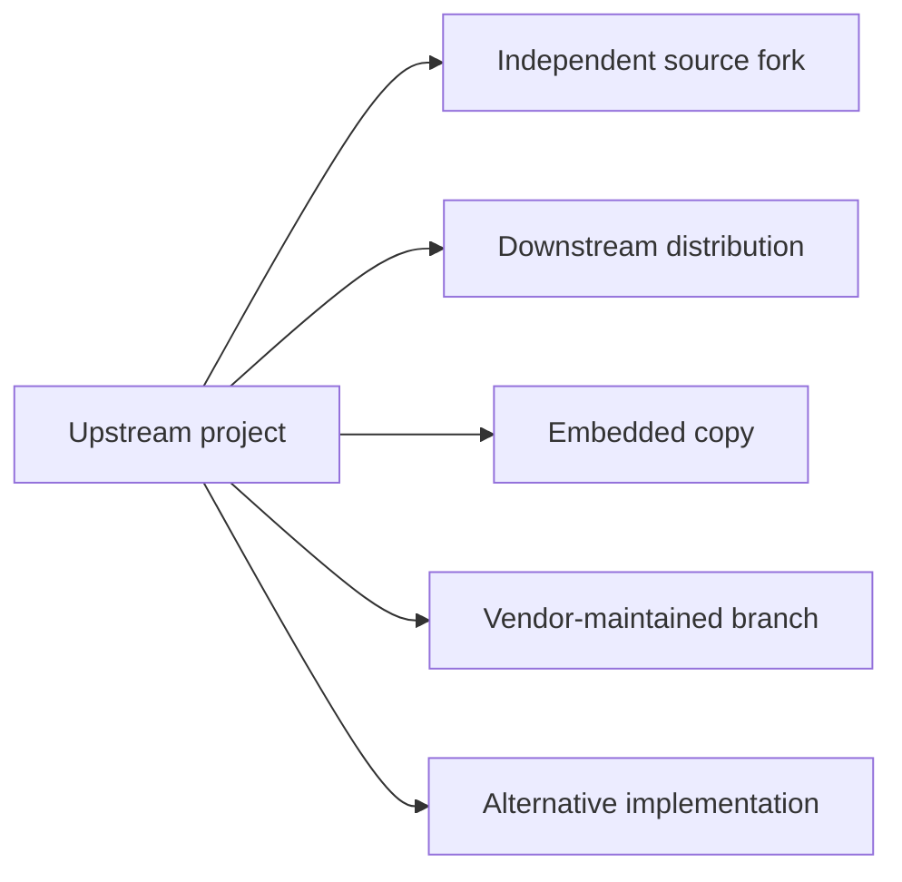
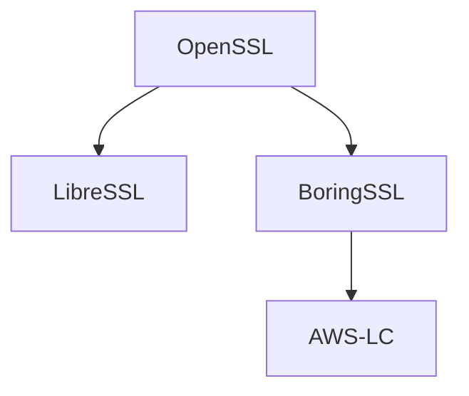
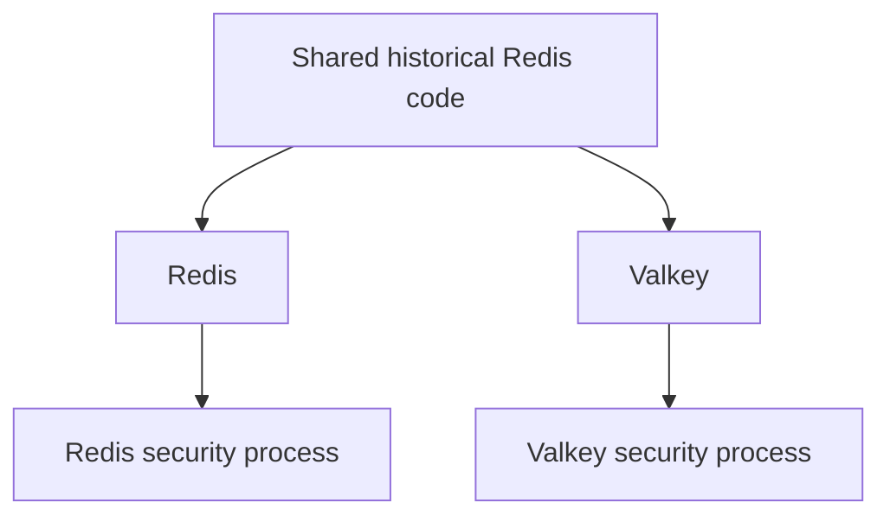
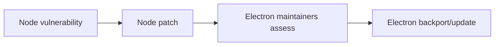
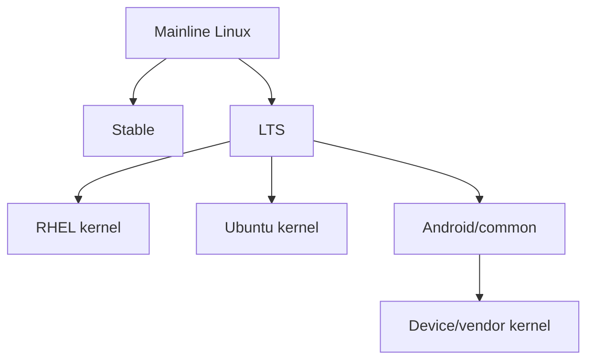
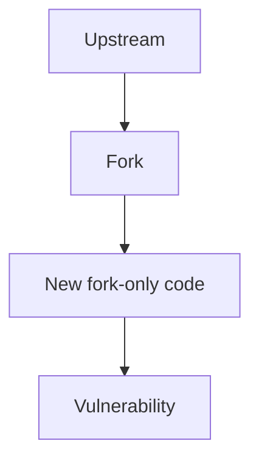
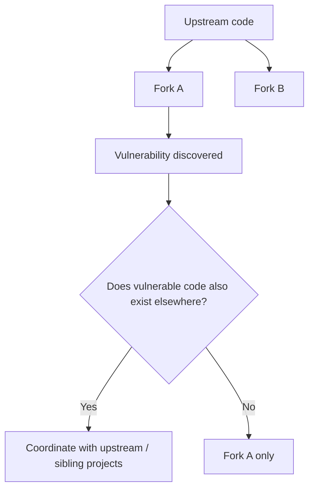
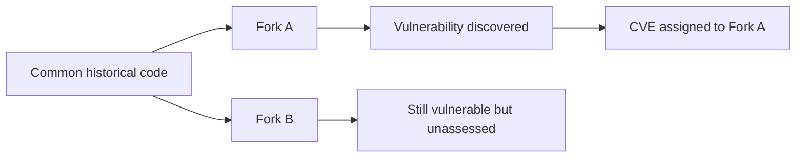

# Forks, Variants and Embedded Copies

A raw GitHub fork count is not especially useful for security analysis. What
matters is whether there is another *maintained code line* that can diverge
from upstream.

There are several different relationships, and they do not behave the same way:

---

## Strong independent fork families

### The OpenSSL family

OpenSSL has a genuine, historically significant fork family.

BoringSSL describes itself as a fork of OpenSSL. AWS-LC describes itself as a
fork of BoringSSL, which itself descends from OpenSSL. LibreSSL is another
independent OpenSSL-derived codebase.

Sources:

- <https://boringssl.googlesource.com/boringssl>
- <https://github.com/aws/aws-lc>
- <https://github.com/libressl/portable>

The important point is that CVE does not maintain this genealogy.

If a vulnerable function originated in OpenSSL and survives in all descendants,
somebody still has to determine whether each descendant is affected.

### Redis and Valkey

Valkey is the clearest current Redis fork. The relationship is now:

Redis and Valkey now operate independent security processes. Redis does not
guarantee that its security patches are applicable to forks. Valkey accepts its
own private security reports and can coordinate with Valkey vendors.

Source:

- <https://github.com/valkey-io/valkey/security>

This means that a vulnerability discovered in one branch does not automatically
become a vulnerability record for the other.

---

## Derivative and embedded ecosystems

### Tomcat

Tomcat has several significant downstream forms, including Apache TomEE, Red
Hat JBoss Web Server, and other application servers and vendor distributions
embedding or repackaging Tomcat.

TomEE is particularly explicit about its process. It tracks Tomcat security
fixes and may publish a TomEE security update by updating or backporting the
Tomcat changes.

Source:

- <https://tomee.apache.org/security/security.html>

This is not automatic CVE propagation. It is maintainers knowing that TomEE
contains Tomcat and consciously monitoring upstream security work.

### Apache HTTP Server

Apache HTTP Server is distributed inside several vendor products, including IBM
HTTP Server, Red Hat JBoss Core Services HTTP Server, and Oracle HTTP Server.

Vendor advisories often exist because the vendor has independently assessed
whether the Apache HTTP Server vulnerability applies to its shipped build.

Example IBM security-bulletin pattern:

- <https://www.ibm.com/support/pages/security-bulletin-ibm-http-server-affected-multiple-vulnerabilities-due-included-apache-http-server-0>

Again, the relationship is maintained by the vendor, not by the CVE system.

### Node.js

Electron is an especially useful Node downstream example. Electron embeds
Node.js and maintains its own release lines, and explicitly documents that
security-only branches can receive security-related changes from Node releases
without consuming the entire upstream release.

Source:

- <https://www.electronjs.org/docs/latest/tutorial/electron-timelines>

That produces this flow:

### Python

Python has a mixture of CPython itself, PyPy, GraalPy, historical direct forks
such as Cinder, and the newer CinderX extension model. These are not all direct
forks of current CPython.

That matters because a CVE in CPython may:

- affect PyPy too
- not affect PyPy at all
- require a completely different fix
- affect only CPython internals

GraalPy can import CPython fixes where relevant, but applicability still has to
be established for the alternative implementation.

### Kubernetes

Kubernetes has an enormous downstream distribution ecosystem: K3s, RKE2,
OpenShift, managed cloud Kubernetes products, and numerous certified
distributions.

Kubernetes is important because it has a formal private-distributor coordination
mechanism — its Security Response Committee can coordinate vulnerability
handling before public disclosure. This is much more structured than
"downstream vendors watch GitHub."

Source:

- <https://github.com/kubernetes/committee-security-response>

### Linux

Linux is probably the largest variant ecosystem of all: upstream stable
kernels, long-term kernels, Red Hat kernels, Ubuntu kernels, SUSE kernels,
Android kernels, hardware-vendor kernels, and device-specific downstream trees.

A vulnerability can therefore exist in multiple descendants with completely
different patch states.

The security problem is not just "is Linux affected?" It is:

> Which exact kernel lineage contains the vulnerable code, and has that lineage
> received the relevant fix?

---

## What happens when the vulnerability is discovered in a fork?

There are three main cases.

### Case 1 — fork-specific vulnerability

The vulnerability belongs to the fork. There may be nothing to send upstream.

### Case 2 — inherited upstream vulnerability

Somebody has to perform the source-history analysis. CVE does not do that
automatically.

### Case 3 — shared vulnerability is never recognised

This is the dangerous case. Fork B can remain vulnerable while:

- no CVE explicitly names it
- no CPE names it
- no package advisory maps it
- no scanner alerts on it

That is a **false sense of absence**, not evidence of safety.
