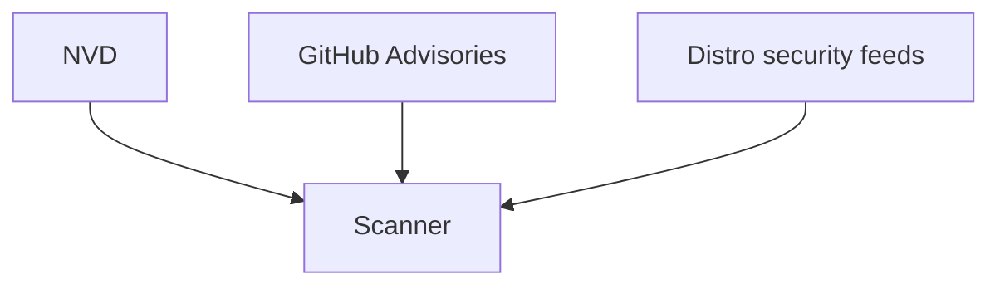
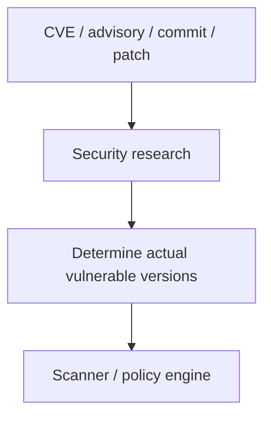
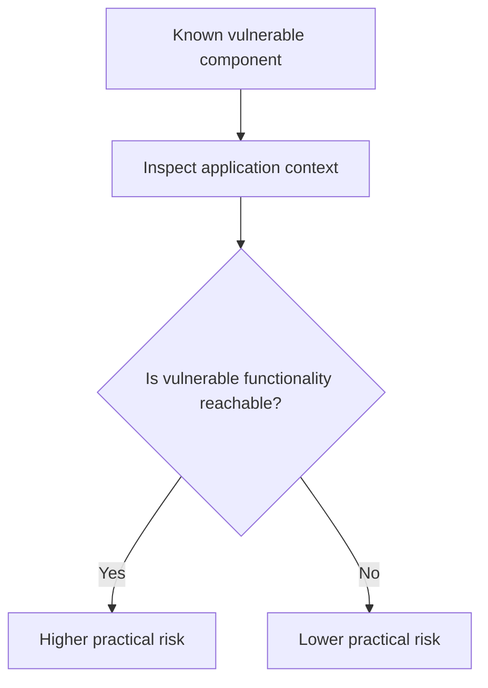
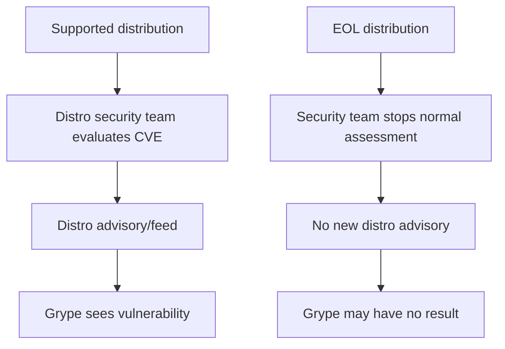
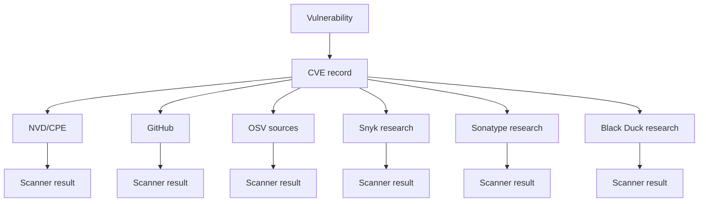
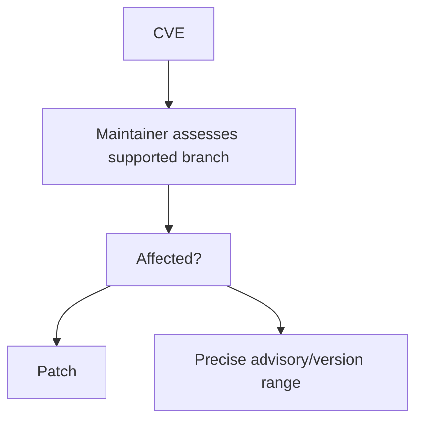
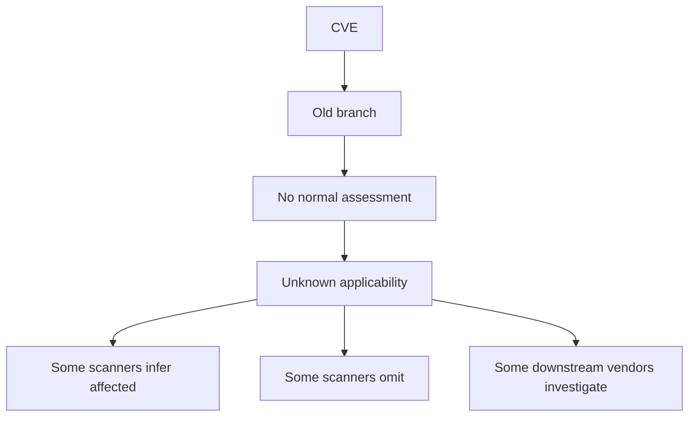

# How Scanners Behave When the Data Is Incomplete

Scanner vendors broadly fall into three classes. The classes answer different
questions, and only one of them is even *trying* to answer "does this old
release contain a vulnerability the public record forgot to list?"

---

## Class 1 — feed consumers



Typical behaviour:

- consume existing vulnerability records
- map package identity/version to published affected ranges
- inherit errors and omissions in those feeds

Examples include Dependabot when it has a reviewed GitHub Advisory package
mapping, Grype for many ecosystems, and many basic SCA implementations.

The problem is straightforward:

> Missing affected-version data in → missing scanner result out.

---

## Class 2 — enriched vulnerability intelligence



These vendors explicitly claim to research or correct version applicability.

### Sonatype

Sonatype says its researchers determine vulnerable version ranges rather than
merely accepting public data as authoritative.

Sources:

- <https://help.sonatype.com/en/sonatype-vulnerability-data.html>
- <https://www.sonatype.com/state-of-the-software-supply-chain/2026/methodology>

Sonatype also has an explicit Component-EOL capability:

- <https://help.sonatype.com/en/component-end-of-life.html>

A particularly useful Sonatype concept is the **Deviation Notice**, used where
Sonatype's own research differs from public vulnerability reporting. Example:

- <https://ossindex.sonatype.org/vulnerability/CVE-2025-48989>

This is strong evidence that Sonatype does not simply mirror NVD.

**Link note, 2026-09-08:** that URL no longer resolves for an anonymous
reader. `ossindex.sonatype.org` now redirects to Sonatype's commercial guide
and the API returns 401 without credentials. The observation above stands — it
was made when the index was public — but it can no longer be checked at
source, which is itself an instance of Conclusion 4.

### Black Duck

Black Duck maintains Black Duck Security Advisories (BDSA). Its documentation
states that researchers cross-check vulnerabilities against potentially
affected component versions, and that this can produce additional or more
accurate mappings than public sources.

Source:

- <https://docs.blackduck.com/>

Black Duck therefore appears to fit the same enriched-intelligence category as
Sonatype. However, exact BDSA mappings are usually visible only in the
commercial product, so this investigation could not independently score each
test CVE.

### Snyk

Snyk maintains its own vulnerability database and security-research process,
drawing on CVEs, GitHub issues, pull requests, commits, and both automated and
manual research. Snyk then assigns package/version ranges itself.

Source:

- <https://docs.snyk.io/scan-with-snyk/snyk-open-source/manage-vulnerabilities/snyk-vulnerability-database>

Snyk's public data therefore provides a useful way to compare its version-range
decisions with NVD, GitHub and OSV. The important finding — worked through in
the next-but-one card — is that **independent research still does not make
Snyk consistently correct for EOL versions**.

---

## Class 3 — application-context analysis



Examples include JFrog Xray Contextual Analysis, Snyk reachability/triage
features, and Mend prioritisation.

These features answer a different question:

> Is this known vulnerability exploitable in this application?

They do **not** necessarily answer:

> Does this old release contain a vulnerability that the public CVE record
> forgot to list?

That distinction matters.

---

## Grype demonstrates the EOL data problem explicitly

Grype relies on upstream security feeds for many OS ecosystems. Its
documentation warns that once an operating system is EOL, the security feeds it
depends on may stop receiving updates.

Source:

- <https://oss.anchore.com/docs/guides/vulnerability/ecosystems/>

That produces:



This is not a Grype bug. It is a consequence of the data source disappearing.

Grype's behaviour against a real scenario image is traced in
the *T04 — Grype* investigation.

---

## GitHub and Dependabot also have coverage limits

Dependabot depends heavily on GitHub Advisory Database package mappings. GitHub
distinguishes:

- reviewed advisories with package/version ranges
- unreviewed advisories
- CVEs that have no usable package mapping

If an advisory has no supported package mapping, Dependabot may not generate an
alert even though the CVE exists.

Source:

- <https://docs.github.com/en/code-security/reference/supply-chain-security/troubleshoot-dependabot/vulnerability-detection>

This becomes very visible in the Node and Tomcat cases that follow.

---

## What this means for scanner accuracy

The old model is:

```text
CVE -> scanner -> answer
```

The evidence suggests a better model:



Each branch can have different affected versions, different timing, different
package identities, different assumptions about EOL software, different
research depth, and different downstream/vendor knowledge.

The vulnerability ecosystem is therefore **eventually consistent**, not
instantly authoritative.

---

## Why EOL software makes the problem worse

EOL software removes one of the most important sources of vulnerability
intelligence:

> the maintainer who still cares about that release.

Before EOL:



After EOL:



This is why "the scanner found nothing" becomes a weaker assurance as software
ages.
