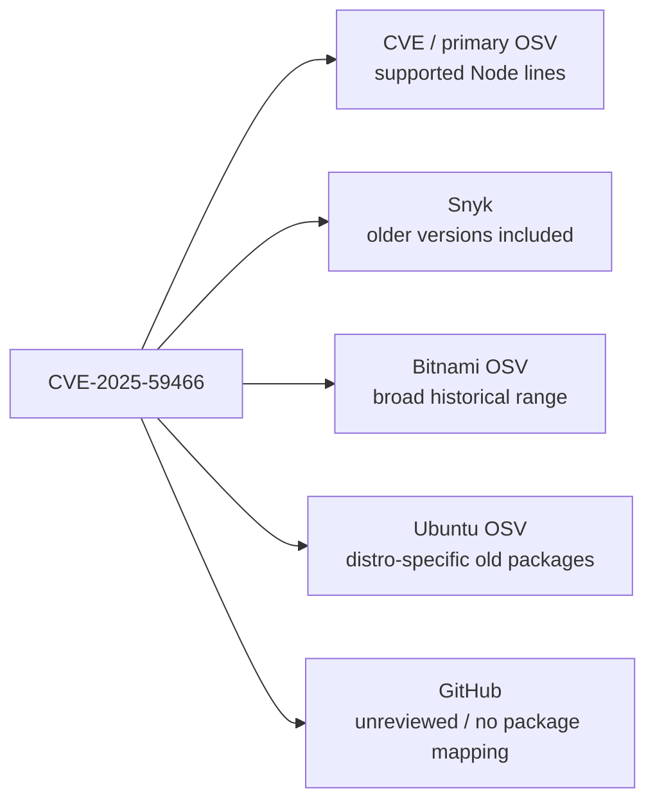

# Empirical Comparison — Tomcat and Node.js Across the Public Databases

The investigation compared public data for several Tomcat CVEs against known
EOL Tomcat versions, then repeated the exercise for one Node.js CVE.

This was **not** a live scan of every commercial product. It was a comparison
of the public advisory/package/version data that those scanners or ecosystems
expose.

## Test versions

Two especially useful old versions:

```text
org.apache.tomcat:*:8.5.100
org.apache.tomcat:*:7.0.109
```

Both represent EOL Tomcat lines.

---

## CVE-2024-38286

Known affected old releases include Tomcat 8.5.100 and Tomcat 7.0.109.

NVD's page includes CNA information that acknowledges the older lines, while
the NVD CPE configuration is narrower and begins with newer Tomcat.

Source:

- <https://nvd.nist.gov/vuln/detail/CVE-2024-38286>

### Snyk

Snyk's public Maven mapping starts at Tomcat 9.0.13.

Result for the old versions: **Miss**

- <https://security.snyk.io/vuln/SNYK-JAVA-ORGAPACHETOMCAT-8073089>

### GitHub Advisory Database

GitHub's reviewed advisory explicitly maps the older Maven ranges, including
8.5 and 7.x.

Result: **Hit**

- <https://github.com/advisories/GHSA-7jqf-v358-p8g7>

### OSV

The GitHub-derived OSV record also contains those old ranges.

Result: **Hit**

- <https://osv.dev/vulnerability/GHSA-7jqf-v358-p8g7>

### Why this case matters

This is a very useful counter-example to the idea that proprietary research
always has broader historical coverage. For this CVE:

```text
GitHub curated data -> old versions recognised
Snyk public Maven range -> old versions omitted
```

---

## CVE-2026-24880

Tomcat 8.5.100 and 7.0.109 are known affected.

### Snyk

Snyk uses a range equivalent to:

```text
>= 7.0.0 and < 9.0.116
```

That deliberately spans 7.x, 8.5.x and 9.x.

Result: **Hit**

- <https://security.snyk.io/vuln/SNYK-JAVA-ORGAPACHETOMCAT-15990632>

### GitHub

GitHub similarly maps the old Maven versions.

Result: **Hit**

- <https://github.com/advisories/GHSA-563x-q5rq-57qp>

### OSV

OSV records also span the old releases.

Result: **Hit**

- <https://osv.dev/vulnerability/BIT-tomcat-2026-24880>

---

## CVE-2026-59083

Tomcat 8.5 is known affected.

### Snyk

Snyk's public Maven range begins at the Tomcat 9.0 milestone line.

Result for 8.5: **Miss**

- <https://security.snyk.io/vuln/SNYK-JAVA-ORGAPACHETOMCAT-19348777>

### GitHub

GitHub knows about the vulnerability in prose, but the advisory is unreviewed
and has no usable package mapping.

Result for Dependabot-style package matching: **No reliable package alert**

- <https://github.com/advisories/GHSA-hcjr-322h-429r>

### OSV

CVE-derived OSV information can still contain the older affected line.

This demonstrates that:

```text
GitHub advisory prose
GitHub package mapping
OSV CVE record
```

can all have different levels of completeness.

---

## CVE-2025-24813

This is a particularly useful workshop case because Tomcat 8.5 is known
affected and the vulnerability later became highly visible. Tomcat 8.5.0
through 8.5.100 are affected.

Source:

- <https://osv.dev/vulnerability/CVE-2025-24813>

### Snyk

Snyk's public Maven record for the relevant Tomcat package begins with the
Tomcat 9 line.

Result for 8.5: **Miss**

- <https://security.snyk.io/vuln/SNYK-JAVA-ORGAPACHETOMCAT-9380766>

### GitHub

GitHub's reviewed advisory explicitly maps the 8.5 line.

Result: **Hit**

- <https://github.com/advisories/GHSA-83qj-6fr2-vhqg>

### OSV

OSV also contains old-version knowledge, depending on the source record and
package mapping consumed.

---

## CVE-2024-50379

Tomcat 8.5 is explicitly affected.

Source:

- <https://osv.dev/vulnerability/CVE-2024-50379>

### Snyk

Snyk correctly includes the 8.5 line.

Result: **Hit**

- <https://security.snyk.io/vuln/SNYK-JAVA-ORGAPACHETOMCAT-8523184>

### GitHub

GitHub also explicitly maps 8.5.

Result: **Hit**

- <https://github.com/advisories/GHSA-5j33-cvvr-w245>

### OSV

OSV is more complicated because separate upstream records can model
package/version ranges differently. A CVE-derived record can know 8.5 is
affected while a Bitnami package record may begin later.

This is important because:

> "OSV says X" is not always a single answer.

OSV aggregates multiple data sources.

---

## Tomcat comparison summary

| CVE | Old/EOL Tomcat affected? | Snyk public range | GitHub package mapping | OSV |
|---|---:|---:|---:|---:|
| CVE-2024-38286 | Yes | Miss | Hit | Hit |
| CVE-2026-24880 | Yes | Hit | Hit | Hit |
| CVE-2026-59083 | Yes | Miss | No reliable reviewed mapping | CVE data can know |
| CVE-2025-24813 | Yes | Miss | Hit | Hit / source-dependent |
| CVE-2024-50379 | Yes | Hit | Hit | Mixed by source record |

The important result is not the small score. The important result is:

> **The answer changes by CVE and by intelligence provider.**

Independent research improves data quality, but it does not create a universal
authoritative answer.

---

## Node.js: an even cleaner example

### CVE-2025-59466

Node's January 2026 security release covers supported release lines and
illustrates the EOL problem very clearly.

Source:

- <https://nodejs.org/en/blog/vulnerability/december-2025-security-releases>

The public ecosystem produces different machine-readable answers.

**Primary CVE / OSV.** The primary CVE-derived OSV record enumerates currently
supported Node release lines such as 20, 22, 24 and 25.

- <https://osv.dev/vulnerability/CVE-2025-59466>

**Snyk.** Snyk's upstream Node record reaches back below Node 20.

- <https://security.snyk.io/vuln/SNYK-UPSTREAM-NODE-14975915>

This is the behaviour we were originally looking for:

> Snyk's research can model older affected releases even where the primary CVE
> range is focused on supported releases.

**Bitnami / OSV.** Bitnami's OSV data models the range from version zero up to
the fixed supported version. This effectively treats older historical versions
as affected unless fixed.

**Ubuntu / OSV.** Ubuntu's distro-specific intelligence can identify older Node
packages such as Node 18, and even much older package lines in supported
extended-maintenance contexts.

**GitHub.** GitHub's advisory for the same vulnerability is unreviewed, has no
package mapping, and therefore cannot drive a normal Dependabot package alert.

That gives us:



This is one of the strongest demonstrations that vulnerability databases are
independent interpretations of the same underlying security event.

---

## OSV is an aggregation layer, not a single opinion

OSV is often treated as though it were one vulnerability database with one
answer. In reality, OSV can contain multiple records sourced from CVE, GitHub
Security Advisories, distribution security teams, Bitnami, language ecosystems
and other upstream advisory sources.

Therefore the same CVE can appear with different package identifiers, different
version ranges, different fix boundaries and different ecosystem-specific
interpretations.

That means an OSV consumer must decide:

1. which records apply to the package being scanned
2. how to deduplicate overlapping records
3. what to do when two sources disagree

---

## What we could not verify conclusively

### Sonatype Lifecycle / IQ

Sonatype clearly states that it performs proprietary vulnerability research and
can deviate from NVD/public mappings. However, without a Lifecycle/IQ tenant we
could not run the same Tomcat artifacts and record the exact output.

- **Capability claim:** verified
- **Per-CVE benchmark result:** not verified

### Black Duck

Black Duck clearly documents that BDSA researchers validate affected component
versions and can produce mappings that differ from public CVE data. However,
exact BDSA range data is usually visible only in the product.

- **Capability claim:** verified
- **Per-CVE benchmark result:** not verified

### Mend

Mend performs proprietary vulnerability mapping and supports analysis of some
very old/EOL operating-system distributions. However, the public documentation
found during this investigation was not explicit enough to claim that Mend
systematically extrapolates CVEs onto older releases omitted from upstream
data.

- **General enrichment:** likely / documented
- **Old-release extrapolation claim:** not proven

### JFrog Xray

JFrog has substantial security research capability, but the clearest public
feature is contextual analysis: is the vulnerable code present, is it
reachable, is it configured, is it exploitable? That is different from proving
that an unsupported release omitted from the CVE range is still vulnerable.

- **Exploitability/contextual analysis:** verified
- **Old-release version-range extrapolation:** not proven from public material reviewed
