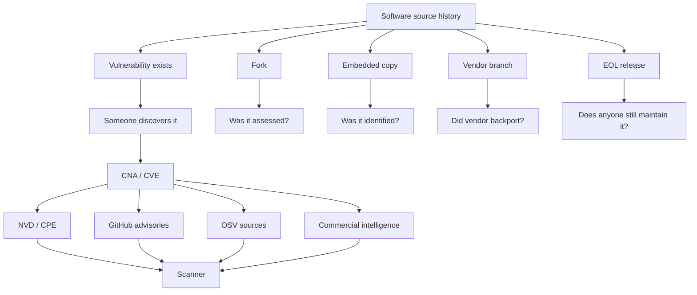

# Conclusions, and What We Can Defensibly Claim

---

## The main conclusions

### Conclusion 1 — CVE is not a dependency graph

CVE does not know:

- that TomEE contains Tomcat
- that Electron embeds Node
- that Valkey shares historical Redis code
- that AWS-LC descends from BoringSSL, which descends from OpenSSL
- that a vendor kernel contains a backported mainline function
- that a private enterprise fork still contains vulnerable code

Those relationships are reconstructed by maintainers, vendors and scanners.

### Conclusion 2 — "not listed" is not "not affected"

For old releases, absence from a CVE affected-version range can mean:

- not affected
- not assessed
- forgotten
- intentionally excluded because unsupported
- not yet curated
- represented under a different package/product identity
- known only to a downstream vendor

These states are not equivalent.

### Conclusion 3 — independent scanner research helps, but does not solve the problem

Sonatype, Black Duck and Snyk all explicitly describe research beyond public
CVE feeds. That is valuable. But the Tomcat comparison shows that even
independently curated intelligence can omit old versions that another database
correctly includes.

There is no single guaranteed source of truth.

### Conclusion 4 — OSV can contain conflicting levels of completeness

OSV is powerful because it aggregates ecosystem-specific intelligence. But that
also means two OSV records for the same CVE can expose different version
ranges. Consumers need to understand the source record, not just the CVE
identifier.

### Conclusion 5 — the most dangerous point is after maintenance stops

When a release is supported, someone is still responsible for answering:

> Is this release affected?

After EOL, that responsibility may disappear.

The vulnerable code does not disappear with it.

---

## Practical implications for developers and security teams

A mature vulnerability-management process should not rely on one scanner alone
for unsupported software. For old or critical components, consider:

1. Check the upstream project security advisory.
2. Check the CNA-authored CVE data.
3. Check NVD/CPE, but do not assume it is complete.
4. Check the GitHub Advisory Database if the component is packaged in an ecosystem GitHub supports.
5. Check OSV and inspect which source records are producing the answer.
6. Check at least one enriched commercial intelligence source if available.
7. Check downstream/vendor advisories where the component is embedded or repackaged.
8. Treat EOL as a separate risk signal even when there are no known CVEs.
9. Where a branch is unsupported, consider source-level or patch-level comparison for high-severity vulnerabilities.
10. Record uncertainty explicitly rather than turning "unknown" into "not affected."

---

## A better mental model

The simplest useful model:



The CVE database sees only part of that graph.

---

## Suggested hands-on demonstration

A defensible hands-on demo does not require access to every commercial product.

Create two minimal Maven projects:

```text
tomcat-8.5.100/
tomcat-7.0.109/
```

Use a Tomcat artifact that appears in the public vulnerability records being
compared. Then compare:

- the GitHub Advisory Database
- OSV
- Snyk's public vulnerability database
- NVD
- Apache Tomcat's own security documentation

Suggested CVEs:

- CVE-2024-38286
- CVE-2025-24813
- CVE-2024-50379

The teaching goal is not to prove one scanner is "best." The teaching goal is
to show:

```text
same software
same CVE
different data source
different answer
```

Then ask:

> Which answer would your CI pipeline have acted on?

---

## Strong statements the evidence supports

The following statements are defensible based on the research:

> A CVE is an identifier and vulnerability record; it is not a software
> genealogy system.

> CVE and CPE data do not automatically propagate vulnerability applicability
> across forks, embedded copies and vendor branches.

> EOL releases can remain vulnerable after upstream stops evaluating or
> patching them.

> The absence of an old release from a CVE affected-version range is not proof
> that the release is unaffected.

> Commercial vulnerability-intelligence providers often perform independent
> version-range research, but their conclusions can still differ.

> Public databases can disagree about the same CVE because they are
> independently curated and updated at different times.

> A scanner can be correct according to its data source and still miss a real
> vulnerability in an old release.

---

## Statements to avoid overclaiming

The research does **not** justify saying:

> "Commercial scanners always detect EOL vulnerabilities."

They do not. It also does not justify:

> "NVD always misses old versions."

It does not. Nor:

> "OSV has the correct answer."

OSV may contain several answers from several sources. And it does not justify:

> "A scanner miss proves the scanner is bad."

The missing information may never have existed in the scanner's upstream data
source.

A better statement is:

> **Vulnerability detection quality depends on the quality, coverage and
> interpretation of the underlying intelligence, and EOL software removes many
> of the mechanisms that keep that intelligence current.**

---

## Bottom line

The software supply chain is a graph.

The vulnerability ecosystem mostly records it as lists.

That mismatch becomes increasingly important when software forks, is embedded,
is repackaged, is privately patched, or leaves upstream support.

The CVE system can tell us that a vulnerability exists.

It cannot, by itself, tell us every place that vulnerable code still exists.

That is why old software can be dangerous even when every scanner on the
dashboard is green.
